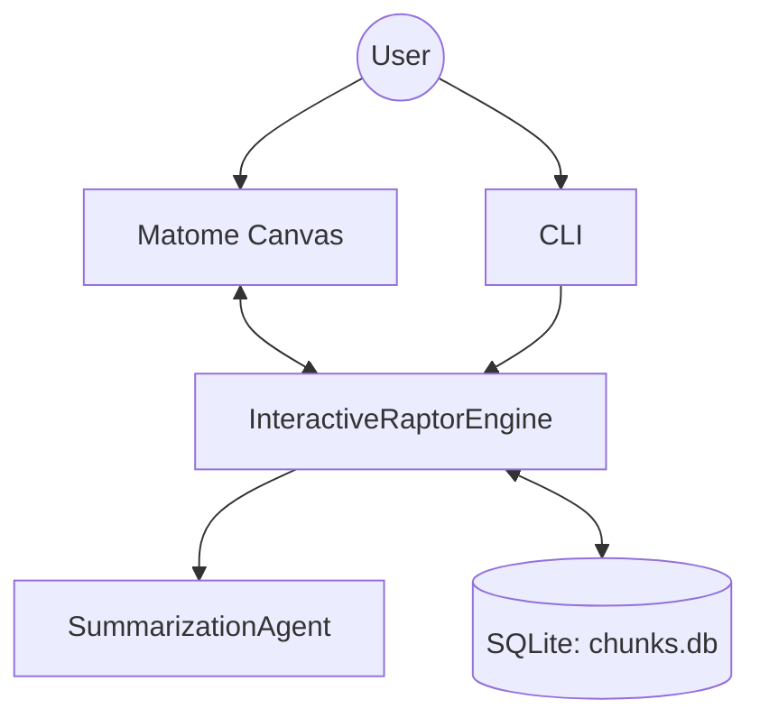

# Matome 2.0: Knowledge Installation System


**"Don't just summarize. Install Knowledge."**

Matome 2.0 transforms long, complex documents into a structured **Data-Information-Knowledge-Wisdom (DIKW)** hierarchy. Unlike traditional summarizers that simply shorten text, Matome helps you restructure information into a mental model that fits your brain, allowing you to "zoom" from profound philosophical truths down to actionable checklists and raw evidence.

## Key Features

*   **Semantic Zooming Engine:** Automatically generates a 4-layer hierarchy (Wisdom -> Knowledge -> Information -> Data) from any text.
*   **Interactive Refinement:** Don't like a summary? Chat with it! Refine any node using natural language instructions (e.g., "Explain this like I'm 5").
*   **Matome Canvas (GUI):** A modern, responsive interface built with Panel to explore and edit your knowledge base visually.
*   **Source Traceability:** Every insight is linked back to the original text chunks, ensuring you can always verify the source.
*   **Prompt Strategy Pattern:** Extensible architecture allowing for custom prompt engineering strategies.

## Architecture Overview

Matome 2.0 uses a layered architecture to separate the interactive GUI from the robust RAPTOR-based backend.



## Prerequisites

*   **Python 3.11+**
*   **uv** (recommended for dependency management) or pip
*   **OpenAI API Key** (or compatible LLM provider)

## Installation & Setup

1.  **Clone the repository:**
    ```bash
    git clone https://github.com/your-org/matome.git
    cd matome
    ```

2.  **Install dependencies:**
    ```bash
    uv sync
    # Or with pip: pip install -e .[dev]
    ```

3.  **Configure Environment:**
    ```bash
    cp .env.example .env
    # Edit .env and add your OPENAI_API_KEY
    ```

## Usage

### 1. Ingest & Generate (CLI)
Process a text file to generate the initial DIKW tree.
```bash
uv run matome run your_document.txt --mode dikw
```

### 2. Explore & Refine (GUI)
Launch the Matome Canvas to explore the generated knowledge.
```bash
uv run matome canvas
```
*   Open your browser at `http://localhost:5006`.
*   Click the **Wisdom** node to drill down.
*   Select any node and use the **Refine** chat to edit it.

## Development Workflow

We follow a cycle-based development process (AC-CDD).

**Running Tests:**
```bash
uv run pytest
```

**Linting & Formatting:**
```bash
uv run ruff check .
uv run mypy .
```

## Project Structure

```ascii
.
├── dev_documents/          # Architecture, Specs, UATs
│   ├── system_prompts/     # Cycle-specific documentation
│   ├── ALL_SPEC.md         # Raw requirements
│   └── SYSTEM_ARCHITECTURE.md
├── src/
│   ├── matome/             # Main package
│   │   ├── agents/         # LLM logic & Strategies
│   │   ├── canvas/         # GUI (Panel)
│   │   ├── engines/        # RAPTOR & Interactive engines
│   │   └── cli.py          # CLI entry point
│   └── domain_models/      # Pydantic schemas
├── tests/                  # Test suite
├── tutorials/              # Jupyter notebooks
└── pyproject.toml          # Configuration
```

## License

MIT License. See `LICENSE` for details.
