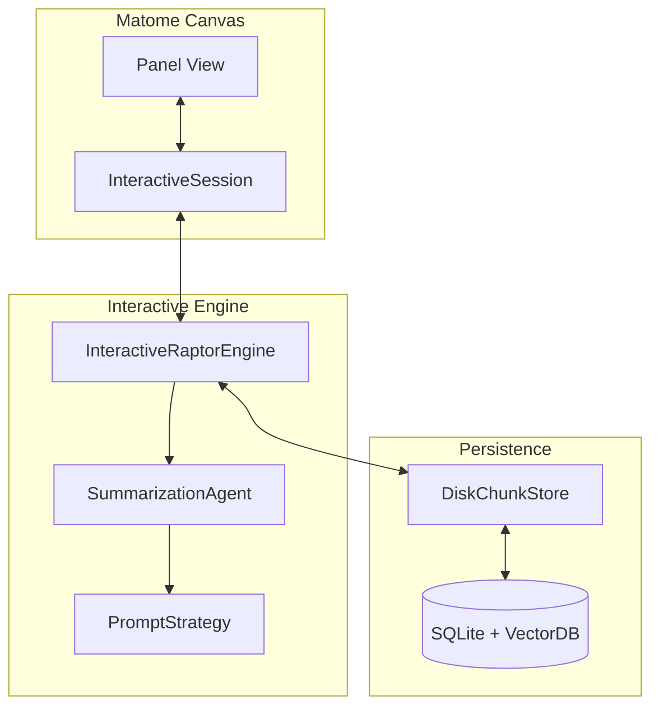

# Matome 2.0: Knowledge Installation


**Matome** (Japanese for "Summary") is a next-generation summarization system that transforms passive reading into active "Knowledge Installation." Unlike traditional tools that merely compress text, Matome generates a hierarchical **DIKW (Data, Information, Knowledge, Wisdom)** structure, allowing users to zoom from high-level aphorisms down to concrete action items and original source evidence.

## Key Features

-   **Semantic Zooming (DIKW Engine):** Navigate knowledge vertically. Start with a "Wisdom" one-liner, drill down into "Knowledge" frameworks, and land on actionable "Information" checklists.
-   **Interactive Refinement:** Don't like a summary? Rewrite it. Select any node in the tree and use the built-in chat to tailor the content to your understanding (e.g., "Explain this like I'm 5").
-   **Source Verification:** Trust but verify. Every AI-generated summary is linked directly to the original text chunks, ensuring complete traceability and preventing hallucinations.
-   **Local First:** Built on a robust local SQLite + Vector Store architecture, ensuring your data remains private and accessible without constant cloud dependency.
-   **Reactive Canvas:** A modern, responsive GUI built with Panel that makes exploring complex documents as intuitive as using a map.

## Architecture Overview

Matome 2.0 separates the concerns of data processing (RAPTOR), storage (SQLite/VectorDB), and user interaction (Panel GUI).



## Prerequisites

-   **Python 3.11+**
-   **OpenAI API Key** (for GPT-4o usage)
-   **uv** (recommended for dependency management) or standard `pip`.

## Installation & Setup

1.  **Clone the repository:**
    ```bash
    git clone https://github.com/your-org/matome.git
    cd matome
    ```

2.  **Install dependencies (using uv):**
    ```bash
    uv sync
    ```
    *Or using pip:*
    ```bash
    pip install -e .[dev]
    ```

3.  **Configure Environment:**
    Create a `.env` file in the root directory:
    ```bash
    cp .env.example .env
    # Edit .env and add your OPENAI_API_KEY
    ```

## Usage

### 1. Batch Generation (CLI)
Process a document to generate the initial DIKW tree.
```bash
uv run matome run data/my_book.txt --mode dikw
```

### 2. Interactive Canvas (GUI)
Launch the web interface to explore and refine the results.
```bash
uv run panel serve src/matome/interface/app.py --autoreload
```
Open your browser to `http://localhost:5006/app`.

## Development Workflow

We follow a strict **Cycle-Based Development** process (AC-CDD).

**Running Tests:**
```bash
uv run pytest
```

**Linting & Formatting:**
This project enforces strict quality standards using `ruff` and `mypy`.
```bash
uv run ruff check .
uv run mypy .
```

## Project Structure

```ascii
src/
├── domain_models/       # Pydantic Schemas & Constants
├── matome/
│   ├── agents/          # LLM Agents & Prompt Strategies
│   ├── engines/         # RAPTOR & Interactive Logic
│   ├── interface/       # Panel GUI (View & ViewModel)
│   └── store/           # Database Access
dev_documents/           # Architecture & Specs
tests/                   # Unit & Integration Tests
```

## License

MIT License. See `LICENSE` for details.
