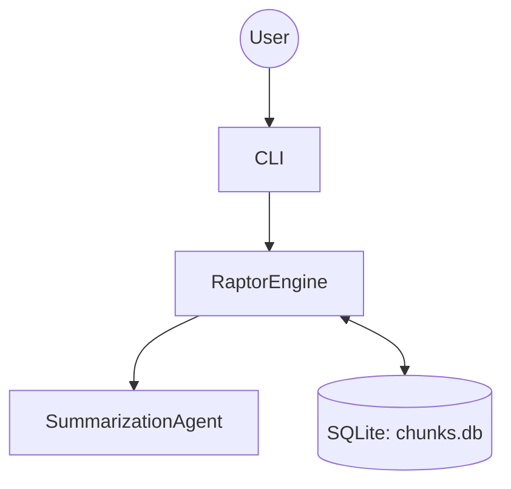

# Matome 2.0: Knowledge Installation System


**"Don't just summarize. Install Knowledge."**

Matome 2.0 transforms long, complex documents into structured summaries. It uses a recursive summarization approach (RAPTOR) to build a hierarchical tree of information.

## Current Capabilities (Cycle 01)

*   **Recursive Summarization:** Automatically generates a hierarchical summary tree from text documents.
*   **Prompt Strategy Pattern:** Extensible architecture allowing for custom prompt engineering strategies (Internal API).
*   **Strict Schema Validation:** Robust data models ensuring data integrity.

## Prerequisites

*   **Python 3.11+**
*   **uv** (recommended for dependency management) or pip
*   **OpenAI API Key** (or compatible LLM provider)

## Installation & Setup

1.  **Clone the repository:**
    ```bash
    git clone https://github.com/your-org/matome.git
    cd matome
    ```

2.  **Install dependencies:**
    ```bash
    uv sync
    ```

3.  **Configure Environment:**
    Create a `.env` file in the root directory:
    ```bash
    OPENAI_API_KEY=your_api_key_here
    # Optional:
    # OPENROUTER_API_KEY=your_openrouter_key
    ```

## Usage

### Ingest & Generate (CLI)
Process a text file to generate the summary tree.
```bash
uv run matome run your_document.txt
```
This will output a summary to `summary.md` (or configured output).

## Architecture Overview

Matome 2.0 uses a layered architecture to separate the interactive GUI from the robust RAPTOR-based backend.



## Roadmap

*   **Cycle 02:** DIKW (Data-Information-Knowledge-Wisdom) Engine Implementation.
*   **Cycle 03:** Interactive Backend & Refinement.
*   **Cycle 04:** GUI Foundation (Matome Canvas).
*   **Cycle 05:** Semantic Zooming & Full Release.

## Project Structure

```ascii
.
├── dev_documents/          # Architecture, Specs, UATs
├── src/
│   ├── matome/             # Main package
│   │   ├── agents/         # LLM logic & Strategies
│   │   ├── engines/        # RAPTOR engine
│   │   └── cli.py          # CLI entry point
│   └── domain_models/      # Pydantic schemas
├── tests/                  # Test suite
├── tutorials/              # Jupyter notebooks
└── pyproject.toml          # Configuration
```

## License

MIT License. See `LICENSE` for details.
