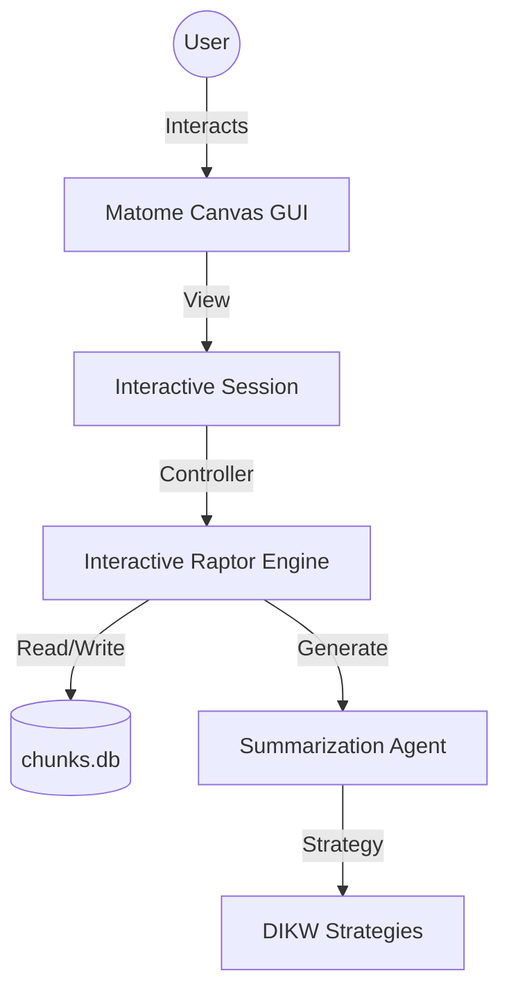

# Matome 2.0: Knowledge Installation System

[]()
[]()
[]()

**Turn static text into interactive knowledge graphs.**

Matome 2.0 is not just a summarizer; it's a **"Semantic Zooming" engine**. It breaks down long documents (books, reports) into a hierarchical DIKW (Data, Information, Knowledge, Wisdom) structure, allowing you to traverse from high-level profound insights down to actionable checklists and original source evidence.

## Key Features

- **Semantic Zooming:** Navigate information at four levels of abstraction:
    - **Wisdom (L1):** Profound, context-free truths (20-40 chars).
    - **Knowledge (L2):** Mental models and structural logic.
    - **Information (L3):** Actionable checklists and procedures.
    - **Data (L4):** Original source text.
- **Interactive Refinement:** Don't like a summary? Talk to it. Instruct the AI to rewrite specific nodes ("Make this simpler", "Focus on finance") without regenerating the whole tree.
- **Source Traceability:** Every insight is linked back to the original text chunks, ensuring you can always verify the AI's claims.
- **Matome Canvas:** A modern, reactive GUI built with Panel for exploring and refining your knowledge base.

## Architecture Overview

Matome uses a modular architecture separating the Core Engine (RAPTOR-based) from the Interactive UI (MVVM pattern).



## Prerequisites

- **Python 3.11+**
- **uv** (Recommended package manager)
- **OpenAI API Key** (Set as `OPENAI_API_KEY` environment variable)

## Installation & Setup

1.  **Clone the repository:**
    ```bash
    git clone https://github.com/your-org/matome.git
    cd matome
    ```

2.  **Install dependencies with uv:**
    ```bash
    uv sync
    ```

3.  **Configure Environment:**
    ```bash
    cp .env.example .env
    # Edit .env and add your OPENAI_API_KEY
    ```

## Usage

### CLI Mode (Batch Generation)
Process a text file and generate the initial DIKW tree.
```bash
uv run matome run data/my_book.txt --mode dikw
```

### Interactive Mode (GUI)
Launch the Matome Canvas to explore and refine your knowledge base.
```bash
uv run matome serve
```

## Development Workflow

This project follows a strict 5-cycle development plan.

### Running Tests
```bash
uv run pytest
```

### Code Quality
We enforce strict typing and linting.
```bash
uv run ruff check .
uv run mypy .
```

## Project Structure

```ascii
src/
├── domain_models/       # Pydantic schemas (DIKW definitions)
├── matome/
│   ├── agents/          # LLM interaction & Strategies
│   ├── engines/         # RAPTOR & Interactive Logic
│   ├── ui/              # Panel-based GUI (MVVM)
│   └── cli.py           # Entry point
tests/                   # Comprehensive test suite
dev_documents/           # Architecture & Cycle Specs
```

## License

MIT License. See [LICENSE](LICENSE) for details.
