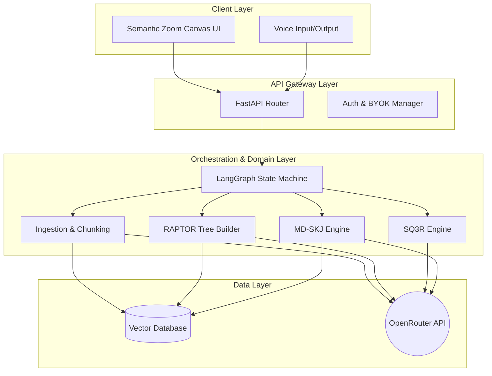

# matome


**matome** ("summary" in Japanese) is a revolutionary frictionless active learning platform and knowledge workspace. It relieves users from cognitive overload when reading exceptionally long and complex documents by intelligently generating interactive semantic knowledge graphs.

## Key Features

- **Semantic Zooming:** Prevents cognitive overload by displaying high-level concepts first, and dynamically revealing deeper, high-density details only when the user is ready.
- **Frictionless SQ3R Automation:** Mandates interactive learning without slowing you down. Unlock deeper knowledge by answering AI-generated contextual questions and solidifying it through immediate voice feedback.
- **Multi-Dimensional Semantic KJ (MD-SKJ):** Pivot standard linear documents along completely new analytical axes (e.g., timeline, system workflow) to instantly discover hidden insights and generate system requirements or structural diagrams.

## Architecture Overview

matome leverages a robust LangGraph state machine orchestrating interactions with OpenRouter models and local vector stores. Documents are ingested, intelligently chunked, and constructed into a RAPTOR tree. The platform strictly enforces enterprise-grade security with Zero-Data Retention policies and local key encryption.


```mermaid
graph TD
    subgraph Client Layer
        UI[Semantic Zoom Canvas UI]
        Audio[Voice Input/Output]
    end

    subgraph API Gateway Layer
        FastAPI[FastAPI Router]
        Auth[Auth & BYOK Manager]
    end

    subgraph Orchestration & Domain Layer
        LangGraph[LangGraph State Machine]
        Ingest[Ingestion & Chunking]
        Raptor[RAPTOR Tree Builder]
        QA[SQ3R Engine]
        Pivot[MD-SKJ Engine]
    end

    subgraph Data Layer
        VecDB[(Vector Database)]
        OpenRouter((OpenRouter API))
    end

    UI --> FastAPI
    Audio --> FastAPI
    FastAPI --> LangGraph
    LangGraph --> Ingest
    LangGraph --> Raptor
    LangGraph --> QA
    LangGraph --> Pivot

    Ingest --> VecDB
    Raptor --> VecDB
    Pivot --> VecDB

    Ingest --> OpenRouter
    Raptor --> OpenRouter
    QA --> OpenRouter
    Pivot --> OpenRouter
```

## Prerequisites

- Python 3.12+
- `uv` package manager
- Node.js (for frontend rendering, planned)
- Valid API keys for OpenRouter (optional for mock execution)

## Installation & Setup

1. **Clone the repository:**
   ```bash
   git clone https://github.com/your-repo/matome.git
   cd matome
   ```

2. **Sync dependencies using `uv`:**
   ```bash
   uv sync
   ```

3. **Configure the environment:**
   ```bash
   cp .env.example .env
   # Add your OPENROUTER_API_KEY to the .env file if using Real Mode
   ```

## Usage

**Quick Start Tutorial (UAT):**

To experience the interactive demonstration of matome's features via a `marimo` notebook:

```bash
uv run marimo edit tutorials/UAT_AND_TUTORIAL.py
```

This interface will guide you through document ingestion, SQ3R unlocking, and the MD-SKJ pivot feature.

## Development Workflow

We utilize a strict cycle-based development workflow heavily reliant on automated testing and linting.

- **Run Tests:**
  ```bash
  uv run pytest
  ```
- **Check Typing:**
  ```bash
  uv run mypy .
  ```
- **Run Linter/Formatter:**
  ```bash
  uv run ruff check .
  uv run ruff format .
  ```

## Project Structure

```text
matome/
├── pyproject.toml
├── main.py
├── src/
│   ├── config/          # Pydantic Settings and Security
│   ├── domain/          # Core Schemas (Chunks, RAPTOR Nodes)
│   ├── application/     # LangGraph Workflows and Services
│   ├── infrastructure/  # LLM and Vector Store Gateways
│   └── interfaces/      # FastAPI Routers
├── tests/               # Pytest Suite
└── tutorials/
    └── UAT_AND_TUTORIAL.py # Marimo interactive tutorial
```

## License

This project is licensed under the MIT License.
