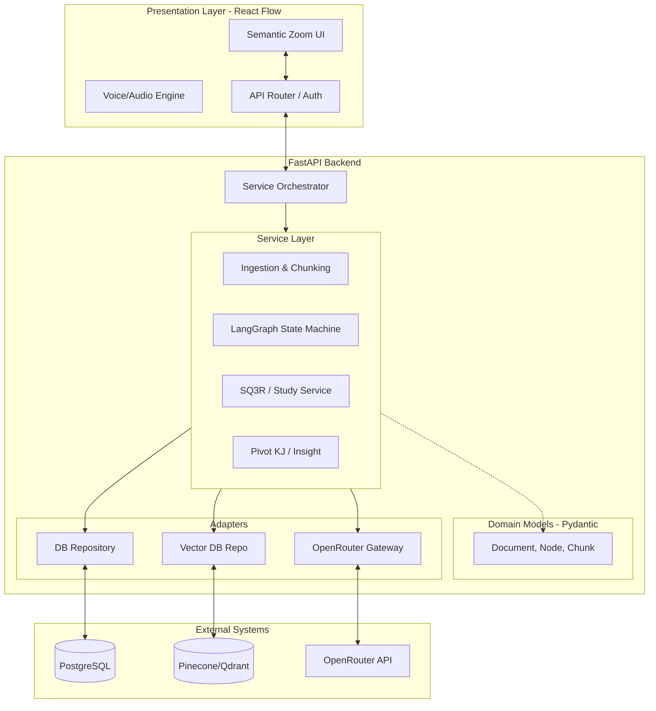

# matome

  

**matome** ("summary" in Japanese) is an advanced knowledge workspace that liberates humanity from the pain of digesting massive amounts of text. By integrating cognitive psychology principles (SQ3R, spacing effects) with cutting-edge generative AI (RAPTOR, Multi-Dimensional Semantic KJ), it transforms passive reading into an exhilarating, frictionless active learning game.

---

## 🚀 Key Features

*   **Frictionless Active Learning:** Forces "generative learning" by requiring users to answer AI-generated questions and recite content to unlock information nodes, significantly boosting long-term retention.
*   **Semantic Zoom UI:** Combats cognitive overload using Progressive Disclosure. Users navigate a visually stunning, infinite canvas that displays the big picture first, smoothly zooming into details only when requested.
*   **RAPTOR Hierarchical Tree Generation:** Automatically ingests vast documents (PDF, Markdown) and clusters them into a multi-layered knowledge graph using advanced semantic chunking and Gaussian Mixture Models (GMM), preserving deep context.
*   **Multi-Dimensional Pivot KJ:** Allows users to dynamically restructure the knowledge tree along new axes (e.g., SWOT, System Design) and instantly export AI-generated requirement documents and Mermaid UML diagrams.

---

## 🏗️ Architecture Overview

The system employs a strictly decoupled, modular monolith architecture utilizing React for the interactive UI, FastAPI for backend orchestration, and LangGraph for robust AI workflow management.


```mermaid
graph TD
    subgraph Frontend [Presentation Layer - React Flow]
        UI[Semantic Zoom UI]
        Audio[Voice/Audio Engine]
        UI <--> Gateway
    end

    subgraph Backend [FastAPI Backend]
        Gateway[API Router / Auth]
        Gateway <--> Orchestrator[Service Orchestrator]

        subgraph Services [Service Layer]
            Ingest[Ingestion & Chunking]
            Graph[LangGraph State Machine]
            Study[SQ3R / Study Service]
            Pivot[Pivot KJ / Insight]
        end

        Orchestrator --> Services

        subgraph Domain [Domain Models - Pydantic]
            Models[Document, Node, Chunk]
        end

        subgraph Infrastructure [Adapters]
            DB_Repo[DB Repository]
            Vec_Repo[Vector DB Repo]
            LLM_Gate[OpenRouter Gateway]
        end

        Services -.-> Models
        Services --> DB_Repo
        Services --> Vec_Repo
        Services --> LLM_Gate
    end

    subgraph External Systems
        DB[(PostgreSQL)]
        VecDB[(Pinecone/Qdrant)]
        OpenRouter[OpenRouter API]

        DB_Repo <--> DB
        Vec_Repo <--> VecDB
        LLM_Gate <--> OpenRouter
    end
```

---

## 🛠️ Prerequisites

*   Python 3.12+
*   [`uv`](https://docs.astral.sh/uv/) (Extremely fast Python package installer and resolver)
*   An [OpenRouter](https://openrouter.ai/) API Key

---

## 📦 Installation & Setup

1.  **Clone the repository:**
    ```bash
    git clone https://github.com/your-username/matome.git
    cd matome
    ```

2.  **Install dependencies using `uv`:**
    ```bash
    uv sync
    ```

3.  **Configure Environment Variables:**
    ```bash
    cp .env.example .env
    # Edit .env and add your OPENROUTER_API_KEY
    ```

---

## 💻 Usage

### Quick Start (Development Server)

Run the backend FastAPI server:

```bash
uv run fastapi dev src/main.py
```

*Note: The frontend implementation details are located in the `frontend` directory (if applicable) and require a separate node start command.*

---

## 🔄 Development Workflow

This project rigorously follows the **AC-CDD (Architecture-Centric Context-Driven Development)** methodology, structured into 6 strict implementation cycles (detailed in `dev_documents/system_prompts/SYSTEM_ARCHITECTURE.md`).

### Running Tests

We strictly isolate side-effects during testing using mocks.

```bash
# Run the full test suite with coverage
uv run pytest
```

### Running Linters

We enforce strict typing and code quality using Ruff and Mypy.

```bash
# Auto-format and lint code
uv run ruff check . --fix

# Run strict type checking
uv run mypy .
```

---

## 📁 Project Structure

```text
matome/
├── src/                    # Application source code
│   ├── main.py             # FastAPI entry point
│   ├── domain_models/      # Core Pydantic schemas
│   ├── services/           # Business logic
│   └── infrastructure/     # External adapters
├── tests/                  # Unit and integration tests
├── dev_documents/          # Architecture and UAT documentation
├── pyproject.toml          # Dependencies and linter config
└── README.md
```

---

## 📄 License

This project is licensed under the MIT License - see the LICENSE file for details.
