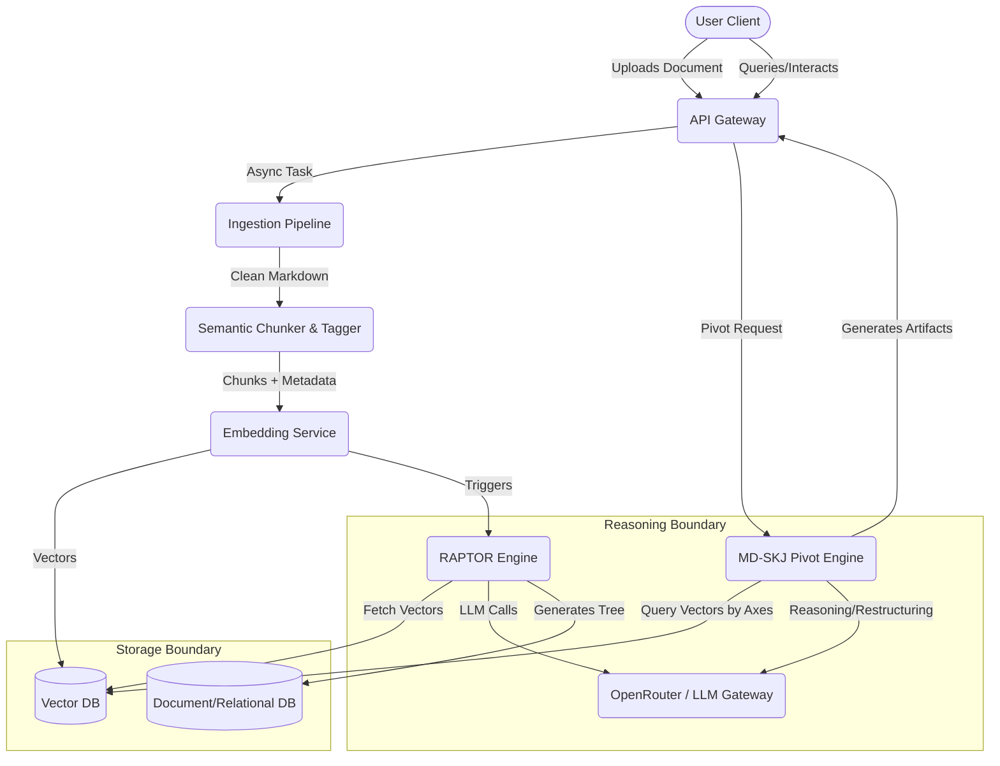

# matome


**matome** ("summary" in Japanese) is a next-generation knowledge workspace that liberates professionals from the pain of digesting massive amounts of information. By integrating cognitive psychology principles (SQ3R, Feynman technique) with advanced AI technologies (RAPTOR, MD-SKJ), matome transforms passive reading into a frictionless, gamified intellectual game.

## Key Features

- **Semantic Zooming & RAPTOR Trees:** Upload hundreds of pages and instantly view a hierarchical, infinite-canvas knowledge map instead of a wall of text.
- **Frictionless Active Learning (SQ3R):** Unlock knowledge nodes by answering adaptive AI questions and "recite" what you've learned using voice input, anchored by real-time hallucination detection (CAHM).
- **Multi-Dimensional Semantic KJ (Pivot KJ):** Instantly dismantle the author's logic and dynamically reconstruct information along new business axes (e.g., SWOT, System Data Flow).
- **Automated Workflow Export:** Automatically generate actionable Requirements Documents (PRDs) and valid Mermaid.js UML diagrams from your reorganized knowledge clusters.

## Architecture Overview

matome leverages a robust, decoupled architecture combining a high-performance React frontend with a FastAPI/LangGraph backend. It parses documents, generates semantic chunks, embeds them into a Vector Database, and builds a recursive hierarchical tree. The Pivot engine then queries this tree dynamically based on user axes to output novel insights.


```mermaid
graph TD
    User([User Client]) --> |Uploads Document| API(API Gateway)
    User --> |Queries/Interacts| API

    API --> |Async Task| Ingest(Ingestion Pipeline)
    Ingest --> |Clean Markdown| Chunker(Semantic Chunker & Tagger)
    Chunker --> |Chunks + Metadata| Embed(Embedding Service)

    Embed --> |Vectors| VectorDB[(Vector DB)]
    Embed --> |Triggers| Raptor(RAPTOR Engine)

    Raptor --> |Fetch Vectors| VectorDB
    Raptor --> |LLM Calls| LLM(OpenRouter / LLM Gateway)
    Raptor --> |Generates Tree| DocDB[(Document/Relational DB)]

    API --> |Pivot Request| Pivot(MD-SKJ Pivot Engine)
    Pivot --> |Query Vectors by Axes| VectorDB
    Pivot --> |Reasoning/Restructuring| LLM
    Pivot --> |Generates Artifacts| API

    subgraph Storage Boundary
        VectorDB
        DocDB
    end

    subgraph Reasoning Boundary
        Raptor
        Pivot
        LLM
    end
```

## Prerequisites

- Python 3.12+
- [uv](https://github.com/astral-sh/uv) package manager
- Valid OpenRouter API Key (or local LLM setup)

## Installation & Setup

Initialize the project using `uv`:

```bash
# Clone the repository
git clone https://github.com/your-org/matome.git
cd matome

# Sync dependencies using uv
uv sync

# Set up your environment variables
cp .env.example .env
# Edit .env and add your OPENROUTER_API_KEY
```

## Usage

Start the system (example command; will be updated as the FastAPI server is implemented):

```bash
uv run python main.py
```

### Quick Start Tutorial

To experience the matome "Aha!" moment immediately, run our interactive Marimo notebook (part of the User Acceptance Tests):

```bash
uv run marimo edit tutorials/UAT_AND_TUTORIAL.py
```

## Development Workflow

We enforce strict code quality using modern Python tooling.

**Run Linters (Ruff):**
```bash
uv run ruff check .
```

**Run Type Checking (Mypy):**
```bash
uv run mypy src
```

**Run Tests:**
```bash
uv run pytest
```

Development is divided into 6 distinct implementation cycles (see `dev_documents/system_prompts/SYSTEM_ARCHITECTURE.md` for details).

## Project Structure

```text
matome/
├── src/
│   ├── api/               # FastAPI controllers and routes
│   ├── domain_models/     # Strict Pydantic models (Chunk, Node, DocumentTree)
│   ├── engines/           # Core logic (Chunker, RAPTOR, Pivot, LLM Gateway)
│   └── utils/             # Security, logging, and helpers
├── tests/                 # Pytest test suite
├── dev_documents/         # Specifications and architecture plans
├── pyproject.toml         # Dependencies and linter configuration
└── main.py                # Application entry point
```

## License

This project is licensed under the MIT License - see the LICENSE file for details.
