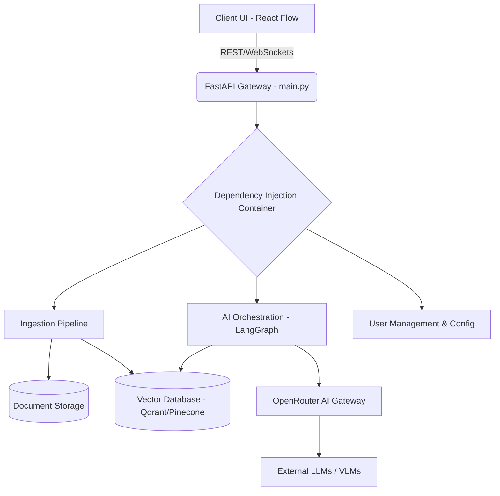

# matome


**matome** ("summary" in Japanese) is an advanced active learning and document analysis platform that liberates humanity from the pain of digesting massive amounts of information. By integrating cognitive psychology principles like the SQ3R method with cutting-edge AI technologies (RAPTOR, GraphRAG, and Multi-Dimensional Semantic KJ), it transforms knowledge acquisition and insight generation into an exhilarating, frictionless intellectual game.

## Key Features

- **Progressive Disclosure & Semantic Zooming:** Mitigate cognitive overload by starting with a high-level mind map (RAPTOR tree) and dynamically increasing resolution only where you focus.
- **Frictionless SQ3R Automation:** Enforces active learning by requiring you to answer AI-generated questions before unlocking deeper nodes, accompanied by satisfying micro-gamification rewards.
- **Pivot KJ (Multi-Dimensional Knowledge Restructuring):** Instantly dismantle the author's original structure and reorganise information along new axes (e.g., SWOT, System Design, Actor vs. State Transition) to generate completely new insights and workflows.
- **Automated Workflow Export:** Seamlessly convert legacy business manuals into modern, AI-validated PRDs and Mermaid.js UML diagrams (sequence diagrams, flowcharts, ER diagrams).
- **Secure & Configurable AI Routing:** Enterprise-ready architecture supporting Bring Your Own Key (BYOK) and granular OpenRouter model selection based on task requirements, ensuring zero data retention for sensitive documents.

## Architecture Overview

The matome system is built on a modern, event-driven, additive architecture that strictly separates concerns between the user interface, the document processing pipeline, and the AI orchestration layer.


```mermaid
graph TD
    A[Client UI - React Flow] -->|REST/WebSockets| B(FastAPI Gateway - main.py)
    B --> C{Dependency Injection Container}
    C --> D[Ingestion Pipeline]
    C --> E[AI Orchestration - LangGraph]
    C --> F[User Management & Config]
    D --> G[(Document Storage)]
    D --> H[(Vector Database - Qdrant/Pinecone)]
    E --> I[OpenRouter AI Gateway]
    I --> J[External LLMs / VLMs]
    E --> H
```

The system uses `main.py` as a lightweight gateway to orchestrate FastAPI routing and dependency injection. Background tasks handle semantic chunking and entity extraction iteratively, storing semantic embeddings in a high-speed vector database. LangGraph orchestrates complex LLM workflows (such as Chain of Density summarisation and Pivot KJ clustering) ensuring high resilience and fault tolerance.

## Prerequisites

- **Python:** 3.12 or higher
- **Package Manager:** [uv](https://github.com/astral-sh/uv)
- **API Keys:** An active [OpenRouter](https://openrouter.ai/) API Key (for external LLM usage)

## Installation & Setup

1. Clone the repository:
   ```bash
   git clone https://github.com/yourusername/matome.git
   cd matome
   ```

2. Install dependencies using `uv`:
   ```bash
   uv sync
   ```

3. Configure your environment variables. Copy the example file and add your keys:
   ```bash
   cp .env.example .env
   # Edit .env and set OPENROUTER_API_KEY=your_key_here
   ```

## Usage

Start the backend server using the main entry point:

```bash
uv run python main.py
```

*Note: The current `main.py` is the baseline entry point. Once the FastAPI cycle is completed, it will expose the REST API at `http://localhost:8000`.*

### Quick Start (Tutorial)
To experience the UAT and tutorial workflow interactively:

```bash
uv run marimo edit tutorials/UAT_AND_TUTORIAL.py
```

## Development Workflow

This project adheres to strict type-checking and linting standards to ensure robustness. Ensure you run the following commands before submitting any changes:

- **Run Linters (Ruff):**
  ```bash
  uv run ruff check .
  ```
- **Format Code (Ruff):**
  ```bash
  uv run ruff format .
  ```
- **Static Type Checking (Mypy):**
  ```bash
  uv run mypy .
  ```
- **Run Tests & Coverage (Pytest):**
  ```bash
  uv run pytest
  ```

Development is divided into 6 distinct implementation cycles, beginning with infrastructure setup and progressing through semantic chunking, RAPTOR tree generation, UI integration, Pivot KJ development, and finally enterprise security hardening.

## Project Structure

```text
.
├── main.py                     # Primary entry point (FastAPI Gateway)
├── pyproject.toml              # Project configuration and linter settings
├── README.md                   # Project documentation
├── src/                        # Source code directory
│   ├── domain/                 # Core Pydantic domain models (IdentityNode, ContentNode)
│   ├── application/            # Business logic and use case orchestrators
│   ├── infrastructure/         # External APIs, VectorDB, and OpenRouter integration
│   └── api/                    # FastAPI routes and dependencies
└── tests/                      # Unit and integration tests
```

## License

This project is licensed under the MIT License.
