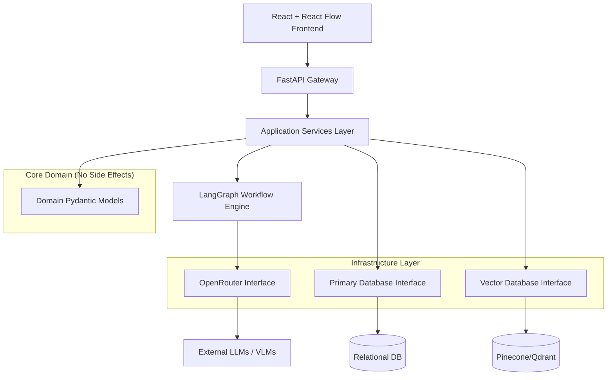

# matome

  

## Project Description

**matome** (Japanese for "summary") is an advanced, AI-powered knowledge workspace designed to transform the painful process of digesting massive documents into an exhilarating intellectual game. It leverages cognitive psychology principles—such as the SQ3R method and Cognitive Load Theory—alongside cutting-edge generative AI technologies like RAPTOR, GraphRAG, and Multi-Dimensional Semantic KJ (MD-SKJ). matome automatically deconstructs and reconstructs complex documents, allowing professionals to build a robust "knowledge network" and seamlessly pivot from passive reading to the rapid output of insights, requirements, and workflows.

## Key Features

*   **Frictionless SQ3R Automation (Active Learning)**: Replaces passive reading with interactive, AI-generated questions and immediate feedback, gamifying the learning process and maximizing retention.
*   **Semantic Zoom UI (Progressive Disclosure)**: Employs a RAPTOR-based hierarchical summary tree. Users start with a high-level overview and dynamically "zoom in" to increase resolution only on areas of interest, eliminating cognitive overload.
*   **Pivot KJ Engine (Multi-Dimensional Reconstruction)**: Automatically dismantles existing documents (the "As-Is" state) and dynamically re-arranges the information along new, user-selected business frameworks (e.g., SWOT, System Actors) to generate new insights (the "To-Be" state).
*   **Automated Artifact Generation**: Seamlessly exports reconstructed knowledge graphs into actionable formats like PRD drafts and UML diagrams (Mermaid.js/PlantUML).
*   **Enterprise-Grade Security & BYOK**: Built with a "Zero-Data Retention" philosophy. It strictly isolates sensitive data, supports Bring Your Own Key (BYOK) configurations, and offers flexible LLM routing via OpenRouter to balance cost and capability.

## Architecture Overview

matome is built using an AC-CDD (Architect-Critic-Coder-Domain-Driven) methodology, enforcing strict separation of concerns through Dependency Injection.

*   **Core Logic**: Encapsulated in pure, strictly validated Pydantic models within the `src/domain_models/` directory, ensuring data integrity without external side effects.
*   **Application Services**: Orchestrate complex workflows (like `RaptorEngine` and `SQ3REngine`) using LangGraph, operating purely on abstract protocols.
*   **Infrastructure Adapters**: Concrete implementations (e.g., `OpenRouterClient`, `PineconeClient`) reside in the `infrastructure/` layer, allowing seamless swapping of underlying technologies (e.g., switching to local LLMs or mock services for testing).


```mermaid
graph TD
    Client[React + React Flow Frontend] --> API[FastAPI Gateway]
    API --> ApplicationServices[Application Services Layer]
    ApplicationServices --> AIOrchestrator[LangGraph Workflow Engine]
    ApplicationServices --> DomainModels[Domain Pydantic Models]

    AIOrchestrator --> LLMAdapter[OpenRouter Interface]
    ApplicationServices --> DBAdapter[Primary Database Interface]
    ApplicationServices --> VectorDBAdapter[Vector Database Interface]

    LLMAdapter --> ExternalLLM[External LLMs / VLMs]
    DBAdapter --> PrimaryDB[(Relational DB)]
    VectorDBAdapter --> VectorDB[(Pinecone/Qdrant)]

    subgraph "Core Domain (No Side Effects)"
        DomainModels
    end

    subgraph "Infrastructure Layer"
        LLMAdapter
        DBAdapter
        VectorDBAdapter
    end
```

## Prerequisites

*   **Python**: 3.12+
*   **Package Manager**: `uv`
*   **API Keys**: OpenRouter API key (required for full AI functionality, configurable via `.env`).

## Installation & Setup

1.  **Clone the repository:**
    ```bash
    git clone <repository_url>
    cd matome
    ```

2.  **Install dependencies using `uv`:**
    ```bash
    uv sync
    ```

3.  **Configure Environment Variables:**
    Copy the example environment file and add your actual keys:
    ```bash
    cp .env.example .env
    # Edit .env and set OPENROUTER_API_KEY=your_actual_key
    ```
    *Note: The system supports a `MATOME_MOCK_MODE=True` environment variable to run deterministically without API keys for testing.*

## Usage

### Running the API Server
To start the FastAPI backend server:
```bash
uv run uvicorn src.main:app --reload
```
The API documentation will be available at `http://127.0.0.1:8000/docs`.

### Interactive UAT & Tutorials
To run the interactive executable notebook (User Acceptance Testing / Tutorial) in headless mode (Mock Mode):
```bash
uv run marimo run tutorials/UAT_AND_TUTORIAL.py --headless
```

## Development Workflow

The project strictly adheres to rigorous code quality and architectural standards.

*   **Running Linters & Formatters (Ruff):**
    ```bash
    uv run ruff check .
    uv run ruff format .
    ```
*   **Type Checking (Mypy):**
    ```bash
    uv run mypy .
    ```
*   **Running Tests (Pytest with Coverage):**
    The project enforces an "Anti-Mock" policy, using custom Test Doubles via the Dependency Injection container instead of `unittest.mock`.
    ```bash
    uv run pytest
    ```

### Implementation Cycles
Development is structured into exactly 6 strictly defined cycles:
1.  **CYCLE01**: Core Domain Models & Configuration Foundation
2.  **CYCLE02**: LLM Interface & OpenRouter Integration
3.  **CYCLE03**: Document Ingestion & Chunking Pipeline
4.  **CYCLE04**: RAPTOR Tree Generation & Summarization
5.  **CYCLE05**: Learning Engine & SQ3R Interactions
6.  **CYCLE06**: Pivot KJ Engine & Export Generation

## Project Structure

```text
matome/
├── src/
│   ├── application/     # Application workflow and DI container
│   ├── config/          # Central configuration loading
│   ├── domain_models/   # Pure Pydantic models (Strict Schema)
│   ├── infrastructure/  # Concrete adapters (OpenRouter, Pinecone)
│   ├── interfaces/      # Abstract Protocols for dependency inversion
│   └── main.py          # FastAPI application entrypoint
├── tests/               # Pytest test suite
├── tutorials/           # Executable Marimo UAT/Tutorial notebooks
├── pyproject.toml       # Project configuration and dependency management
└── README.md            # You are here
```

## License

MIT License. See `LICENSE` file for details.