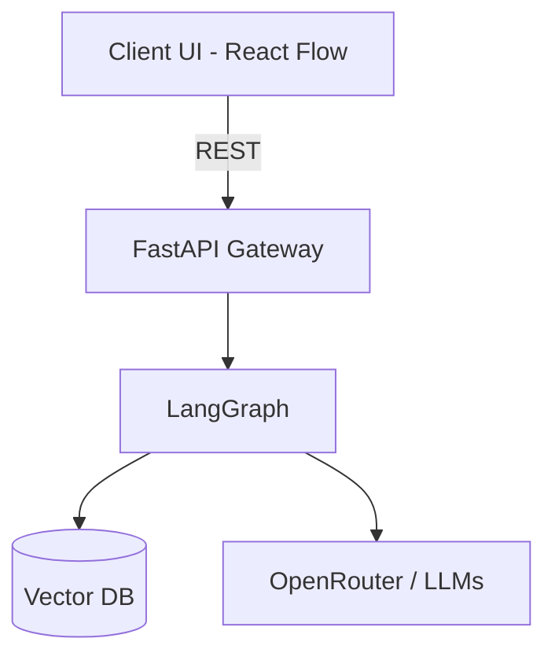

# matome


## Project Description
**matome** is an advanced interactive knowledge workspace designed to liberate users from the pain of digesting massive amounts of text. By seamlessly integrating the latest generative AI, cognitive psychology principles (SQ3R), and high-performance visual interfaces, it transforms static reading into an exhilarating, active learning and knowledge-restructuring experience.

## Key Features
*   **Frictionless Active Learning (SQ3R Automation):** The system automatically locks content and prompts you with questions before reading, ensuring active engagement and drastically improving long-term memory retention.
*   **Semantic Zoom Interface:** Utilises a progressive disclosure UI to prevent cognitive overload. Start with a high-level mind map and zoom smoothly into dense, AI-refined summaries as needed.
*   **Multi-Dimensional Pivot KJ Analysis:** Dynamically restructure your documents. Instantly transform a rigid, chapter-based legacy manual into an agile, actor-vs-state workflow diagram with a single click.
*   **Enterprise-Grade Privacy & BYOK:** Designed with security first. Utilize local inference options or Bring Your Own Key (BYOK) for OpenRouter to ensure your sensitive data is never used for external AI training.

## Architecture Overview
The matome platform employs a modern, decoupled architecture designed for high performance and extensibility.
It uses a React/React Flow frontend to deliver 60fps interactive canvases and a FastAPI Python backend orchestrated by LangGraph. It relies on a Vector Database for semantic chunking and retrieval, and utilizes OpenRouter to dynamically route AI tasks to the most cost-effective models.


```mermaid
graph TD
    UI[Client UI - React Flow] -->|REST| API[FastAPI Gateway]
    API --> Orchestrator[LangGraph]
    Orchestrator --> VectorDB[(Vector DB)]
    Orchestrator --> LLM[OpenRouter / LLMs]
```

## Prerequisites
*   Python 3.12+
*   `uv` package manager
*   OpenRouter API Key (optional for Mock Mode)

## Installation & Setup
```bash
# Clone the repository
git clone https://github.com/your-org/matome.git
cd matome

# Install dependencies using uv
uv sync

# Set up environment variables
cp .env.example .env
# Edit .env and add your OPENROUTER_API_KEY if applicable
```

## Usage
Run the interactive User Acceptance Test (UAT) and tutorial using marimo:
```bash
uv run marimo edit tutorials/UAT_AND_TUTORIAL.py
```

## Development Workflow
The development is divided into 8 structured cycles, focusing on robust testing and clean architecture.
*   **Run tests:** `uv run pytest`
*   **Run linters:** `uv run ruff check .` and `uv run mypy .`

## Project Structure
```text
matome/
├── src/                 # Main application source code
├── tests/               # Unit, integration, and E2E tests
├── dev_documents/       # Specifications and Architecture docs
├── tutorials/           # Interactive UAT notebooks (Marimo)
├── pyproject.toml       # Dependencies and strict linter config
└── README.md            # You are here
```

## License
MIT License
