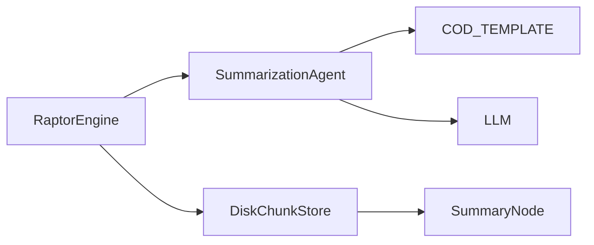

# Cycle 01 Specification: Core Refactoring - Metadata & Strategy Pattern

## 1. Summary

Cycle 01 marks the foundational step in transforming Matome from a static CLI tool into the dynamic "Knowledge Installation" system envisioned in Matome 2.0. The primary objective of this cycle is **Core Refactoring**, specifically targeting the data models and the summarization logic to support the forthcoming Data-Information-Knowledge-Wisdom (DIKW) hierarchy.

Currently, the system operates on a relatively simple `SummaryNode` model and a monolithic `SummarizationAgent`. The agent's logic is tightly coupled with a specific prompt template (`COD_TEMPLATE`), making it difficult to vary the summarization style based on the node's position in the hierarchy (e.g., generating "Wisdom" vs. "Action"). Furthermore, the data model lacks the necessary metadata fields to track which level of the DIKW pyramid a node belongs to, or whether a user has manually refined it.

To address these limitations without disrupting the existing functionality, Cycle 01 will introduce two major architectural patterns:
1.  **The Strategy Pattern for Prompts:** We will decouple the "how" of summarization from the "what". The `SummarizationAgent` will no longer hardcode the prompt template. Instead, it will accept a `PromptStrategy` object. This interface will define methods for generating the prompt string and parsing the LLM's response. This change allows us to seamlessly swap between a "Wisdom Strategy" (for root nodes), a "Knowledge Strategy" (for branches), and an "Action Strategy" (for leaves) in future cycles, while maintaining a single, clean agent class.
2.  **Enhanced Metadata Schema:** We will upgrade the `SummaryNode` Pydantic model. The `metadata` field, currently a flexible dictionary, will be standardized to include `dikw_level` (enum), `is_user_edited` (boolean), and `prompt_history` (list). This ensures that every node carries its own semantic context and edit history, which is crucial for the interactive refinement features planned for Cycle 03 and 05.

Critically, this cycle is designed to be **backward compatible**. The default `PromptStrategy` implemented in this cycle (`BaseSummaryStrategy`) will replicate the existing Chain of Density (CoD) logic. Similarly, the new metadata fields will have sensible defaults (e.g., `dikw_level="data"` or `None`) so that existing databases or pipelines don't break. The `DiskChunkStore` will also be updated to ensure these new fields are correctly serialized and deserialized from the SQLite database.

By the end of Cycle 01, the system will look identical from the outside (CLI output remains the same), but the internal architecture will be flexible enough to support the complex semantic zooming and interactive features of Matome 2.0. This "refactor-first" approach minimizes technical debt and reduces the risk of regressions when we later implement the more complex DIKW generation logic.

## 2. System Architecture

The architecture for Cycle 01 focuses on modifying the *Core Application Logic* and *Data Layer* components within the `src/matome` package. The changes are localized to `agents/`, `domain_models/`, and `utils/`.

### 2.1. Updated File Structure

The following ASCII tree illustrates the file structure for Cycle 01. Files marked in **bold** are new or will be significantly modified.

```ascii
src/matome/
├── __init__.py
├── agents/
│   ├── __init__.py
│   ├── **summarizer.py**       # MODIFIED: Refactor to use PromptStrategy
│   ├── **strategies.py**       # NEW: Define PromptStrategy Protocol and Base Implementation
│   └── verifier.py
├── engines/
│   ├── __init__.py
│   ├── chunker.py
│   ├── cluster.py
│   ├── embedder.py
│   ├── raptor.py
│   ├── semantic_chunker.py
│   └── token_chunker.py
├── utils/
│   ├── __init__.py
│   ├── prompts.py              # MODIFIED: Move COD_TEMPLATE to strategies.py (or keep as const)
│   ├── **store.py**            # MODIFIED: Ensure Metadata serialization works
│   └── compat.py
├── config.py
├── interfaces.py
└── main.py

src/domain_models/
├── __init__.py
├── **manifest.py**             # MODIFIED: Update SummaryNode with new fields
├── **metadata.py**             # NEW: Define NodeMetadata and DIKWLevel Enum
└── types.py
```

### 2.2. Component Interaction Changes

#### Before Cycle 01:


#### After Cycle 01:
```mermaid
graph LR
    RaptorEngine --> SummarizationAgent
    SummarizationAgent --> PromptStrategy
    PromptStrategy <|.. BaseSummaryStrategy
    BaseSummaryStrategy --> COD_TEMPLATE
    SummarizationAgent --> LLM
    RaptorEngine --> DiskChunkStore
    DiskChunkStore --> SummaryNode
    SummaryNode --> NodeMetadata
```

1.  **RaptorEngine:** Remains largely unchanged in this cycle, but it instantiates `SummarizationAgent` potentially with a default strategy.
2.  **SummarizationAgent:** Now requires a `strategy` argument (or defaults to `BaseSummaryStrategy`). Its `summarize` method delegates prompt construction to `strategy.generate_prompt(text)` and parsing to `strategy.parse_response(response)`.
3.  **PromptStrategy (Protocol):** Defines the contract.
    *   `model_name: str` (Optional, to suggest model)
    *   `generate_prompt(context: str, **kwargs) -> str`
    *   `parse_response(response: str) -> str`
4.  **BaseSummaryStrategy:** Implements `PromptStrategy`. It holds the logic currently inside `SummarizationAgent` (using `COD_TEMPLATE`).
5.  **SummaryNode:** The `metadata` field is now strictly typed or validated against `NodeMetadata`.
6.  **DiskChunkStore:** The `_add_nodes` and `get_node` methods must ensure that the complex `metadata` object is correctly converted to/from JSON when stored in the `content` column of the SQLite table.

### 2.3. Data Flow for Summarization

1.  **Request:** `RaptorEngine` calls `summarizer.summarize(text)`.
2.  **Strategy Selection:** `SummarizationAgent` uses its injected `strategy`.
3.  **Prompt Generation:** `strategy.generate_prompt(text)` creates the string (e.g., "Summarize this...").
4.  **LLM Call:** `SummarizationAgent` calls `self.llm.invoke(messages)`.
5.  **Parsing:** `strategy.parse_response(response_content)` cleans up the output.
6.  **Result:** `SummarizationAgent` returns the clean summary string.

This flow effectively isolates the "Prompt Engineering" aspect into the `strategies.py` module, making the Agent a pure "LLM Client".

## 3. Design Architecture

This section details the Pydantic models and Protocols that will drive the new architecture.

### 3.1. Domain Models (`src/domain_models/metadata.py` & `manifest.py`)

We need a robust schema for metadata to support the DIKW hierarchy.

```python
# src/domain_models/metadata.py

from enum import Enum
from pydantic import BaseModel, Field, ConfigDict
from typing import Literal

class DIKWLevel(str, Enum):
    """
    The Semantic Zooming Level.
    Wisdom: L1 (Root) - Abstract, Philosophical.
    Knowledge: L2 (Branches) - Structural, Explanatory.
    Information: L3 (Twigs) - Actionable, Procedural.
    Data: L4 (Leaves) - Raw Evidence.
    """
    WISDOM = "wisdom"
    KNOWLEDGE = "knowledge"
    INFORMATION = "information"
    DATA = "data"

class NodeMetadata(BaseModel):
    """
    Standardized metadata for SummaryNodes.
    """
    model_config = ConfigDict(extra="allow") # Allow extra fields for backward compatibility

    dikw_level: DIKWLevel | None = Field(
        default=None,
        description="The abstraction level of this node."
    )
    is_user_edited: bool = Field(
        default=False,
        description="True if the user has manually refined this node. Prevents auto-overwrite."
    )
    prompt_history: list[str] = Field(
        default_factory=list,
        description="History of prompts used to generate/refine this node."
    )
    # Origin fields (existing use cases)
    cluster_id: int | str | None = None
    source_chunk_indices: list[int] | None = None
```

```python
# src/domain_models/manifest.py modification

from domain_models.metadata import NodeMetadata

class SummaryNode(BaseModel):
    # ... existing fields ...
    # metadata: Metadata = Field(...)  <-- CHANGE THIS
    metadata: NodeMetadata = Field(
        default_factory=NodeMetadata,
        description="Structured metadata including DIKW level."
    )
```

**Key Constraints & Invariants:**
*   **Validation:** `dikw_level` must be a valid enum member if present.
*   **Immutability:** `is_user_edited` should only be toggled by the `InteractiveRaptorEngine` (in Cycle 03), but the model supports it now.
*   **Serialization:** When `SummaryNode` is dumped to JSON for SQLite storage, `NodeMetadata` must be serialized properly. Pydantic handles this, but `DiskChunkStore` checks strictly for dicts in some places. We need to ensure `model_dump()` is used.

### 3.2. Prompt Strategy Protocol (`src/matome/agents/strategies.py`)

```python
from typing import Protocol, runtime_checkable

@runtime_checkable
class PromptStrategy(Protocol):
    """
    Protocol defining how to generate prompts and parse responses.
    """

    def generate_prompt(self, context: str, **kwargs) -> str:
        """
        Create the prompt string for the LLM.
        """
        ...

    def parse_response(self, response: str) -> str:
        """
        Parse the LLM response (e.g., remove Chain-of-Thought, extract JSON).
        """
        ...
```

### 3.3. Base Implementation

```python
class BaseSummaryStrategy:
    """
    Legacy strategy implementing Chain of Density (CoD).
    """
    def generate_prompt(self, context: str, **kwargs) -> str:
        from matome.utils.prompts import COD_TEMPLATE
        return COD_TEMPLATE.format(context=context)

    def parse_response(self, response: str) -> str:
        # Basic cleanup if needed
        return response.strip()
```

## 4. Implementation Approach

The implementation will be executed in a strict sequence to ensure stability.

### Step 1: Create `src/domain_models/metadata.py`
*   Define the `DIKWLevel` enum and `NodeMetadata` class.
*   This is a new file, so it won't break anything immediately.

### Step 2: Update `src/domain_models/manifest.py`
*   Import `NodeMetadata`.
*   Update `SummaryNode.metadata` type hint from `dict` (or `Metadata` alias) to `NodeMetadata`.
*   **Critical:** Ensure backward compatibility. If `Metadata` was `dict[str, Any]`, passing a dict to `SummaryNode` constructor should still work if Pydantic casts it. We might need `model_validator(mode='before')` to convert raw dicts to `NodeMetadata` if Pydantic doesn't do it automatically for nested models (it usually does).
*   **Verification:** Run existing tests. They might fail if they pass arbitrary keys that are not allowed in `NodeMetadata` (unless `extra='allow'`). I set `extra='allow'` to handle this.

### Step 3: Create `src/matome/agents/strategies.py`
*   Define the `PromptStrategy` Protocol.
*   Implement `BaseSummaryStrategy`.
*   Copy `COD_TEMPLATE` logic (or import it).

### Step 4: Refactor `src/matome/agents/summarizer.py`
*   Update `SummarizationAgent.__init__` to accept `strategy: PromptStrategy | None = None`.
*   If `None`, instantiate `BaseSummaryStrategy`.
*   Update `summarize` method to use `self.strategy.generate_prompt` and `self.strategy.parse_response`.
*   Remove direct usage of `COD_TEMPLATE` inside the agent.
*   **Verification:** This is the most risky step. Run all tests immediately.

### Step 5: Update `src/matome/utils/store.py`
*   Review `DiskChunkStore._add_nodes` and `get_node`.
*   When reading from DB (`json.loads(content_json)`), the dict is passed to `SummaryNode.model_validate`. Pydantic V2 handles nested model validation.
*   The `content` column in SQLite stores the JSON dump of the node. `model_dump_json` handles nested models.
*   So minimal changes might be needed here, but explicit testing is required to ensure `metadata` isn't lost or corrupted.

## 5. Test Strategy

### 5.1. Unit Testing Approach (Min 300 words)
Unit tests will focus on the new components and the refactored agent.

*   **Metadata Validation:**
    *   Create a test file `tests/unit/test_metadata.py`.
    *   Test `NodeMetadata` instantiation with valid/invalid `dikw_level`.
    *   Test `SummaryNode` instantiation with a raw dict for metadata to ensure auto-conversion works.
    *   Test `extra` fields handling: Pass `{'cluster_id': 123, 'random_field': 'test'}` and ensure it's accepted (due to `extra='allow'`).
*   **Strategy Protocol:**
    *   Create `tests/unit/test_strategies.py`.
    *   Test `BaseSummaryStrategy`: Ensure it formats `COD_TEMPLATE` correctly with the input context.
    *   Test `parse_response`: Ensure it handles whitespace or simple formatting issues.
*   **Summarization Agent:**
    *   Update `tests/unit/test_summarizer.py`.
    *   **Mocking:** Use `unittest.mock` to mock the `strategy` object passed to the agent.
    *   **Verify Delegation:** Call `agent.summarize("text")`. Assert that `mock_strategy.generate_prompt` was called with "text". Assert that `mock_strategy.parse_response` was called with the LLM output.
    *   **Fallback:** Test that if no strategy is provided, `BaseSummaryStrategy` is used.

### 5.2. Integration Testing Approach (Min 300 words)
Integration tests will ensure the components work together and the DB persistence is correct.

*   **Store Persistence:**
    *   Update `tests/integration/test_store.py` (or similar).
    *   Create a `SummaryNode` with specific DIKW metadata (`level=DIKWLevel.WISDOM`, `is_user_edited=True`).
    *   Add it to `DiskChunkStore`.
    *   Retrieve it immediately.
    *   **Assertion:** Verify that the retrieved node's metadata is an instance of `NodeMetadata` and the values match. This confirms that JSON serialization/deserialization in SQLite works for the nested model.
*   **End-to-End Pipeline (Refactoring Safety):**
    *   Run `tests/integration/test_raptor_pipeline.py`.
    *   This test likely runs the full `RaptorEngine`. Since `RaptorEngine` uses `SummarizationAgent`, and we refactored the Agent, this test must pass to prove we didn't break the existing flow.
    *   If `RaptorEngine` manually constructs `SummaryNode` (which it does), verify it doesn't fail due to metadata strictness.
*   **Migration Test (Simulated):**
    *   Although we don't have a real migration tool yet, we should verify that if `metadata` is `None` or an empty dict (simulating old data), the `SummaryNode` defaults are applied correctly (e.g., `dikw_level=None`).

This strategy ensures that the "Refactoring" goal is met with high confidence before we start building new features in Cycle 02.
