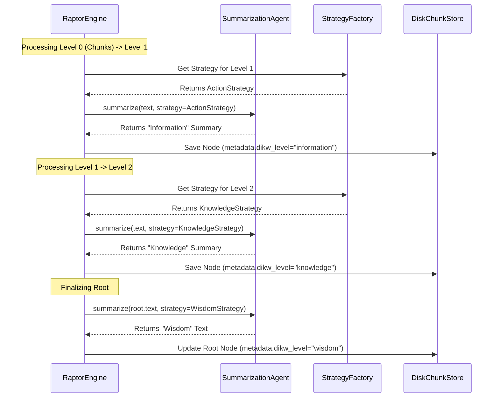

# Cycle 02 Specification: DIKW Generation Engine

## 1. Summary

Building upon the core refactoring in Cycle 01, Cycle 02 focuses on the "Brain" of Matome 2.0: the **DIKW Generation Engine**. This cycle implements the "Semantic Zooming" logic by creating specialized prompt strategies for Wisdom, Knowledge, and Information, and integrating them into the RAPTOR pipeline.

Currently, the system uses a single summarization style (Chain of Density) regardless of the hierarchy level. This results in "fractal repetition" where a high-level summary looks just like a low-level one, only broader. The goal of this cycle is to break this pattern. We will implement three distinct strategies:
1.  **ActionStrategy (Information - L1):** Transforming raw data chunks into actionable checklists, how-to guides, and concrete procedures.
2.  **KnowledgeStrategy (Knowledge - L2+):** Synthesizing information into structural mental models, frameworks, and "Why" explanations.
3.  **WisdomStrategy (Wisdom - Root):** Distilling knowledge into profound, memorable aphorisms or guiding principles (20-50 chars).

To achieve this, we will modify the `RaptorEngine` to select the appropriate strategy dynamically during the recursive summarization process. Since RAPTOR builds the tree bottom-up (Data -> L1 -> L2...), we can map strategies to levels: Level 1 generation uses `ActionStrategy`, subsequent levels use `KnowledgeStrategy`, and the final Root Node is post-processed with `WisdomStrategy` to ensure the "Aha!" moment.

By the end of Cycle 02, the CLI `run` command will produce a `DocumentTree` where nodes are semantically distinct based on their level, and the `chunks.db` will be populated with this rich, multi-layered content. This completes the "Generation" phase of the project, setting the stage for the "Interactive" phase.

## 2. System Architecture

The architecture for Cycle 02 expands the `agents/` and `engines/` modules.

### 2.1. Updated File Structure

```ascii
src/matome/
├── agents/
│   ├── strategies.py       # MODIFIED: Add Wisdom, Knowledge, Action strategies
│   └── summarizer.py
├── engines/
│   ├── raptor.py           # MODIFIED: Logic to inject strategies per level
│   └── ...
├── utils/
│   └── prompts.py          # MODIFIED: Add new templates (WISDOM_PROMPT, etc.)
└── ...
```

### 2.2. Component Interaction



## 3. Design Architecture

### 3.1. Prompt Strategies (`src/matome/agents/strategies.py`)

We will implement three new classes conforming to `PromptStrategy` Protocol.

1.  **`ActionStrategy`**:
    *   **Goal:** Convert text into "How-to" or "Checklist".
    *   **Prompt:** "Extract actionable steps... format as markdown checklist... ignore theory."
    *   **Parsing:** Ensure output starts with `- [ ]` or similar.

2.  **`KnowledgeStrategy`**:
    *   **Goal:** Explain "Why" and "Structure".
    *   **Prompt:** "Identify the underlying framework... explain the mechanism... use analogies."
    *   **Parsing:** Standard text.

3.  **`WisdomStrategy`**:
    *   **Goal:** One profound sentence.
    *   **Prompt:** "Distill this into a single aphorism... max 50 characters... be provocative."
    *   **Parsing:** Strict length check? Or just trimming.

### 3.2. Raptor Engine Logic (`src/matome/engines/raptor.py`)

The `RaptorEngine` needs a `strategy_selector` logic.

```python
def get_strategy_for_level(target_level: int) -> PromptStrategy:
    if target_level == 1:
        return ActionStrategy()
    return KnowledgeStrategy() # Default for intermediate levels
```

The `_summarize_clusters` method in `RaptorEngine` currently instantiates `SummarizationAgent` (or uses a shared one). If it uses a shared one, we must update the agent's strategy *before* calling `summarize`, or pass the strategy *to* `summarize`.
*   *Design Choice:* The `SummarizationAgent.summarize` method should probably accept an optional `strategy` override. This is cleaner than mutating the agent state.
*   *Refinement:* `SummarizationAgent.summarize(text, config, strategy=None)`.

### 3.3. Root Post-Processing

Standard RAPTOR might end at Level 2 (Knowledge). But we want the Root to be Wisdom.
*   **Logic:** After the recursive loop terminates and we have a single root, we apply `WisdomStrategy` to it.
*   **Edge Case:** If the document is short (1 chunk), the chunk is the root. We still want Wisdom. So we summarize the single chunk with `WisdomStrategy`.

## 4. Implementation Approach

### Step 1: Define Prompts (`src/matome/utils/prompts.py`)
*   Create `ACTION_TEMPLATE`: Focus on verbs, checklists.
*   Create `KNOWLEDGE_TEMPLATE`: Focus on nouns, concepts, relationships.
*   Create `WISDOM_TEMPLATE`: Focus on insight, brevity, impact.

### Step 2: Implement Strategies (`src/matome/agents/strategies.py`)
*   Implement `ActionStrategy`, `KnowledgeStrategy`, `WisdomStrategy`.
*   Each implementation uses the corresponding template.

### Step 3: Update `SummarizationAgent` (`src/matome/agents/summarizer.py`)
*   Modify `summarize` signature: `def summarize(self, text: str, config=None, strategy: PromptStrategy | None = None) -> str`.
*   If `strategy` is provided, use it. Else use `self.strategy` (default).

### Step 4: Update `RaptorEngine` (`src/matome/engines/raptor.py`)
*   Modify `_summarize_clusters` loop.
    *   Determine `target_level`.
    *   Select strategy: `Action` if level 1, `Knowledge` otherwise.
    *   Pass strategy to `summarizer.summarize`.
    *   Set `dikw_level` in metadata when creating `SummaryNode`.
*   Modify `_finalize_tree` (or end of `run`):
    *   Take the final root node.
    *   Re-summarize its content using `WisdomStrategy`.
    *   Update root node text and set `dikw_level="wisdom"`.
    *   Save updated root to store.

## 5. Test Strategy

### 5.1. Unit Testing Approach (Min 300 words)
*   **Strategy Output:**
    *   Test `ActionStrategy`: Feed a paragraph of text. Mock LLM response with a checklist. Verify parsing.
    *   Test `WisdomStrategy`: Feed a paragraph. Mock LLM response with a short sentence. Verify.
*   **Agent Override:**
    *   Test `SummarizationAgent.summarize(..., strategy=CustomStrategy())`. Verify `CustomStrategy` is used instead of default.
*   **Raptor Logic:**
    *   Test `_finalize_tree` logic (mocked). Ensure that even if the tree generation produces a "Knowledge" root, the final step converts it to "Wisdom".

### 5.2. Integration Testing Approach (Min 300 words)
*   **Full Pipeline Run:**
    *   Run `matome run` on `sample.txt`.
    *   **Verify Hierarchy:**
        *   Load `chunks.db`.
        *   Get Root. Assert `metadata.dikw_level == "wisdom"`. Assert text length < 100 chars (heuristic).
        *   Get Level 1 nodes. Assert `metadata.dikw_level == "information"`. Assert text contains "- [ ]" (heuristic check for checklist).
        *   Get Level 2 nodes (if any). Assert `metadata.dikw_level == "knowledge"`.
*   **Content Consistency:**
    *   Manual check (via `view_text` in test): Does the Wisdom summary actually reflect the document? (Hard to automate, but basic meaningfulness check).
*   **Performance:**
    *   Ensure that swapping strategies doesn't add significant overhead (other than LLM latency).

This cycle completes the backend logic for DIKW.
