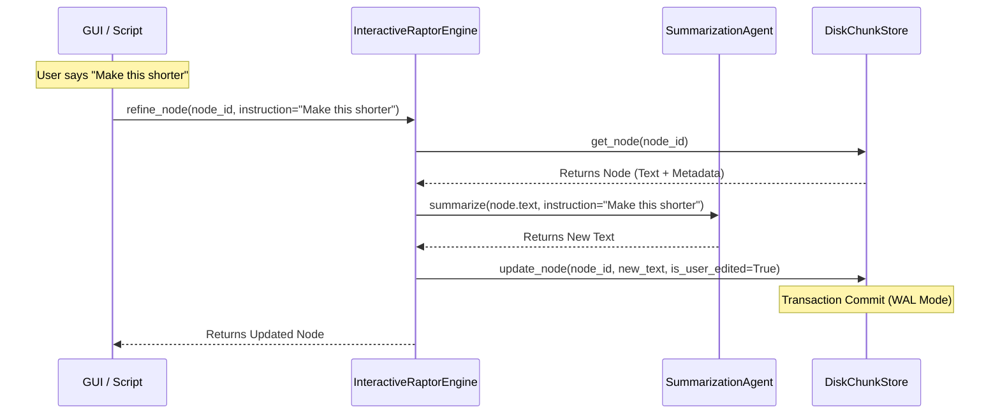

# Cycle 03 Specification: Interactive Engine & Concurrency

## 1. Summary

Cycle 03 focuses on the "Backend" infrastructure required to support the interactive GUI. While Cycle 01 and 02 established the data model and generation logic, the system is still fundamentally a batch processor. To enable the "Matome Canvas" experience, we need a controller that can handle granular, user-initiated updates to the document tree in real-time, without blocking or corrupting the database.

The core deliverable of this cycle is the `InteractiveRaptorEngine`. Unlike the standard `RaptorEngine`, which runs a recursive loop from start to finish, the `InteractiveRaptorEngine` is designed for random access. It provides methods like `refine_node(node_id, instruction)` to regenerate specific parts of the tree based on user feedback. This engine will act as the bridge between the future GUI (Cycle 04) and the data layer.

Concurrency is a major concern here. The GUI will be reading from the database (to display the tree) potentially at the same time a background process or another user action is writing to it. We must harden the `DiskChunkStore` implementation to ensure thread safety. This involves explicitly enabling SQLite's Write-Ahead Logging (WAL) mode and implementing robust context managers for transaction handling.

By the end of Cycle 03, we will have a Python API that allows us to load an existing `chunks.db`, navigate the tree programmatically, and update nodes with new instructions, all while maintaining data integrity. This "headless" interactive engine is a prerequisite for the visual interface.

## 2. System Architecture

The architecture introduces a new engine class and enhances the storage utility.

### 2.1. Updated File Structure

```ascii
src/matome/
├── engines/
│   ├── **interactive.py**  # NEW: InteractiveRaptorEngine
│   ├── raptor.py
│   └── ...
├── utils/
│   ├── **store.py**        # MODIFIED: Concurrency hardening
│   └── ...
└── ...
```

### 2.2. Component Interaction



## 3. Design Architecture

### 3.1. InteractiveRaptorEngine (`src/matome/engines/interactive.py`)

This class wraps the `DiskChunkStore` and `SummarizationAgent`.

```python
class InteractiveRaptorEngine:
    def __init__(self, store: DiskChunkStore, agent: SummarizationAgent):
        self.store = store
        self.agent = agent

    def refine_node(self, node_id: str, instruction: str) -> SummaryNode:
        """
        Regenerate a specific node based on user instruction.
        """
        node = self.store.get_node(node_id)
        if not node:
            raise ValueError(f"Node {node_id} not found")

        # Determine strategy based on instruction (simplified for now, or use a RefineStrategy)
        # For Cycle 03, we might just pass the instruction as an additional prompt context
        # or use a specific 'RefinementStrategy' that takes the instruction.

        # Let's say we have a generic RefinementStrategy
        strategy = RefinementStrategy(instruction=instruction)

        # We re-summarize the *children* of this node?
        # Or just rewrite the current text?
        # Refinement usually means "Rewrite this text".
        # But to be accurate, we should ideally look at the source (children).
        # For efficiency, we might just rewrite the current text if the instruction is stylistic.
        # If instruction is "Add more detail", we might need children.
        # For simplicity in Cycle 03: Rewrite current text + Context from children if available.

        # Implementation Detail:
        # 1. Get Children Texts (if possible) -> context
        # 2. Call Agent with context + instruction

        new_text = self.agent.summarize(
            context=self._get_children_text(node),
            strategy=strategy
        )

        # Update Node
        node.text = new_text
        node.metadata.is_user_edited = True
        node.metadata.prompt_history.append(instruction)

        self.store.update_node(node)
        return node

    def _get_children_text(self, node: SummaryNode) -> str:
        # Helper to fetch children content
        ...
```

### 3.2. DiskChunkStore Concurrency (`src/matome/utils/store.py`)

*   **WAL Mode:** Ensure `PRAGMA journal_mode=WAL` is set on every connection (or at least consistently).
*   **Transaction Scope:** Use `with self.engine.begin() as conn:` strictly for writes.
*   **Connection Pooling:** Ensure `QueuePool` is configured correctly for threading (`check_same_thread=False` for SQLite if needed, though SQLAlchemy usually handles this).

## 4. Implementation Approach

### Step 1: Enhance `DiskChunkStore`
*   Verify `connect_args={'check_same_thread': False}` for SQLite engine creation (essential for concurrent access in GUI frameworks).
*   Add `update_node(self, node: SummaryNode)` method (currently only `update_node_embedding` exists).
*   Ensure `get_node` and `update_node` are atomic.

### Step 2: Implement `RefinementStrategy`
*   In `src/matome/agents/strategies.py`, add a strategy that takes an `instruction` and applies it to the context.
*   Prompt: "Original Context: {context}\nUser Instruction: {instruction}\nRewrite the summary..."

### Step 3: Implement `InteractiveRaptorEngine`
*   Create the class.
*   Implement `refine_node`.
*   Implement `get_children(node_id)` and `get_parent(node_id)` helpers (traversal).

## 5. Test Strategy

### 5.1. Unit Testing Approach (Min 300 words)
*   **Refinement Logic:**
    *   Mock `store` and `agent`.
    *   Call `refine_node`.
    *   Verify `agent.summarize` is called with the instruction.
    *   Verify `store.update_node` is called with the new text and `is_user_edited=True`.
*   **Store Updates:**
    *   Test `store.update_node` with a modified node.
    *   Fetch it back and assert changes.

### 5.2. Integration Testing Approach (Min 300 words)
*   **Concurrency Stress Test:**
    *   Create a script that spawns 5 threads.
    *   Threads 1-3: Randomly read nodes.
    *   Threads 4-5: Randomly update nodes (refine).
    *   Run for 10 seconds.
    *   **Assert:** No `OperationalError` (database locked).
    *   **Assert:** Data consistency (no partial writes).
*   **Refinement Data Flow:**
    *   Create a tree.
    *   Refine the Root Node.
    *   Check `chunks.db`.
    *   Restart the "app" (reload store).
    *   Verify the refined text persists.

This cycle ensures that when we put a GUI on top, the backend won't crumble under the weight of state management and concurrent requests.
