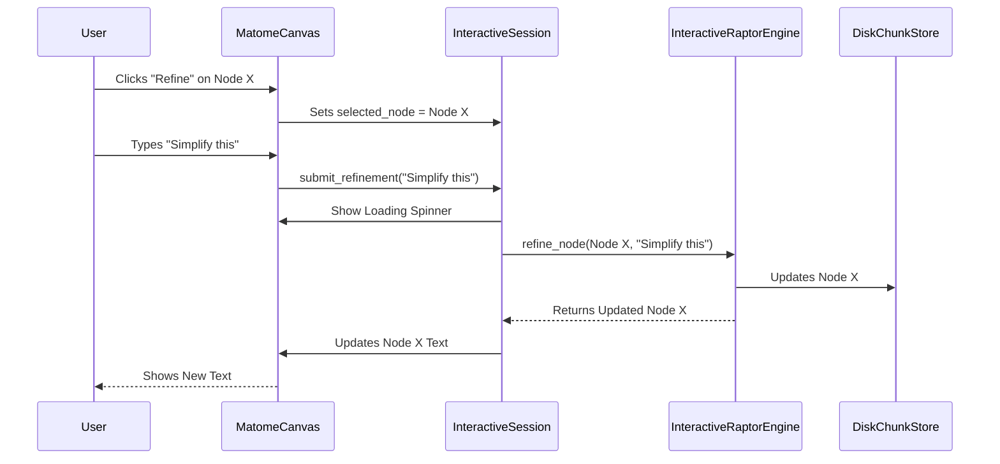

# Cycle 05 Specification: Semantic Zooming & Refinement

## 1. Summary

Cycle 05 is the culmination of the Matome 2.0 project, delivering the full **Interactive Knowledge Installation** experience. In this final cycle, we connect all the pieces developed previously—the DIKW generation (Cycle 02), the interactive engine (Cycle 03), and the GUI foundation (Cycle 04)—to create a truly dynamic user interface.

The core features to be implemented are:
1.  **Semantic Zooming (Drill-Down):** Users can click on the Root (Wisdom) node to reveal its supporting branches (Knowledge), and further click on those to reveal the leaves (Information). This navigation mimics the cognitive process of "zooming in" for details.
2.  **Interactive Refinement (Chat):** Users can select any node and provide natural language feedback (e.g., "Make this less technical"). The system will re-generate that specific node in real-time using the `InteractiveRaptorEngine` and update the UI instantly.

This cycle focuses heavily on the `ui/` package, expanding the `MatomeCanvas` and `InteractiveSession` to handle complex state changes and asynchronous updates. We will use Panel's advanced features (like `pn.chat.ChatInterface` or custom input widgets) to facilitate the refinement dialogue.

By the end of Cycle 05, the application will fully satisfy the "Knowledge Installation" vision: a tool where users don't just read summaries, but actively curate and internalize them.

## 2. System Architecture

### 2.1. Updated File Structure

```ascii
src/matome/
├── ui/
│   ├── view_model.py       # MODIFIED: Add drill_down logic, refinement actions
│   ├── components.py       # MODIFIED: Add RefinementWidget, DrillDownLayout
│   └── app.py
└── ...
```

### 2.2. Component Interaction (Refinement Loop)



## 3. Design Architecture

### 3.1. ViewModel Enhancements (`InteractiveSession`)

```python
class InteractiveSession(param.Parameterized):
    # ... existing ...
    expanded_nodes: set[str] = param.List(default=[]) # Track open branches
    is_processing: bool = param.Boolean(default=False)

    def toggle_node(self, node_id: str):
        """Expand or collapse a node's children."""
        if node_id in self.expanded_nodes:
            self.expanded_nodes.remove(node_id)
        else:
            self.expanded_nodes.append(node_id)
        # Trigger update

    def refine_current_node(self, instruction: str):
        """Async method to call engine."""
        if not self.selected_node_id:
            return

        self.is_processing = True
        try:
            # We need to run this in a thread or async task to not block UI
            updated_node = self.engine.refine_node(self.selected_node_id, instruction)
            # Update local cache/state to reflect change
            # Trigger UI refresh
        finally:
            self.is_processing = False
```

### 3.2. View Enhancements (`MatomeCanvas`)

We need a recursive layout or a flexible grid to show the tree.
A simple approach for Cycle 05 is a **Column of Rows**:
*   Row 1: Wisdom (Root)
*   Row 2: Children of Wisdom (Knowledge) - Visible if Wisdom is expanded.
*   Row 3: Children of Selected Knowledge - Visible if Knowledge is expanded.

Alternatively, a **Miller Columns** (Finder-like) layout or a **Tree View**. For simplicity and clarity of text, a **Vertical Accordion** or **Nested Cards** might be best. Panel's `pn.Column` is recursive-friendly.

**Refinement Widget:**
A `pn.widgets.TextInput` and `pn.widgets.Button` that appear when a node is selected. Or a modal dialog.

## 4. Implementation Approach

### Step 1: Implement Drill-Down Logic
*   Update `InteractiveSession` to fetch children of a node.
*   Update `MatomeCanvas` to render children dynamically.
*   Use `pn.Column` to stack levels.

### Step 2: Implement Refinement UI
*   Add a "Edit" button to each `NodeCard`.
*   When clicked, show a `TextInput` area (or switching the card to "Edit Mode").
*   Bind the "Submit" action to `session.refine_current_node`.

### Step 3: Async Feedback
*   Use `pn.state.execute` or `await` if using async handlers to prevent freezing the GUI during LLM generation.
*   Show a progress indicator (`pn.indicators.LoadingSpinner`).

## 5. Test Strategy

### 5.1. Unit Testing Approach (Min 300 words)
*   **ViewModel Navigation:**
    *   Test `toggle_node`. Verify `expanded_nodes` set changes.
    *   Test `refine_current_node`. Mock the engine. Verify `is_processing` toggles `True` -> `False`.
*   **UI Logic:**
    *   Test that clicking a "Expand" button on a mock `NodeCard` calls `session.toggle_node`.

### 5.2. Integration Testing Approach (Min 300 words)
*   **Full User Journey (Manual/Playwright):**
    *   Launch App.
    *   **Zoom:** Click Root. See Knowledge nodes appear.
    *   **Refine:** Click a Knowledge node. Click "Edit". Type "Make shorter". Click "Go".
    *   **Verify:** Spinner appears. After ~2-5s (LLM time), text updates.
    *   **Persist:** Reload page. Verify text remains updated.
    *   **Sanity:** Verify the "Wisdom" node didn't change (unless we edited it).

This cycle completes the software development.
