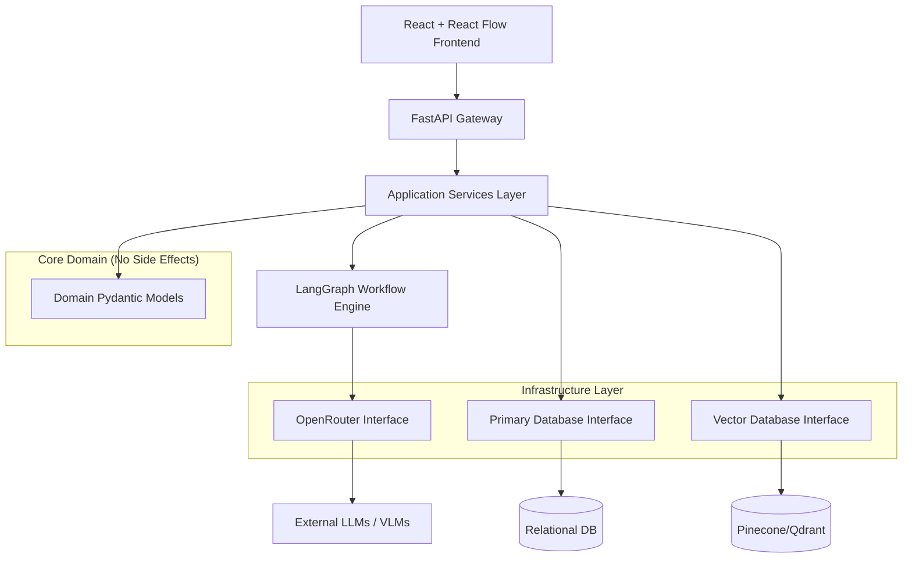

# System Architecture: matome

## Summary
The "matome" project is an advanced, AI-powered knowledge workspace designed to seamlessly integrate cognitive psychology principles with cutting-edge generative AI technologies. It aims to completely reinvent how professionals interact with massive amounts of text data, transforming the passive consumption of long documents into a "frictionless active learning platform." This system leverages RAPTOR, GraphRAG, and Multi-Dimensional Semantic KJ (MD-SKJ) techniques to deconstruct, analyse, and reconstruct complex documents. The ultimate goal is to facilitate both learning and the rapid synthesis of insights such as system requirements, business workflows, and research outlines. The architecture is engineered to be scalable, responsive, and deeply customisable while maintaining strict enterprise-grade security and privacy. This architecture will build upon the existing domain models, ensuring seamless integration of the new capabilities with minimal disruption to the established foundation. We will use a modular, Dependency-Injection based Python backend and a React Flow frontend.

## System Design Objectives
The primary objective of the matome architecture is to solve the critical pain points of cognitive overload, passive learning inefficiency, and the "As-Is trap" when analysing existing documentation. To achieve this, the system must satisfy several stringent design objectives:

1.  **Ultra-High Performance & Low Latency**: The system must process massive documents efficiently, maintaining a 60fps experience on the frontend even with thousands of nodes, and delivering AI feedback in under 2.5 seconds. Time To First Token (TTFT) from LLMs must remain under 1.0 second. This requires asynchronous processing, background task queues, and intelligent frontend rendering strategies.
2.  **Modular & Extensible AI Integration**: The architecture must support seamless switching and routing of various Large Language Models (LLMs) and Vision-Language Models (VLMs) via OpenRouter. This allows the system to balance cost, speed, and reasoning capabilities depending on the specific task (e.g., fast models for chunking, deep reasoning models for insight generation).
3.  **Strict Data Privacy & Security**: Enterprise users require absolute certainty that their data will not be used to train public models. The system must support Bring Your Own Key (BYOK) configurations, strong encryption for credentials, and a modular design that could support local, on-premise inference deployments if necessary. Furthermore, the core domain must explicitly support Role-Based Access Control (RBAC) and Multi-Tenancy from its inception to prevent future refactoring.
4.  **Robust Domain Driven Design (DDD)**: The core logic must be encapsulated in pure, thoroughly tested Pydantic domain models. Existing models like `SemanticChunk` and `EnrichedDocument` will be retained and carefully extended. The design must adhere to strict separation of concerns, ensuring that business logic is completely isolated from infrastructure concerns like database access or external API calls.
5.  **Fault Tolerance and Resilience**: Background processing pipelines (e.g., document ingestion, chunking, tree generation) must be robust against failures. Utilizing tools like LangGraph as a state machine ensures that complex, multi-step AI workflows can gracefully handle errors, retry failed steps, and maintain data consistency.
6.  **Frictionless User Experience**: The architecture must support complex UI interactions like "Semantic Zooming" and dynamic graph repositioning ("Pivot KJ"). This necessitates a clear, event-driven contract between the frontend and the backend.

These objectives serve as the primary success criteria. The architecture must not only meet the functional requirements detailed in the `ALL_SPEC.md` but do so while strictly adhering to these constraints, ensuring a maintainable, scalable, and secure enterprise application. We will strictly use `pydantic` for schema validation, `fastapi` for routing, and dependency injection to manage side effects.

## System Architecture
The system architecture of matome follows a modern, multi-tiered approach, strongly emphasizing the separation of concerns, asynchronous processing, and a robust, state-managed AI workflow engine. The backend is built using FastAPI in Python, acting as the central orchestrator, while the frontend leverages React and React Flow for complex, interactive graph visualization.

### High-Level Components

1.  **Frontend (Client)**: A React-based Single Page Application (SPA). It uses React Flow to render the interactive "Semantic Zoom" UI and the "Pivot KJ" dynamic canvas. It communicates with the backend via RESTful APIs and potentially WebSockets for real-time progress updates during document ingestion.
2.  **API Gateway / Backend Service (FastAPI)**: The central entry point for all client requests. It handles authentication, authorization, request validation (using Pydantic models), and routes requests to the appropriate application services.
3.  **AI Orchestration Engine (LangGraph)**: The core intelligence layer. It manages the complex, multi-step state machines required for document ingestion, RAPTOR tree generation, and semantic analysis. It handles retries, state persistence, and error recovery for LLM interactions.
4.  **Model Router (OpenRouter Integration)**: A dedicated infrastructure component responsible for abstracting LLM/VLM interactions. It uses configuration data to route requests to the optimal model based on cost and capability requirements.
5.  **Vector Database (Pinecone / Qdrant)**: Stores the semantic embeddings and metadata for every chunk of text. It enables the ultra-fast similarity searches and metadata filtering required for the GraphRAG and Pivot KJ features.
6.  **Relational/Document Database (PostgreSQL / MongoDB)**: Stores user accounts, configuration settings (including encrypted API keys), document metadata, and the saved states of user workspaces (e.g., Pivot KJ layouts).

### Data Flow

1.  **Ingestion**: A user uploads a document. The frontend sends the file to the FastAPI backend. The backend initiates an asynchronous LangGraph workflow. The workflow extracts text/images, chunks the text, calls embedding models, and stores the `SemanticChunk` models in the Vector DB and `EnrichedDocument` data in the primary database.
2.  **Learning/Navigation**: The client requests the document tree. The backend retrieves the `RaptorNode` hierarchy. When a user interacts with a node, the frontend requests specific unlocking questions or summaries, triggering fast, context-aware LLM calls via the API Gateway.
3.  **Insight Generation (Pivot KJ)**: The user selects a new analytical axis. The frontend requests a new layout. The backend queries the Vector DB for chunks matching the new axis criteria, uses a reasoning LLM to determine the new structure, and returns the updated graph topology to the frontend.

### Boundary Management Rules
- **Domain Models**: Pydantic models in `src/domain_models/` MUST NOT contain any logic related to databases, HTTP requests, or external SDKs. They represent pure business rules and state.
- **Application Services**: Classes in `src/application/` orchestrate workflows. They MUST interact with external systems only through interfaces (Protocols) defined in `src/interfaces/`.
- **Infrastructure**: Classes in `src/infrastructure/` implement the interfaces. This is the ONLY place where external libraries (like `httpx`, `pinecone`, `openai`) are directly used.
- **Dependency Injection**: All dependencies MUST be injected at runtime, ensuring that the application layer is completely decoupled from the infrastructure layer, making it easy to mock during testing.



## Design Architecture
The design architecture is deeply rooted in Domain-Driven Design (DDD), utilizing Pydantic for strict schema validation and runtime type safety. We will leverage and extend the existing domain models found in `src/domain_models/` rather than replacing them.

### File Structure Overview
```text
matome/
├── src/
│   ├── domain_models/        # Pure business logic and state
│   │   ├── __init__.py
│   │   ├── document.py       # Existing: SemanticChunk, RaptorNode, EnrichedDocument
│   │   ├── exceptions.py     # Custom domain exceptions
│   │   ├── graph_state.py    # Existing: State models
│   │   ├── pivot.py          # Existing: Pivot models
│   │   ├── config.py         # NEW: Model configuration, BYOK settings
│   │   └── user_session.py   # NEW: User learning progress, unlock states
│   ├── interfaces/           # Protocols defining infrastructure boundaries
│   │   ├── __init__.py
│   │   ├── llm_protocol.py   # Interface for OpenRouter / LLMs
│   │   ├── vector_db.py      # Interface for similarity search
│   │   └── document_repo.py  # Interface for document storage
│   ├── application/          # Orchestration and workflows
│   │   ├── __init__.py
│   │   ├── ingestion.py      # Background processing pipelines
│   │   ├── learning.py       # SQ3R logic, question generation
│   │   ├── pivot_engine.py   # MD-SKJ reconstruction logic
│   │   └── di_container.py   # Dependency Injection setup
│   ├── infrastructure/       # Concrete implementations of interfaces
│   │   ├── __init__.py
│   │   ├── openrouter.py     # OpenRouter API client
│   │   ├── pinecone_client.py# Vector DB client
│   │   └── test_services.py  # Mock services for testing
│   └── main.py               # FastAPI application entrypoint
├── tests/
├── pyproject.toml
└── README.md
```

### Class and Schema Overview
We will heavily utilize Pydantic `BaseModel` with `ConfigDict(extra="forbid")` to ensure strict data integrity.

1.  **`document.py` (Existing, Extended)**: We will keep `SemanticChunk`, `RaptorNode`, and `EnrichedDocument`. We will extend `ChunkMetadata` to include more detailed tagging required by the new MD-SKJ axes (e.g., specific business frameworks).
2.  **`config.py` (New)**: Contains models like `AppConfig` and `ModelRoutingRules` to manage API keys (securely loaded from environment variables, never hardcoded) and specify which model handles which task (e.g., `text_fast_model`, `text_reasoning_model`).
3.  **`user_session.py` (New)**: Contains `LearningProgress` and `NodeInteraction` models to track which nodes a user has unlocked, their answers to questions, and their overall progress through the document tree. These models MUST include `user_id` and `tenant_id` to strictly enforce RBAC and data isolation boundaries.
4.  **Interfaces**: We will define pure Python `typing.Protocol` classes. For example, `LLMProtocol` will define a method `async def generate_text(prompt: str, model_type: str) -> str: ...`. This ensures the application layer doesn't know about OpenRouter specifically.
5.  **Dependency Injection**: `src/application/di_container.py` will map abstract protocols to concrete infrastructure classes. This allows us to easily swap in `MockLLMService` during tests or fall back to local models if required by enterprise constraints.

## Implementation Plan
The implementation is structured into exactly 6 distinct, sequential cycles. Each cycle delivers a verifiable slice of the architecture, adhering strictly to the AC-CDD methodology.

*   **CYCLE01: Core Domain Models & Configuration Foundation**
    *   **Focus**: Establish the absolute foundation. We will refine the existing `document.py` models, create the new `config.py` for BYOK and model routing, and set up the robust Dependency Injection (DI) container.
    *   **Key Deliverables**: Updated `ChunkMetadata`, new `AppConfig` models, `DIContainer` implementation, and basic abstract interface definitions (`LLMProtocol`, `VectorDBProtocol`).
*   **CYCLE02: LLM Interface & OpenRouter Integration**
    *   **Focus**: Implement the communication layer with external AI models. We will build the concrete implementation of `LLMProtocol` that talks to OpenRouter, respecting the configuration rules defined in Cycle 1.
    *   **Key Deliverables**: `src/infrastructure/openrouter.py` with support for fallback models, robust error handling, and timeout configurations. Mock implementations for testing.
*   **CYCLE03: Document Ingestion & Chunking Pipeline**
    *   **Focus**: Build the first half of the data processing pipeline. We will implement the semantic chunking logic and entity extraction, creating `SemanticChunk` objects from raw text. This cycle MUST also implement multi-modal parsing (routing images/PDFs to VLMs) and Pre-tagging metadata (Time, Logic, Polarity axes) required for the Pivot engine.
    *   **Key Deliverables**: `src/application/ingestion.py` focusing on multi-modal parsing, chunking algorithms, and invoking the LLM for entity extraction and pre-tagging.
*   **CYCLE04: RAPTOR Tree Generation & Summarization**
    *   **Focus**: Complete the ingestion pipeline by organizing chunks into the hierarchical summary tree. We will implement the logic to build `RaptorNode` structures and apply the Chain of Density (CoD) summarization.
    *   **Key Deliverables**: Enhancements to `ingestion.py` to handle clustering and hierarchical summarization, producing a fully populated `EnrichedDocument`.
*   **CYCLE05: Learning Engine & SQ3R Interactions**
    *   **Focus**: Implement the core application logic for the user learning experience. This involves generating contextual questions for nodes and validating user answers to unlock content.
    *   **Key Deliverables**: `src/application/learning.py` containing logic for `generate_unlock_question` and `validate_answer`, updating user progress state.
*   **CYCLE06: Pivot KJ Engine & Export Generation**
    *   **Focus**: Build the advanced insight generation features. This involves querying the graph based on new multidimensional axes and generating final output documents (like PRDs).
    *   **Key Deliverables**: `src/application/pivot_engine.py` with logic to restructure the tree and `export_service.py` to format the restructured data into Markdown or UML formats.

## Test Strategy
The testing strategy is designed to be rigorous, deterministic, and isolated. We will strictly adhere to the project's anti-mocking policy, utilizing dependency injection and custom test doubles instead of `unittest.mock`.

*   **Unit Testing (All Cycles)**:
    *   Every Pydantic model will have exhaustive unit tests verifying validation rules, constraints (like dimension limits), and error handling for invalid inputs.
    *   Business logic classes in `src/application/` will be tested by injecting "Dummy" or "Fake" implementations of infrastructure protocols. For example, we will inject a `MockLLMService` that returns predictable strings instead of hitting an actual API.
    *   We will aggressively use `pytest.raises` to ensure domain exceptions are correctly triggered.
*   **Integration Testing (Cycles 02, 03, 04, 06)**:
    *   We will test the interaction between application services and infrastructure adapters.
    *   For the OpenRouter client (Cycle 2), we will use custom `httpx.AsyncBaseTransport` classes to intercept network requests and return controlled JSON responses, simulating success, timeouts, and API errors without actually making external calls.
    *   File I/O operations will strictly utilize `pytest.MonkeyPatch` and temporary directories (`tmp_path` fixture) to ensure tests do not pollute the real filesystem.
*   **End-to-End (E2E) / User Acceptance Testing (All Cycles)**:
    *   UAT will be implemented as executable Marimo notebooks (`tutorials/UAT_AND_TUTORIAL.py`).
    *   These notebooks MUST support a "Mock Mode." If API keys are absent, the DI container must seamlessly resolve to deterministic mock services, allowing the entire UAT notebook to execute successfully in CI environments without external dependencies. This ensures the architectural workflows are fully verifiable independent of external infrastructure availability.