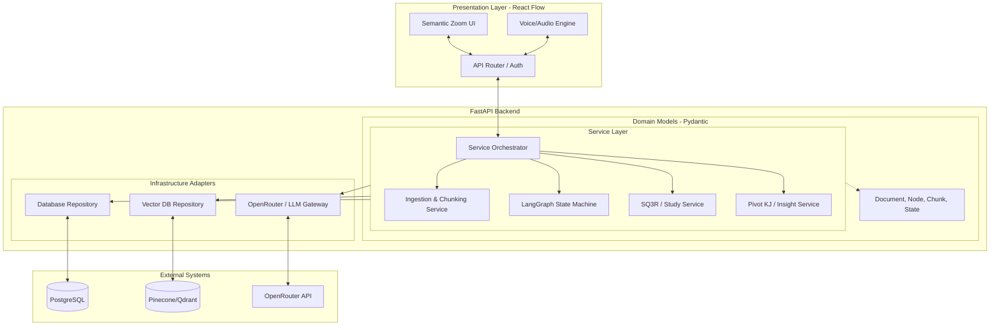

# SYSTEM ARCHITECTURE

## 1. Summary

matome is an advanced knowledge workspace designed to transform the process of digesting and structuring large volumes of text. By integrating cognitive psychology principles like the SQ3R method and spacing effects with cutting-edge generative AI technologies such as RAPTOR, GraphRAG, and Multi-Dimensional Semantic KJ, the platform aims to eliminate cognitive overload. It provides a frictionless active learning environment that empowers professionals, researchers, and learners to rapidly analyse documents, construct robust knowledge networks, and generate innovative outputs like system requirements, strategy matrices, and academic hypotheses. The system architecture is built on a modern, scalable foundation utilising React for the frontend, FastAPI for the backend, and LangGraph for orchestrating complex AI workflows, ensuring high performance, low latency, and strict security compliance for enterprise usage.

## 2. System Design Objectives

The primary objective of the system design is to construct a highly responsive, scalable, and secure platform capable of ingesting, processing, and visualising massive text datasets without degrading the user experience. The system must reduce cognitive overload by progressively disclosing information through a visually engaging, infinite canvas interface while simultaneously enforcing active learning through interactive AI-driven prompts.

To achieve this, the architecture must explicitly address the cognitive limitations defined by John Sweller's Cognitive Load Theory. When intrinsic cognitive load and extraneous load saturate the working memory, information processing halts. Our platform mitigates this by strictly adhering to the Progressive Disclosure UI pattern. By presenting only the highest-level conceptual nodes initially and allowing the user to seamlessly zoom into detailed semantic chunks, the system systematically controls the rate of information ingestion. This architectural requirement dictates that the backend must pre-process documents into a hierarchical structure that directly supports this UI paradigm, rather than serving raw text streams.

Furthermore, the integration of Benjamin Bloom's Taxonomy of Educational Objectives requires the system to move beyond passive information display. The architecture must natively support 'generative learning' by enforcing interactive engagement. This is realised through the integration of the SQ3R method (Survey, Question, Read, Recite, Review). The system must be capable of dynamically generating context-aware questions and evaluating user responses in real-time. This necessitates a low-latency infrastructure capable of processing audio input, transcribing it, evaluating its semantic correctness against the source material, and delivering constructive feedback, all within a strict 2.5-second threshold to maintain a state of flow.

From a technical perspective, the platform demands ultra-low latency and high-performance rendering. The user interface must maintain a smooth 60 frames per second (fps) rendering rate, even when visualising complex knowledge graphs containing upwards of 5,000 nodes simultaneously. This requires the use of WebGL or advanced Canvas APIs on the frontend, decoupled entirely from the heavy lifting of natural language processing, which is offloaded to the backend infrastructure. The backend itself must process vast documents, including PDFs, EPUBs, and raw markdown, handling complex elements such as embedded charts, mathematical formulas, and unstructured visual data using multi-modal Vision-Language Models (VLMs).

The advanced semantic structuring engine forms another core pillar of the design objectives. The system must move beyond rudimentary, fixed-character chunking algorithms. It must employ semantic chunking that respects natural language boundaries and contextual shifts. By leveraging techniques such as UMAP for dimensionality reduction and Gaussian Mixture Models (GMM) for soft clustering, the platform will autonomously generate a RAPTOR hierarchical knowledge tree. This tree must preserve deep context, allowing individual concepts to belong to multiple parent categories seamlessly.

Frictionless extensibility and integration are paramount for long-term viability. The architecture adopts a modular, plugin-like approach for AI model routing via OpenRouter. This design enables the dynamic selection of the most cost-effective and capable language model for each specific task—utilising fast, lightweight models for initial text chunking and reserving reasoning-heavy models for complex Insight generation and web-grounding operations. This routing must occur transparently, without necessitating core codebase modifications.

Finally, enterprise-grade security and privacy are non-negotiable design constraints. The system must strictly enforce zero-data retention policies for sensitive user uploads. It must provide robust support for Single Sign-On (SSO) and Role-Based Access Control (RBAC) to integrate smoothly with existing corporate IT infrastructure. For the most sensitive use cases involving highly confidential data, the architecture must support a fully localised, on-premise deployment model, routing inference requests to self-hosted Large Language Models to ensure data never traverses the public internet.
Furthermore, this architectural design must facilitate a robust testing environment that completely eliminates flaky tests caused by external dependencies. By strictly adhering to the dependency inversion principle, the system must allow developers to effortlessly inject mock services for the vector database and the LLM gateway. This ensures that the core business logic—such as the SQ3R enforcement and the complex LangGraph state transitions—can be tested deterministically and rapidly in isolated continuous integration pipelines.

Another critical objective is ensuring broad accessibility and seamless environmental adaptation. The system design must inherently support dark mode and high-contrast sepia modes to mitigate the eye strain commonly associated with reading massive text corpora over extended periods. This involves rigorous adherence to WCAG-compliant contrast ratios across all dynamic UI components. Furthermore, the architecture must support full keyboard navigation, allowing power users to zoom, pan the canvas, and initiate voice interactions entirely via keyboard shortcuts, bypassing the need for a mouse and thereby increasing overall interaction efficiency.

In terms of data processing, the system must be designed to handle graceful degradation. Should the designated primary reasoning LLM experience an outage via OpenRouter, the architecture must automatically and transparently fall back to a predefined secondary model (e.g., switching from a Claude 3.5 Sonnet to a GPT-4o-mini) to ensure uninterrupted service. This fault tolerance is a mandatory design objective, ensuring the platform remains highly available even during upstream provider instability.

Finally, the design must prioritise the accurate parsing and representation of complex structural elements within uploaded documents. When ingesting technical PDFs or academic papers, the architecture must guarantee that embedded architectural diagrams, flowcharts, and complex mathematical equations are not merely stripped out as noise. Instead, they must be correctly interpreted by multi-modal Vision-Language Models and converted into semantic markdown or LaTeX representations, preserving the totality of the author's original intent within the generated RAPTOR knowledge graph.


## 3. System Architecture

The system architecture of matome follows a strictly decoupled, microservices-inspired monolithic design (often termed a 'modular monolith'). This architectural style ensures a clear and impenetrable separation of concerns between the frontend presentation layer, backend orchestration, data persistence mechanisms, and external AI integrations. This approach guarantees that changes in one domain do not cause cascading failures or require extensive refactoring in others.

Explicit Rules on Boundary Management and Separation of Concerns:
The architecture is fundamentally governed by rigorous boundary rules. The Presentation Layer (Frontend), built upon React and React Flow, is strictly responsible for UI rendering, managing the infinite canvas state, and capturing user inputs such as voice and text. It must remain entirely devoid of any business logic concerning document parsing, chunking algorithms, or AI prompt generation. All complex state management related to the learning process is offloaded to the backend.

The API Gateway and Routing layer, constructed with FastAPI, serves as the single entry point for all client requests. Its responsibilities are strictly limited to authentication, request validation using Pydantic models, and delegating validated payloads to the underlying service layer. It must not contain domain-specific business rules or direct database queries.

The Service Layer acts as the core orchestrator of the application's business logic. It orchestrates complex, multi-step LangGraph workflows, manages the state of asynchronous document processing tasks, and enforces the cognitive learning rules mandated by the SQ3R methodology. This layer relies entirely on dependency injection to access infrastructure components, ensuring it remains isolated from specific database implementations or external API schemas.

The Domain Layer is the absolute source of truth for all data structures and validation rules, defined using strict Pydantic models (e.g., `Document`, `Chunk`, `Node`, `User`). These models are entirely isolated from database schemas or external API response formats. They utilize `extra="forbid"` to prevent arbitrary data injection and ensure absolute type safety throughout the application's lifecycle.

The Infrastructure Layer contains the adapters and repositories responsible for all external communications. The `VectorDBRepository` manages interactions with Pinecone or Qdrant, handling the storage and retrieval of dense vector embeddings. The `LLMGateway` manages all model inferences via OpenRouter or local instances. A crucial architectural rule is that infrastructure classes must never leak external data types (such as raw OpenRouter JSON responses or specific Pinecone client objects) into the Service layer. Instead, they must parse, validate, and return strongly typed Domain models, ensuring the core business logic remains pristine and unaffected by third-party API changes.

Data Flow and Integration Points:
When a user uploads a document, the API Gateway validates the request and passes it to the Ingestion Service. The service streams the file into the multi-modal extraction pipeline. The extracted text is then passed to the Chunking Service, which utilises the LLMGateway to perform semantic segmentation and Named Entity Recognition (NER). The resulting chunks are embedded and stored via the VectorDBRepository.

Following ingestion, the LangGraph Orchestrator takes control, pulling the chunks to build the RAPTOR tree using UMAP and GMM algorithms. The output is a hierarchical set of `GraphNode` models, saved back to the primary database. During the interactive study phase, the Study Service interacts with the LLMGateway to generate dynamic questions and evaluate user responses, updating the state of individual `GraphNode` models as the user progresses. Finally, the Pivot KJ Service can dynamically query the VectorDBRepository to pull cross-sectional nodes based on custom user axes, regenerating the layout and exporting the results via the API Gateway.




## 4. Design Architecture

The repository file structure and design architecture adhere strictly to domain-driven design (DDD) principles and the AC-CDD methodology. The physical layout of the codebase directly reflects the logical boundaries of the system, ensuring maintainability and ease of navigation for engineering teams.

File Structure Overview:
```text
.
├── src/
│   ├── main.py                  # FastAPI application entry point
│   ├── config.py                # Pydantic BaseSettings for configuration
│   ├── domain_models/           # Core Pydantic schemas (Strictly typed, zero dependencies)
│   │   ├── __init__.py
│   │   ├── document.py          # Document, Chunk, and Node models
│   │   ├── user.py              # User and Auth models
│   │   └── state.py             # LangGraph state definitions
│   ├── services/                # Business logic orchestrators
│   │   ├── ingestion.py         # Handles file parsing and semantic chunking
│   │   ├── graph_builder.py     # Constructs the RAPTOR hierarchy using GMM
│   │   └── pivot_kj.py          # Implements the Multi-Dimensional KJ logic
│   ├── infrastructure/          # External adapters
│   │   ├── llm_gateway.py       # OpenRouter API client with fallback logic
│   │   └── vector_store.py      # Pinecone/Qdrant repository implementation
│   └── api/                     # FastAPI route definitions
│       ├── v1/
│       │   ├── documents.py
│       │   └── study.py
├── tests/                       # Comprehensive test suite (Unit, Integration)
├── dev_documents/               # System architecture and user acceptance criteria
├── pyproject.toml               # Project metadata and strict linter rules
└── README.md                    # Landing page and setup instructions
```

Core Domain Pydantic Models Structure and Typing:
The integrity of the system relies entirely on the strictness of the domain models. We utilise Pydantic V2 to enforce rigorous schema validation, type hinting, and boundary protection. Every metadata field is explicitly typed, and the use of `extra="forbid"` is mandatory across all base models to prevent the injection of arbitrary, unvalidated data which could lead to security vulnerabilities or subtle data corruption bugs down the line.

The core domain revolves around the transformation of raw uploaded files into a highly structured, semantically linked graph. To achieve this, we introduce the `SourceDocument` model to represent the initial ingestion state. This is progressively decomposed into `SemanticChunk` models, which represent the smallest indivisible units of meaning within the text. Finally, these chunks are abstracted and linked together to form `GraphNode` models, representing the multi-level RAPTOR tree.

Clear Integration Points with Existing Domain Objects:
This architecture is fundamentally additive. The introduction of advanced semantic features does not necessitate the destruction or fundamental rewrite of existing simple file handling capabilities. Instead, the new schema objects perfectly extend the existing domain objects. For example, a standard file entity in the legacy system naturally maps to the `SourceDocument` object. The `SemanticChunk` and `GraphNode` objects maintain explicit, strictly typed references (e.g., UUID foreign keys) back to their originating `SourceDocument`. This additive design ensures backwards compatibility while seamlessly enabling the new RAPTOR capabilities. Existing endpoints that handle basic file retrieval remain unaffected, while new endpoints designed for the Semantic Zoom UI leverage the extended `GraphNode` structures.

The `ChunkMetadata` class ensures that contextual information—such as the exact positional index within the source document and the specific named entities extracted during the chunking phase—is permanently associated with the chunk. This metadata is critical for subsequent filtering operations within the Vector Database and forms the foundation for the multi-dimensional Pivot KJ analysis.

```python
from pydantic import BaseModel, Field, ConfigDict
from typing import List, Optional, Literal
from uuid import UUID

class ChunkMetadata(BaseModel):
    model_config = ConfigDict(extra="forbid")
    source_doc_id: UUID
    start_index: int
    end_index: int
    entities: List[str] = Field(default_factory=list)

class SemanticChunk(BaseModel):
    chunk_id: UUID
    content: str
    metadata: ChunkMetadata

class GraphNode(BaseModel):
    node_id: UUID
    level: int  # 0 for leaf, increasing for higher abstractions
    summary: str
    children_ids: List[UUID] = Field(default_factory=list)
    chunk_ids: List[UUID] = Field(default_factory=list) # Linked concrete chunks
    is_unlocked: bool = Field(default=False)
```

By ensuring these models are devoid of infrastructure logic—such as database connection strings or HTTP client code—the system guarantees that the core business logic can be tested in complete isolation, utilising simple in-memory mock repositories and resulting in incredibly fast, deterministic unit test execution.


## 5. Implementation Plan

The implementation of the matome platform will be executed strictly across 6 sequential cycles. This phased approach guarantees that foundational architecture, security, and core data models are solidly established before any complex AI orchestration or advanced user interface features are introduced.

### Cycle 01: Project Foundation and Core Domain Models
- **Focus:** The absolute priority for Cycle 01 is establishing the strictly typed core structures, repository scaffolding, and base configuration using Pydantic V2. This cycle deliberately avoids any external integrations, focusing entirely on the internal domain logic.
- **Features:**
    - Define all core Pydantic domain models: `SourceDocument`, `SemanticChunk`, `GraphNode`, and `ChunkMetadata`. These models must enforce `extra="forbid"` and include comprehensive field validation.
    - Implement the `PipelineConfig` and `CredentialConfig` using Pydantic `BaseSettings`. This ensures that no hardcoded values, API keys, or infrastructure-specific paths exist within the application logic. All configuration must be loaded explicitly from environment variables.
    - Set up the basic FastAPI application structure in `src/main.py`.
    - Define the core interfaces (Abstract Base Classes) for the repository pattern, such as `AbstractVectorRepository` and `AbstractLLMGateway`.
    - Establish the Dependency Injection (DI) container placeholders. This will initially use dynamic import strategies or simple factory functions to resolve dependencies, avoiding premature mock implementations of future services.
    - Create custom domain exception classes (e.g., `ProcessingError`, `LLMError`, `ValidationError`) that the service layer will raise. These must be entirely decoupled from specific HTTP status codes, which are the responsibility of the presentation layer.
    - Ensure the basic `main.py` starts correctly and all structural files are present to satisfy architectural linting (e.g., Ruff, Mypy).

### Cycle 02: Infrastructure Adapters and LLM Gateway
- **Focus:** Building the boundary layer that connects the pristine domain to external, unpredictable systems. This cycle focuses heavily on error handling, retries, and secure credential management.
- **Features:**
    - Implement the concrete `LLMGateway` class using `httpx`. This class must interact securely with the OpenRouter API. It is strictly responsible for handling HTTP-level concerns: setting timeouts, managing connection pooling, and implementing exponential backoff retry logic for transient network failures or rate limits.
    - Implement securely managed, environment-backed API key retrieval. The API keys must be encrypted at rest if stored, and the system must never expose these keys in application logs or error messages.
    - The `LLMGateway` must enforce the rule that all external JSON responses from OpenRouter are immediately parsed into Pydantic domain models before being returned to the service layer.
    - Implement the base `VectorDBRepository` interface. For this cycle, an initial in-memory or SQLite-backed mock version will be created for early testing and local development, ensuring developers do not need active cloud credentials to verify core logic.
    - Set up the basic logging infrastructure, ensuring that sensitive data is scrubbed before being written to output streams.

### Cycle 03: Document Ingestion and Semantic Chunking Engine
- **Focus:** The first stage of the AI pipeline, responsible for transforming unstructured text into structured, context-rich chunks (FR-1.1, FR-1.2).
- **Features:**
    - Develop the `IngestionService`. This service will initially handle plain text and Markdown files, laying the groundwork for future PDF and multi-modal support. It must implement robust error handling for malformed input files, ensuring that the system gracefully rejects invalid data without crashing.
    - Implement the logic for context-preserving semantic chunking. The system must move away from arbitrary character limits. It will utilise a combination of lightweight NLP techniques and fast LLM calls to detect natural language boundaries, paragraph structures, and contextual shifts.
    - Implement basic Named Entity Recognition (NER) to automatically identify and extract key terms, actors, and concepts from each chunk. This data will be populated into the `ChunkMetadata.entities` field, forming the foundation for future search and graph linking.
    - This cycle focuses heavily on the efficiency of the text processing algorithms. Large files must be streamed or processed in batches to prevent memory exhaustion (OOM errors) during the ingestion phase.

### Cycle 04: RAPTOR Hierarchical Tree Generation
- **Focus:** Synthesising the disparate semantic chunks into a structured, multi-layered knowledge graph using advanced clustering techniques (FR-1.3, FR-1.4).
- **Features:**
    - Integrate LangGraph to orchestrate the summarisation and clustering workflow. This involves defining the state machine that manages the progression of chunks through the pipeline.
    - Implement the core mathematical logic to perform dimensionality reduction on the embedded chunks using UMAP.
    - Implement the soft clustering logic using Gaussian Mixture Models (GMM). This allows a single semantic chunk to belong to multiple parent clusters, preventing the loss of context that occurs in strict hierarchical structures.
    - Develop the LangGraph nodes that apply the Chain of Density (CoD) prompts via the `LLMGateway`. These nodes will iteratively refine and condense the text of parent clusters into high-density summaries.
    - Establish the complex linkage logic that connects the child `chunk_ids` to the newly generated parent `GraphNode` instances. This completes the construction of the multi-level RAPTOR tree in memory, ready for persistence in the database.

### Cycle 05: Interactive Learning Engine (SQ3R)
- **Focus:** Implementing the core active learning loop, moving from data processing to user interaction (FR-3.1, FR-3.2, FR-3.3).
- **Features:**
    - Develop the `StudyService`. This service governs the state of the user's progress through the RAPTOR graph.
    - Implement the API endpoints that evaluate a user's interaction with a specific node. When a user attempts to access a locked node, the service must trigger the `LLMGateway` to dynamically generate a "Fact-recall" or "Inference" question based on the node's underlying summary.
    - Build the evaluation logic that grades the user's submitted text or voice transcript answer. This logic must utilise an LLM to assess semantic correctness, rather than relying on exact keyword matching.
    - If the user's answer is correct, the service must generate "Sandwich Feedback"—affirming the correct points, gently correcting any hallucinations or errors, and providing encouragement.
    - The service must then update the target `GraphNode`'s state (e.g., `is_unlocked = True`) in the database, allowing the frontend to render the high-density Chain of Density (CoD) summary.

### Cycle 06: Pivot KJ and Output Generation
- **Focus:** Multi-dimensional knowledge restructuring and the generation of tangible, high-value artifacts (FR-5.1, FR-5.3, FR-5.5).
- **Features:**
    - Develop the `PivotService` which executes the Multi-Dimensional Semantic KJ logic.
    - Implement the API endpoints that allow users to submit a custom analytical axis (e.g., "Actor vs. State Transition" or "SWOT Analysis").
    - The service will use the `LLMGateway` (specifically targeting reasoning-heavy models) to re-evaluate the existing nodes and re-cluster them into a entirely new structural layout based on the user's defined axis. This requires complex prompt engineering to ensure the LLM correctly interprets the axis and categorises the nodes without losing the original context.
    - Finalise the cycle by implementing the export functions. The system must be capable of generating comprehensive Markdown requirements documents from the newly pivoted node structures.
    - Implement the logic to dynamically generate valid Mermaid.js diagram code (e.g., sequence diagrams, state machines) based on the dependencies and relationships established in the Pivot KJ phase. This completes the platform's objective of transforming raw "consumption" into high-value "production."


## 6. Test Strategy

The testing strategy for the matome platform strictly prohibits uncontrolled side effects and enforces a high degree of isolation. All tests involving external LLM APIs (OpenRouter) or real Vector Databases MUST be executed using mocks, stubs, or local simulators. We rely heavily on tools like `pytest-httpx` to intercept outgoing HTTP requests, ensuring that our test suite runs blazingly fast and entirely offline. File I/O operations must strictly utilize `pytest`'s built-in `tmp_path` fixtures to prevent contaminating the developer's local filesystem. We enforce a zero-tolerance policy for flaky tests that randomly fail due to network latency, third-party API downtime, or missing environment variables in standard CI pipelines. The architecture must be inherently testable.

### Cycle 01: Domain Models Testing
- **Focus:** Ensuring the absolute integrity and type safety of the core data structures before any logic is built upon them.
- **Unit Testing:** Rigorously test all Pydantic models. We must ensure that `ValidationError` is reliably raised when instantiating models with missing required fields, providing incorrect data types, or attempting to inject forbidden extra fields into the metadata dictionary. We will explicitly test custom field validators, for instance, ensuring that chunk start indices are always strictly less than end indices, and that UUIDs conform to expected formats.
- **Integration Testing:** In this foundational cycle, integration testing is minimal. The primary focus is verifying that the configuration management system (using `BaseSettings`) loads correctly from environment variables without raising exceptions, and conversely, that it fails loudly and predictably if critical variables (like API keys) are missing.

### Cycle 02: Infrastructure Adapters Testing
- **Focus:** Verifying the resilience and correctness of the boundary layer, specifically focusing on error handling and secure communication.
- **Unit Testing:** We will extensively use `pytest-httpx` to mock a wide variety of responses from the OpenRouter API. We must verify that the `LLMGateway` correctly intercepts HTTP 500 internal server errors, connection timeouts, and 429 rate limit responses, appropriately wrapping them in our custom, domain-specific `LLMError`. Crucially, we must write explicit tests to verify that API keys are injected correctly into outgoing headers but are aggressively scrubbed from any generated logs or exception traces.
- **Integration Testing:** We will test the basic CRUD operations of the Vector Database repository interface against a local, ephemeral SQLite or in-memory mock implementation. This ensures that the interface correctly translates domain models (like `GraphNode`) into persistence-ready formats and retrieves them without data loss or corruption, proving the abstraction holds.

### Cycle 03: Ingestion Engine Testing
- **Focus:** Validating the robustness of the text parsing and semantic chunking algorithms against unpredictable and malformed inputs.
- **Unit Testing:** The semantic chunking algorithms will be subjected to rigorous edge-case testing. We will feed the engine extremely short texts, massive unbroken paragraphs lacking punctuation, texts containing complex Unicode characters, and completely empty files. We must ensure the system does not crash and produces logical chunk boundaries. We will also test the NER tagging logic against mocked, predefined text snippets to ensure it accurately identifies expected entities (e.g., specific proper nouns or dates) without excessive false positives.
- **Integration Testing:** We will simulate the file upload process by passing sample text files via a mocked FastAPI `UploadFile` interface directly into the `IngestionService`. We will then verify that the resulting output—a list of `SemanticChunk` models—accurately represents the entirety of the input file without dropping any data or duplicating content across chunk boundaries.

### Cycle 04: RAPTOR Tree Generation Testing
- **Focus:** Ensuring the complex, multi-stage LangGraph orchestration accurately builds the hierarchical knowledge graph.
- **Unit Testing:** The most critical unit tests here involve mocking the LLM summarization responses. We will feed a statically defined, predictable list of `SemanticChunk` objects into the GMM clustering logic. We must verify that the resulting tree structure exhibits the correct number of hierarchical levels, that parent nodes contain logically grouped child nodes, and that the lowest-level leaf nodes correctly and unambiguously map back to the original chunk IDs.
- **Integration Testing:** We will execute the entire LangGraph workflow end-to-end. However, we will completely mock all actual LLM inference nodes. This allows us to rapidly verify that the state transitions within the graph occur correctly—for example, verifying that if a particular summarisation node fails to generate a summary, the orchestrator catches the error, triggers a retry loop, or gracefully halts the process without corrupting the overarching state object.

### Cycle 05: Interactive Learning Testing
- **Focus:** Validating the logic of the SQ3R loop, specifically the dynamic generation of questions and the accurate evaluation of user responses.
- **Unit Testing:** We will provide the AI evaluation service with a series of known, hardcoded responses: a "perfectly correct" answer, a "partially correct" answer containing minor errors, and a "completely wrong" or nonsensical answer. We must verify that the system correctly assigns the appropriate pass/fail boolean status. Furthermore, we must assert that it generates appropriately structured "Sandwich Feedback" strings that address the specific nuances of the user's input, rather than relying on generic boilerplate responses.
- **Integration Testing:** We will simulate a complete user session via the API endpoints. We will mock the process of a user requesting to open a locked node, verify that the system returns a valid question prompt, submit a mocked correct answer, and finally assert that the system returns the unlock confirmation and the high-density CoD summary, while successfully updating the node's status in the mock database.

### Cycle 06: Pivot KJ Testing
- **Focus:** Verifying the complex logic of multi-dimensional restructuring and the accuracy of the final generated artifacts.
- **Unit Testing:** We will construct a static, predefined RAPTOR tree representing a simple set of concepts. We will provide this tree to the `PivotService` and apply a mock re-clustering axis (e.g., "group by colour" or "group by priority"). We must verify that the output list of nodes accurately reflects the new categorical grouping without losing any of the underlying text content or metadata associated with the original chunks. The transformation must be non-destructive.
- **Integration/E2E Testing:** This is the culmination of the testing strategy, focusing on the generation of Markdown and Mermaid diagrams. We will provide a specifically crafted tree of nodes representing a simple sequential workflow to the export service. We will then assert that the generated Markdown string contains a syntactically valid ````mermaid sequenceDiagram ... ```` block that accurately represents the node dependencies and actor interactions defined in the mock data. This proves the system can successfully bridge the gap between abstract semantic graphs and actionable technical documentation.
