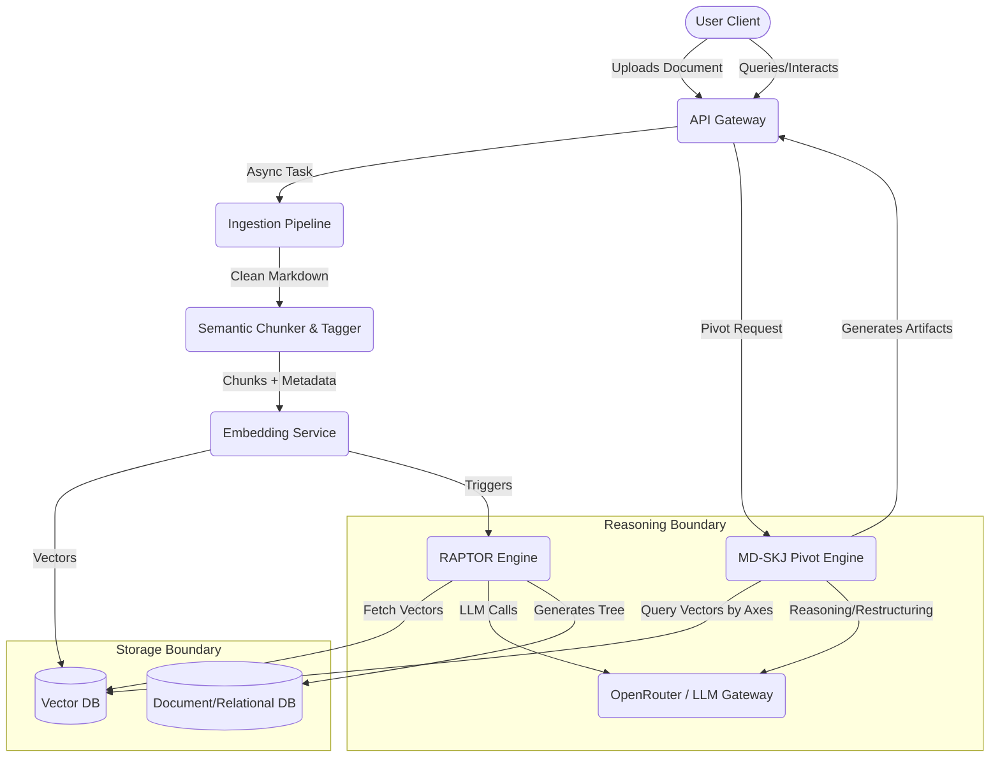

# System Architecture Document

## 1. Summary
The `matome` platform is a cutting-edge active learning workspace and document transformation engine. It is designed to consume lengthy, complex texts, automatically deconstruct them into semantic chunks, and restructure them into hierarchical RAPTOR (Recursive Abstractive Processing for Tree-Organized Retrieval) graphs. Beyond mere summarisation, `matome` offers interactive user engagement through a gamified semantic zoom UI (enforcing SQ3R principles) and a powerful Multi-Dimensional Semantic KJ (MD-SKJ) engine. This engine enables users to pivot the internal logic of a text onto entirely new axes (e.g., transforming a narrative manual into a system sequence workflow) and export the output as actionable requirements or technical diagrams (like Mermaid/UML).

The core philosophy underlying this system is to minimise the user's cognitive load and the "Lost-in-the-Middle" phenomenon frequently observed in linear reading of extensive text, transitioning the process of information consumption into active, structured knowledge synthesis. The architecture integrates robust backend data processing pipelines, LLM-based reasoning strategies via LangGraph and vector stores, and an immersive frontend representation of data, achieving frictionless, high-velocity learning and analysis.

## 2. System Design Objectives

The `matome` project is bound by rigorous performance, functional, and scalability constraints aimed at ensuring it performs reliably in professional and enterprise contexts. Below are the expanded goals, constraints, and success criteria governing the system design.

**Goals:**
First and foremost, the primary goal of the system is absolute accuracy in parsing and preserving the semantic intent of uploaded documents, ensuring no vital context is lost during the chunking and embedding processes. The system must support various document formats, seamlessly normalising noise (such as headers, footers, and complex embedded tables or charts) using advanced VLM technologies.
Secondly, the system aims to create an interaction loop that forces active recall and structured learning. The architecture must perfectly support the gamified sequence of Survey, Question, Read, and Recite, demanding low-latency interactions so that users remain in a "flow" state.
Thirdly, the system must empower users to effortlessly "Pivot" data. This means the underlying data structures must not only represent the original narrative but also be richly tagged with multi-dimensional metadata (Time, Logic, Polarity, Actors, Data Flows) to allow dynamic, immediate restructuring of the graph topology based on user-defined criteria.

**Constraints:**
1.  **Strict Modularity & Additive Evolution:** This is an existing codebase, and any new features must be completely additive. The existing entry point (`main.py`) acts as a scaffold. New capabilities must be strictly isolated within specific domain directories (`src/domain_models`, `src/engines`, `src/api`). Modifying the core existing interfaces is strictly prohibited unless explicitly versioned or extended via well-defined patterns (e.g., Dependency Injection). No monolithic "God Classes" are allowed; instead, discrete services must communicate via defined interfaces and schemas.
2.  **Performance & Latency:** The system must handle high-volume text ingestion without blocking the main event loop. AI processing must occur in isolated, asynchronous background workers (e.g., using Celery or built-in FastAPI background tasks with LangGraph orchestration). The API layer must return a 202 Accepted status instantly upon file upload, shifting heavy processing out of band. Furthermore, real-time voice interaction and text responses must keep the Time To First Token (TTFT) strictly below 1.0 second.
3.  **Cost and API Token Optimisation:** The system must aggressively cache LLM prompts using established caching patterns and vector store logic to minimise token expenditure, particularly since processing large documents can trigger exponentially growing API calls.
4.  **Security:** Enterprise-grade security is non-negotiable. Path traversal vulnerabilities during document ingestion must be blocked entirely. The system must natively support BYOK (Bring Your Own Key) mechanics, storing keys securely and ensuring Zero-Data Retention for user uploads.

**Success Criteria:**
1.  Successful ingestion and hierarchical summary generation (RAPTOR tree creation) of a 50-page text document within 60 seconds of background processing.
2.  Execution of a Pivot KJ transformation in under 5 seconds, correctly producing a syntactically valid Mermaid.js diagram reflecting the new axes.
3.  Attaining 100% pass rates on automated UAT scenarios executed via Marimo notebooks, demonstrating both "Mock Mode" and "Real Mode" API integrations.
4.  Maintaining zero architectural regressions in existing modules while expanding domain models.

## 3. System Architecture

The architecture of the `matome` platform employs a modern decoupled service-oriented design, strictly enforcing the separation of concerns between ingestion, reasoning (LLM orchestration), storage, and presentation APIs. The system acts as an orchestrated pipeline where data transitions through clear boundary phases: Raw Data -> Semantic Chunks -> Vector Nodes -> Graph Structures -> Presentation Artifacts.

**Core Principles & Boundaries:**
- **Dependency Inversion:** High-level policy modules (like the API controllers or Pivot engine) must never depend on low-level implementation details (like a specific Vector DB client or LLM SDK). Interfaces (Protocols in Python) must define the boundaries.
- **Single Responsibility Principle:** Each component has exactly one reason to change. The `SemanticChunker` solely divides text; the `GMMClusterer` solely handles clustering mathematics; the `Summarizer` solely interacts with the LLM to condense text.
- **Immutability of Source:** Uploaded documents, once converted into initial chunks, remain immutable. Enhancements, tags, and AI-generated summaries are stored as separate linked entities or additive metadata.

**Component Breakdown:**
1.  **API Gateway / Controller Layer:** (FastAPI) Handles incoming HTTP/WebSocket connections. Responsible for authenticating users, validating payload schemas, and orchestrating immediate responses (e.g., returning 202 for uploads) while dispatching tasks.
2.  **Ingestion & Normalisation Pipeline:** Receives raw files, applies VLM for image extraction, removes noise (headers/footers), and produces a clean Markdown stream.
3.  **Semantic Chunking & Embedding Engine:** Takes the Markdown stream, applies semantic boundary detection (e.g., cosine similarity drops between adjacent sentences), extracts entities (NER), and calls the Embedding Service to convert chunks into high-dimensional vectors.
4.  **RAPTOR Engine (Graph Constructor):** The core reasoning loop. Uses UMAP for dimensionality reduction and GMM (Gaussian Mixture Models) to soft-cluster chunks. It recursively builds a tree (Leaf -> Node -> Root), calling the LLM at each step to generate "Chain of Density" (CoD) summaries.
5.  **Multi-Dimensional Pivot Engine (MD-SKJ):** Driven by LangGraph. It queries the vector store using user-defined axes, extracts tagged chunks, re-clusters them dynamically, and triggers the generation of new artifacts (Markdown PRDs, Mermaid diagrams) based on the new topology.
6.  **Storage Layer:**
    - *Relational/Document DB:* Stores user metadata, document metadata, API keys (encrypted), and tree hierarchy references.
    - *Vector DB (e.g., Pinecone/Qdrant):* Stores embedded chunks and node summaries for ultra-fast HNSW similarity search.



## 4. Design Architecture

The design architecture dictates how the theoretical components map onto actual Python files, classes, and Pydantic models. We adopt an additive strategy, creating new directories and files while leaving the existing `main.py` alone.

**Directory Structure:**
```text
matome/
├── src/
│   ├── api/
│   │   ├── __init__.py
│   │   ├── routes.py
│   │   └── dependencies.py
│   ├── domain_models/
│   │   ├── __init__.py
│   │   ├── documents.py      (Pydantic: Chunk, Node, DocumentTree)
│   │   ├── interactions.py   (Pydantic: QuestionPrompt, UserAnswer)
│   │   └── config.py         (Pydantic: SystemConfig, APIKeyManager)
│   ├── engines/
│   │   ├── __init__.py
│   │   ├── chunker.py        (Class: SemanticChunker)
│   │   ├── raptor.py         (Class: RaptorTreeBuilder)
│   │   ├── pivot.py          (Class: PivotKJEngine)
│   │   └── llm_gateway.py    (Class: OpenRouterClient)
│   └── utils/
│       ├── __init__.py
│       └── security.py       (Path traversal checks, Encryption)
├── tests/
│   └── ...
├── dev_documents/
│   └── ...
├── pyproject.toml
└── main.py
```

**Core Domain Pydantic Models Overview:**
The system relies heavily on strict type validation via Pydantic to ensure all data crossing boundaries is safe and correctly formatted.

1.  `Chunk` (in `documents.py`): Represents the smallest atomic unit of information.
    - Fields: `chunk_id` (str), `document_id` (str), `text` (str), `embedding` (List[float]), `metadata` (Dict containing entities, temporal tags, logical axes).
    - *Extension rule:* New dimensions for Pivot KJ are strictly added into the `metadata` dictionary to ensure backwards compatibility.

2.  `Node` (in `documents.py`): Represents a clustered summary within the RAPTOR tree.
    - Fields: `node_id` (str), `level` (int), `summary_text` (str), `children` (List[str] representing chunk_ids or child node_ids).

3.  `DocumentTree` (in `documents.py`): The aggregate root representing an entirely processed document.
    - Fields: `tree_id` (str), `root_node_id` (str), `status` (str: Processing, Completed, Failed).

4.  `PivotRequest` (in `interactions.py`): Validates user requests for restructuring.
    - Fields: `source_tree_id` (str), `target_axes` (List[str]), `output_format` (str: Enum[Markdown, Mermaid, PlantUML]).

**Integration Strategy (Additive approach):**
The new Pydantic models will be introduced into `src/domain_models/`. The existing codebase (if any logic exists in `main.py`) will remain untouched. Instead, we will eventually update `main.py` (in later iterations or manually) to import and launch the FastAPI app built around these new models. Dependency injection will be utilised heavily. For instance, `RaptorTreeBuilder` will take an `LLMClientInterface` as a parameter, making it trivial to swap a real API call for a Mock during testing.

## 5. Implementation Plan

The implementation is rigidly divided into 6 sequential cycles. Each cycle represents a self-contained, testable increment of value, strictly ensuring no regressions in previous cycles.

### Cycle 01: Core Domain Models and Security Foundation
**Focus:** Establishing the foundational data structures, validation schemas, and core utility functions required by the rest of the application.
**Tasks:**
- Implement `src/domain_models/documents.py`, defining the strict Pydantic schemas for `Chunk`, `Node`, and `DocumentTree`.
- Implement `src/domain_models/interactions.py` for API request/response validation.
- Implement `src/domain_models/config.py` for managing global settings and OpenRouter API key configurations.
- Create `src/utils/security.py`, implementing robust defense mechanisms against path traversal attacks during file I/O operations and providing encryption helpers for storing API keys.
- Ensure all models strictly forbid extra attributes (`extra="forbid"`) to prevent injection of unvalidated data.

### Cycle 02: Ingestion Pipeline and Semantic Chunking
**Focus:** Building the pipeline that converts raw text into structured, semantically coherent chunks.
**Tasks:**
- Implement `src/engines/chunker.py`.
- Develop the logic to ingest a raw text file (e.g., `testfiles/test_text.txt`).
- Implement a basic heuristic/semantic chunking algorithm that splits text while preserving context (simulating the dynamic proposition-level splitting).
- Extract basic metadata (mocking NER if necessary) and attach it to the `Chunk` Pydantic models.
- Validate that the chunker handles empty files, excessively large strings, and irregular formatting without raising unhandled exceptions.

### Cycle 03: LLM Gateway and Vector Storage Abstraction
**Focus:** Creating the communication layer to external AI models and establishing the storage interface for embeddings.
**Tasks:**
- Implement `src/engines/llm_gateway.py`. Create an interface (`LLMClient`) and a concrete implementation (`OpenRouterClient`) that handles requests to language models with built-in retries and fallback logic.
- Create an abstraction for Vector Storage (e.g., `VectorStoreInterface`) to allow storing and retrieving `Chunk` embeddings. For this cycle, an in-memory dictionary-based mock vector store is acceptable to prove the interface contract.
- Implement the "Chain of Density" (CoD) prompt templates within the LLM Gateway module to prepare for tree generation.

### Cycle 04: The RAPTOR Engine (Hierarchical Tree Generation)
**Focus:** Assembling the core intelligence of the platform—clustering chunks and recursively summarising them to build the knowledge graph.
**Tasks:**
- Implement `src/engines/raptor.py` defining the `RaptorTreeBuilder`.
- Integrate the `SemanticChunker`, `VectorStoreInterface`, and `LLMClient`.
- Implement the logic to simulate dimensionality reduction and clustering (using mock algorithms if standard ML libraries are not yet integrated).
- Build the recursive loop: take leaf chunks -> cluster -> prompt LLM for summary -> create intermediate `Node` -> repeat until a single Root `Node` is formed.
- Save the resulting `DocumentTree` state.

### Cycle 05: Gamified Interaction Layer (SQ3R Mechanics)
**Focus:** Implementing the logic that drives the "Question" and "Recite" features, turning reading into an active learning process.
**Tasks:**
- Extend `src/engines/llm_gateway.py` or create an `interaction_engine.py` to generate contextual questions based on a specific `Node`.
- Implement the Context-Aware Hierarchical Merging (CAHM) logic: a function that takes a user's voice transcript (simulated as text), compares it against the original `Chunk` data, and uses the LLM to detect hallucinations.
- Implement the generation of "Sandwich Feedback" based on the validation results.

### Cycle 06: Pivot KJ Engine and Export Pipeline
**Focus:** Building the system's "killer feature" that allows multi-dimensional restructuring and output generation.
**Tasks:**
- Implement `src/engines/pivot.py` defining the `PivotKJEngine`.
- Develop the logic to accept a `DocumentTree`, filter/query chunks based on new user-defined axes (e.g., "Actor vs. State Transition").
- Prompt the LLM to reorganise these chunks and identify new relationships.
- Implement the generator functions to output the newly structured data into a Markdown Document.
- Implement the specific logic to prompt the LLM to output valid Mermaid.js diagrams (Sequence Diagrams, Flowcharts) based on the Pivot results.

## 6. Test Strategy

The testing strategy mandates strict test-driven development principles. Side-effects must be meticulously controlled; external API calls and disk writes must be mocked during unit testing to ensure speed and stability.

### Cycle 01 Test Strategy (Domain & Security)
- **Unit Tests:** Rigorously test Pydantic models with valid and invalid data payloads. Ensure validation errors are raised correctly for missing fields or incorrect types.
- **Security Tests:** Create specific tests in `tests/unit/test_security.py` that attempt path traversal attacks (e.g., `../../etc/passwd`) against the file validation functions. Verify these strictly raise the appropriate custom `MatomeError` exceptions and do not leak filesystem information.

### Cycle 02 Test Strategy (Ingestion & Chunking)
- **Unit Tests:** Test the `SemanticChunker` with various edge-case strings (empty strings, extremely long contiguous paragraphs without punctuation, texts with mixed languages).
- **Isolation:** Use `pytest` fixtures to provide synthetic text data in memory (via `io.StringIO`) to avoid actual file I/O operations during chunking tests.
- **Verification:** Ensure the output is a list of valid `Chunk` objects and that the combined text of the chunks roughly equals the input text (no data loss).

### Cycle 03 Test Strategy (LLM & Storage Abstractions)
- **Unit Tests:** Test the `OpenRouterClient` using `unittest.mock.patch` to intercept HTTP requests. Simulate API timeouts, 500 server errors, and invalid JSON responses to verify that the retry and fallback mechanisms function correctly.
- **Integration Mocking:** Test the `VectorStoreInterface` by instantiating the in-memory mock implementation and verifying that `insert` and `similarity_search` methods behave according to the established contract.

### Cycle 04 Test Strategy (RAPTOR Engine)
- **Integration Tests:** This cycle requires complex orchestration testing. Use heavily mocked dependencies (Mock LLM, Mock Vector Store, Mock Clusterer).
- **Verification:** Feed a predefined list of `Chunk` objects into the `RaptorTreeBuilder`. Verify that the builder successfully iterates through the clustering and summarisation phases, ultimately returning a well-formed `DocumentTree` with a single root node and properly linked children. Assert that the "LLM" was called the expected number of times.

### Cycle 05 Test Strategy (Interaction Layer)
- **Unit Tests:** Test the question generation logic by providing a mock `Node` summary and verifying the output matches the expected prompt template structure.
- **Logic Tests (CAHM):** Write tests for the hallucination detection logic. Provide a synthetic transcript that clearly contradicts the source chunk data, and mock the LLM response to flag the contradiction. Verify that the final output returned to the user correctly contains the "Sandwich Feedback" formatting, correcting the error gently.

### Cycle 06 Test Strategy (Pivot KJ & Export)
- **End-to-End (Mocked) Tests:** Provide a fully constructed (mock) `DocumentTree` to the `PivotKJEngine`. Pass in new axes (e.g., "Actors").
- **Verification:** Mock the LLM to return a predefined restructured JSON payload. Verify that the Markdown export function correctly formats this payload into sections.
- **Format Validation:** For the Mermaid diagram generation, verify that the resulting string begins with ```mermaid and contains basic valid syntax (e.g., `sequenceDiagram`, `->>`), ensuring the output is ready for frontend rendering. Ensure the Marimo tutorial notebook (`tutorials/UAT_AND_TUTORIAL.py`) can execute this entire flow using these mocked components seamlessly.
