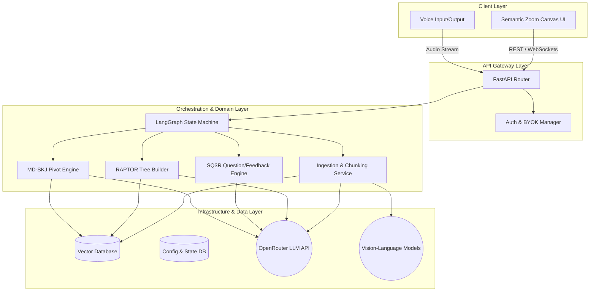

# System Architecture Document for matome

## 1. Summary
The "matome" project aims to construct a revolutionary frictionless active learning platform and knowledge workspace. It is designed to relieve users from the cognitive overload of reading exceptionally long and complex documents. By integrating advanced generative AI technologies like RAPTOR, GraphRAG, and Multi-Dimensional Semantic KJ (MD-SKJ) with scientifically proven cognitive psychology methods such as the SQ3R technique, matome transforms passive reading into an engaging intellectual game.

At its core, the platform digests various document formats (PDF, EPUB, Markdown, images, etc.), intelligently chunks them based on semantic meaning rather than arbitrary character counts, and constructs a navigable knowledge graph. Users interact with this graph via a progressive disclosure UI, unlocking nodes by answering dynamically generated questions. Finally, users can pivot this knowledge into completely new structures, instantly generating system requirements, business strategy matrices, or structured outlines. This document outlines the architectural strategy to build this system, ensuring strict separation of concerns, high performance, and robust security, while seamlessly extending the foundational Python structure.


## 2. System Design Objectives

The primary objective of the matome system is to fundamentally redefine how humans interact with massive textual data, focusing on both the efficiency of information processing and the psychological engagement of the user. To achieve this, the architecture must satisfy several critical design objectives, constraints, and success criteria.

First and foremost, the system must drastically reduce cognitive overload. Traditional document viewers present linear walls of text, which overwhelm working memory. Our objective is to implement a progressive disclosure mechanism, visually presenting only the highest-level summary nodes initially. The architecture must support ultra-fast, hierarchical data retrieval to enable this "Semantic Zooming" interface. The backend must pre-calculate and structure the document into a RAPTOR tree (Recursive Abstractive Processing for Tree-Organized Retrieval) so that the frontend can render nodes smoothly at 60 frames per second. Success in this area is defined by the system's ability to load a 10,000-word document and render the initial root nodes in under three seconds.

Secondly, the platform must enforce active learning without causing user friction. Passive reading leads to rapid forgetting. By integrating the SQ3R (Survey, Question, Read, Recite, Review) method, the system will mandate interaction. Before expanding a locked node, the user must answer an AI-generated question. The architectural challenge here is latency. The system must generate highly contextual questions and evaluate user responses with an absolute minimum delay. We target a Time To First Token (TTFT) of under 1.0 seconds for all interactive AI responses. This requires an asynchronous, event-driven backend utilizing streaming API connections to foundational models via OpenRouter.

Thirdly, the system must empower users to effortlessly transition from information ingestion to knowledge production. This is realised through the Multi-Dimensional Semantic KJ (MD-SKJ) engine. Users will pivot the ingested knowledge graph along novel axes (e.g., from a chronological narrative to a system actor/state workflow). The architecture must therefore store not just the text chunks, but also a rich, multi-dimensional metadata matrix for every chunk. We will leverage an advanced vector database (like Pinecone or Qdrant) capable of hybrid search, combining dense vector embeddings with sparse metadata filtering. The success criterion is the ability to instantaneously re-cluster thousands of nodes based on user-defined criteria without blocking the main thread.

Furthermore, the architecture must adhere strictly to modern software engineering principles, specifically the separation of concerns, dependency injection, and interface-driven design. As we are extending an existing foundational Python project, our additive mindset dictates that we do not write monolithic scripts. Every core function—document ingestion, LLM orchestration, vector storage, and UI state management—must be isolated behind clearly defined Pydantic schemas and abstract base classes. This ensures that as underlying AI models evolve, the core business logic remains untouched. The system must also guarantee enterprise-grade security. Zero-data retention policies must be technically enforced, meaning user documents are never persistently stored without encryption, and are strictly isolated from any model training pipelines. The configuration module must robustly manage Bring Your Own Key (BYOK) settings, utilizing secure environment variables and avoiding any hardcoded secrets.

In summary, the design objectives mandate a highly responsive, psychologically aware, and architecturally decoupled system. The backend must operate as a resilient state machine, orchestrating complex AI pipelines while exposing a clean, secure, and rapid API to an immersive, gamified frontend. This delicate balance of heavy background processing and lightweight, real-time user interaction defines the ultimate success of the matome platform.


## 3. System Architecture

The system architecture of the matome platform is designed around a decoupled, microservices-oriented pattern, heavily leveraging asynchronous task processing and state machine orchestration. To accommodate the complex AI workflows required by the RAPTOR tree generation and MD-SKJ engine, we employ LangGraph to manage the state and flow of data across various intelligent agents. This approach ensures high fault tolerance, scalability, and strict boundary management.

### Component Overview
The architecture is broadly divided into four main layers: the Client Layer, the API Gateway Layer, the Orchestration & Domain Layer, and the Data & Infrastructure Layer.

The Client Layer represents the interactive UI, envisioned as a React-based infinite canvas utilising WebGL or Canvas APIs for high-performance rendering. It communicates strictly via RESTful APIs and WebSockets for real-time streaming updates.

The API Gateway Layer (built with FastAPI) acts as the single entry point. It handles authentication, rate limiting, and request validation using robust Pydantic models. Crucially, this layer must not contain any business logic. It merely routes validated requests to the underlying orchestration services.

The Orchestration Layer is the heart of the system. We utilise LangGraph to define discrete functional nodes (e.g., Text Extraction Node, Semantic Chunking Node, Clustering Node, Summary Generation Node). These nodes pass a highly structured `GraphState` Pydantic object between them. This guarantees immutability and predictability. If an external LLM call fails due to a timeout, LangGraph manages the retry logic or routes the state to an error-handling node, preventing the entire pipeline from crashing.

The Data Layer consists of a Vector Database (Qdrant or Pinecone) for semantic search and metadata filtering, and a secure operational database for user state, configuration, and audit logs. We strictly enforce the Repository Pattern here; the domain logic never interacts directly with database clients but rather through abstract repository interfaces.

### External System Interactions
The system relies heavily on external LLM providers routed through OpenRouter. To maintain the "Zero-Data Retention" constraint, we ensure that API requests explicitly disable data logging on the provider side. For file ingestion, we may interact with external parsing services or run local headless browsers for complex HTML/PDF layouts. All external interactions are abstracted behind Gateway classes (e.g., `LLMGateway`, `DocumentParserGateway`), ensuring that third-party API changes do not bleed into the core domain logic.

### Boundary Management and Separation of Concerns
Strict rules govern component interactions to prevent "God Classes" and spaghetti code.
1. **Dependency Inversion:** Domain models and services must not depend on concrete infrastructure implementations. All infrastructure dependencies (like the Vector DB client or LLM client) must be injected via a Dependency Injection (DI) container during system startup.
2. **Schema-First Communication:** All cross-component communication must utilise strictly typed Pydantic V2 models. Metadata fields must forbid arbitrary extra data (`extra="forbid"`) to prevent malicious injection.
3. **No Mocks in Production Logic:** Foundation phases must use dynamic module loading rather than hardcoded mock classes. We will implement functional, albeit simplified, initial algorithms before swapping them for advanced AI models.

### Architecture Diagram



By adhering to these architectural guidelines, the matome platform ensures robust scalability, allowing developers to seamlessly swap underlying models and infrastructure without rewriting the core cognitive processing logic. The existing foundational codebase will be elegantly extended, transforming it into a powerful, multi-layered knowledge extraction engine.


## 4. Design Architecture

The design architecture dictates how the high-level system components translate into actual file structures, class hierarchies, and Pydantic schemas. To ensure a modern, scalable, and maintainable codebase, we adopt a domain-driven file structure. This additive approach ensures that the new features integrate flawlessly with the existing `matome` repository structure while establishing a strict boundary between domain logic, infrastructure, and application orchestration.

### File Structure Overview

```text
matome/
├── pyproject.toml
├── main.py
├── src/
│   ├── __init__.py
│   ├── config/
│   │   ├── __init__.py
│   │   ├── settings.py           # Core Pydantic BaseSettings (AppConfig, ModelConfig)
│   │   └── security.py           # BYOK encryption and key management logic
│   ├── domain/
│   │   ├── __init__.py
│   │   ├── document.py           # Core schemas: Document, SemanticChunk, RaptorNode
│   │   ├── graph_state.py        # LangGraph State Pydantic models
│   │   └── exceptions.py         # Custom domain exceptions (e.g., ProcessingError)
│   ├── application/
│   │   ├── __init__.py
│   │   ├── ingestion_workflow.py # LangGraph nodes and edge definitions for ingestion
│   │   ├── pivot_workflow.py     # LangGraph workflows for MD-SKJ
│   │   └── sq3r_service.py       # Application service orchestrating the learning loop
│   ├── infrastructure/
│   │   ├── __init__.py
│   │   ├── llm_gateway.py        # OpenRouter HTTPX client implementation
│   │   ├── vector_store.py       # Qdrant/Pinecone client wrappers
│   │   └── document_parser.py    # PDF/Markdown parsing utilities
│   └── interfaces/
│       ├── __init__.py
│       ├── api_router.py         # FastAPI endpoints
│       └── dependencies.py       # Dependency Injection setup and container
├── tests/
│   ├── unit/
│   ├── integration/
│   └── e2e/
└── tutorials/
    └── UAT_AND_TUTORIAL.py       # Marimo interactive notebook for UAT
```

### Class and Function Definitions Overview

The system strictly separates Pydantic domain models from the services that operate on them.

**Core Domain Models (`src/domain/document.py`):**
We define `SemanticChunk` as a fundamental unit of meaning. It contains the raw text, its vector embedding, and a highly structured metadata dictionary. The metadata must be typed using a nested Pydantic model (`ChunkMetadata`) to prevent injection of unsupported keys.
The `RaptorNode` model represents a node in the hierarchical summary tree. It includes fields for the node's synthesized summary, its depth level, references to child nodes, and its locked/unlocked state for the UI.

**Integration with Existing Objects:**
The existing simple data structures must be seamlessly extended. If a basic `Document` class exists, we will use inheritance or composition to create an `EnrichedDocument` that incorporates the RAPTOR tree references. We will maintain backward compatibility wherever possible by ensuring that new required fields have sensible defaults or are populated via graceful migration scripts during ingestion.

**Infrastructure Gateways (`src/infrastructure/llm_gateway.py`):**
To interact with OpenRouter, we will create an `OpenRouterClient` class implementing an abstract `LLMProtocol`. This class uses `httpx.AsyncClient` for asynchronous networking. Crucially, retry logic, timeout handling, and payload sanitization will be encapsulated entirely within this class. The domain layer simply calls `await llm.generate(prompt)`.

**Application Orchestration (`src/application/ingestion_workflow.py`):**
This module defines the LangGraph state machine. We define functions for each step: `extract_text`, `create_chunks`, `embed_chunks`, `cluster_nodes`, and `summarize_clusters`. Each function accepts a `GraphState` object, performs its specific task, and returns an updated copy of the state. This functional approach guarantees that side effects are isolated, making the complex pipeline highly testable.

By enforcing this strict architectural division, we guarantee that the complex AI manipulations required by the `ALL_SPEC.md` do not entangle with the web framework or database drivers. The Dependency Injection container in `interfaces/dependencies.py` will wire these components together at runtime, ensuring complete modularity and adherence to the Open-Closed Principle.


## 5. Implementation Plan

The development of the matome platform will be executed across exactly 6 sequential cycles. This phased approach mitigates risk, ensuring that foundational elements are robustly established before introducing complex cognitive UI features and advanced AI routing. Each cycle delivers a testable increment of value, adhering strictly to the architectural boundaries, and contains precise technical implementation blueprints to prevent ambiguity among developers.

### Cycle 01: Project Foundation and Security Infrastructure

The primary objective of Cycle 01 is to establish the core project skeleton, enforce rigorous code quality standards via `uv`, and implement the critical security mechanisms required for enterprise-grade deployment. Developers will initialize the comprehensive `pyproject.toml` configuration, ensuring that `ruff` (with a strict max-complexity limit of `10` to prevent "God functions") and `mypy` (in strict mode) are actively policing the codebase. We will establish the foundational directory structure (`src/config`, `src/domain`, `src/application`, `src/infrastructure`, `src/interfaces`) as outlined in the Design Architecture.

The most vital component of this cycle is the `src/config/security.py` module. Developers must implement the `AppConfig` and `ModelConfig` subclasses inheriting from `pydantic_settings.BaseSettings`. These classes are tasked with handling environment variables securely. Crucially, we will build the Bring Your Own Key (BYOK) encryption utility (`SecurityService`). This service will use `cryptography.fernet.Fernet` to encrypt API keys at rest. We must strictly avoid implementing false security measures like attempting to wipe Python string memory using `ctypes`, as Python's garbage collection makes true zeroization impossible. Instead, we will rely exclusively on Pydantic's `SecretStr` for in-memory protection, decrypting keys just-in-time when the `OpenRouterClient` initializes.

Furthermore, we will construct the Dependency Injection (DI) container skeleton in `src/interfaces/dependencies.py`. To adhere to strict early-phase architectural constraints, we will utilize dynamic import strategies (`importlib.import_module`) to instantiate configuration objects, rather than hardcoding imports of unimplemented concrete classes. Developers will define abstract base classes (Protocols) such as `LLMProtocol` and `VectorStoreProtocol` in this cycle, ensuring that the DI container can inject them as dependencies for future application services. By the end of Cycle 01, the system will not yet process documents, but it will possess a highly secure, statically verified foundation. This robust base will cleanly resolve environment configurations and safely provide injected singletons (like the `SecurityService`) to any dependent class, satisfying the enterprise security constraints outlined in the specifications without polluting the domain logic with infrastructure details.

### Cycle 02: Core Domain Models and Ingestion Pipeline Skeleton

In Cycle 02, the development team transitions to defining the pure business logic representations of the matome system. Following Schema-First Development principles, developers will meticulously craft the Pydantic domain models in `src/domain/document.py`. The fundamental model is `SemanticChunk`, defined with properties `id: UUID`, `content: str`, `embedding: list[float]`, and crucially, `metadata: ChunkMetadata`. The `ChunkMetadata` is a nested Pydantic model containing fields like `source_file`, `page_number`, `extracted_entities: list[str]`, and multi-dimensional tags (`time_axis`, `actor_axis`). Developers must configure `model_config = ConfigDict(extra='forbid')` globally across these models to strictly prevent arbitrary or malicious data injection into the metadata.

The second core schema is `RaptorNode`, representing a vertex in the hierarchical summary tree. It requires fields: `node_id: str`, `level: int` (representing tree depth), `children_ids: list[str]`, `summarized_content: str`, and a boolean state `is_unlocked` (defaulting to False). The overarching structure is the `EnrichedDocument` schema, aggregating the original text, the list of `SemanticChunk` objects, and the root nodes of the RAPTOR tree. Simultaneously, developers will establish the `GraphState` schema in `src/domain/graph_state.py`. This state object, passed between LangGraph nodes, will contain fields like `current_document: EnrichedDocument | None`, `processing_status: str`, and `error_log: list[str]`.

To prove the architectural pipeline without incurring the cost of LLMs, developers will construct the ingestion skeleton. They will implement dummy, deterministic versions of the abstract Protocols defined in Cycle 1. For example, a `BaseTestChunkingService` will implement a simple regex-based sentence splitter (strictly avoiding unbounded regex quantifiers like `.+` to mitigate ReDoS vulnerabilities). We will define the initial LangGraph workflow (`ingestion_workflow.py`), creating discrete node functions (e.g., `parse_file_node`, `chunk_text_node`) that accept the `GraphState`, invoke the dummy services, and return an updated state dictionary. This cycle proves that deeply nested objects flow correctly through the state machine layers, validated mathematically by Pydantic at every step, creating an immutable sequence of events ready for intelligent processing.

### Cycle 03: LLM Gateway and Advanced Semantic Chunking

Cycle 03 introduces intelligence into the pipeline by swapping out the deterministic test services for production-grade AI implementations. Developers will build the robust `OpenRouterClient` in `src/infrastructure/llm_gateway.py`, implementing the `LLMProtocol`. This client will utilize `httpx.AsyncClient` with explicitly defined connection pooling and transport-level timeouts to efficiently manage external network requests. Security is paramount here: developers must implement strict sanitization logic to ensure HTTP error messages never leak raw response bodies or OpenRouter API endpoints into application logs. Furthermore, to prevent Server-Side Request Forgery (SSRF) via DNS rebinding on potential web-scraping ingestion endpoints, developers will validate target hostnames against an allowed list of domains or private IP blocks before executing requests.

With the LLM Gateway established, we replace the simplified chunking service with the actual `SemanticChunkingService`. This service will utilize lightweight embeddings (e.g., `google/gemini-2.5-flash` via OpenRouter) to calculate the cosine similarity between adjacent sentences. Developers will implement an algorithm that dynamically splits the text at "propositional turning points" where the similarity score drops below a configurable threshold.

Simultaneously, the LangGraph state machine (`ingestion_workflow.py`) will be updated. A new node, `entity_extraction_node`, will be inserted into the graph. This node invokes the LLM Gateway to perform Named Entity Recognition (NER) on each semantic chunk, identifying actors, dates, and technical terms. These entities are then appended to the `ChunkMetadata.extracted_entities` list. Because external LLM calls are inherently flaky, developers must implement robust retry mechanisms utilizing LangGraph's native `RetryPolicy` on these specific nodes. By the end of Cycle 03, the pipeline will successfully ingest a document, securely transmit it to OpenRouter, calculate embedding vectors, intelligently identify semantic boundaries, and populate the `GraphState` with fully realized, metadata-rich `SemanticChunk` objects stored in local operational memory.

### Cycle 04: RAPTOR Tree Generation and Information Densification

Cycle 04 tackles the most mathematically and computationally intensive aspect of the backend: the RAPTOR (Recursive Abstractive Processing for Tree-Organized Retrieval) tree construction. Developers will build the `RaptorService` within the application layer. This service implements the core logic for hierarchical clustering. To adhere strictly to the project's zero-tolerance policy for mocks in core ML pipelines, developers will utilize authentic data science libraries (such as `scikit-learn` and `umap-learn`). The service will extract the high-dimensional embeddings from the `SemanticChunk` objects and perform dimensionality reduction using UMAP to minimize noise. Subsequently, it will apply Gaussian Mixture Models (GMM) for soft clustering, allowing chunks to logically belong to multiple abstract parent nodes simultaneously, thereby preventing the loss of edge-case contexts.

Once the basal clusters are mathematically defined, the `RaptorService` will construct the `RaptorNode` hierarchy. The LangGraph orchestration will route these node structures to a new `summarization_node`. Here, developers will implement the Chain of Density (CoD) prompting strategy. The LangGraph workflow will asynchronously invoke the LLM Gateway for each cluster, commanding the model to iteratively compress the grouped chunks into a highly dense, entity-rich summary.

These resultant summaries will populate the `summarized_content` field of the `RaptorNode` objects. Because generating hundreds of summaries concurrently can easily exceed OpenRouter's rate limits, developers must implement rate-limiting middleware or utilize asyncio semaphores within the LangGraph node to strictly control the concurrency of the `LLMProtocol` invocations. Error handling is critical: if a specific CoD summarization fails repeatedly, the state machine must gracefully degrade, logging a `ProcessingError` in the `GraphState` without halting the entire tree generation process. The culmination of Cycle 04 is a robust background job capable of distilling a 10,000-word document into a multi-layered, fully populated knowledge graph, perfectly structured for the frontend's Semantic Zoom UI.

### Cycle 05: SQ3R Interactive Engine and Gamification API

Cycle 05 shifts focus from backend processing to the user interaction layer, implementing the psychological core of the matome platform: the SQ3R (Survey, Question, Read, Recite, Review) loop. Developers will build the `SQ3RService` in `src/application/sq3r_service.py` and expose its capabilities via strict FastAPI endpoints in `src/interfaces/api_router.py`. The fundamental interaction revolves around unlocking a `RaptorNode`. The API will expose a `GET /nodes/{node_id}/question` endpoint. When invoked, the `SQ3RService` will pass the node's highly dense summary to the LLM Gateway, prompting it to generate an adaptive question tailored to the user's difficulty setting, effectively implementing the "Question" phase.

To handle the "Recite" phase, developers will expose a `POST /nodes/{node_id}/unlock` endpoint. This endpoint accepts a Pydantic `UserAnswerPayload` containing the user's spoken transcript or typed response. The `SQ3RService` will orchestrate a specialized LangGraph workflow: it compares the user's input against the node's ground-truth summary. If the semantic intent matches, the system updates the `RaptorNode.is_unlocked` state to `True`. Crucially, it then uses the LLM to generate "Sandwich Feedback" (Praise, Correction, Praise), returning both the feedback and the unlocked summary text in the API response.

Security at this boundary is paramount. Developers must utilize Pydantic V2 `@field_validator` methods alongside `ValidationInfo` to meticulously sanitize incoming user answers, checking for string lengths and rejecting CRLF characters (`
` or `
`) to prevent prompt injection or HTTP response splitting attacks. All API endpoints will utilize Dependency Injection to resolve the `SQ3RService` and the operational database connection. This cycle transforms the static, mathematically generated knowledge graph into a highly secure, interactive, gamified REST API, ready to drive the React frontend's progressive disclosure animations.

### Cycle 06: Multi-Dimensional Semantic KJ (MD-SKJ) Pivot Engine

The final cycle, Cycle 06, implements the ultimate insight generation feature: the Pivot KJ analysis. This transforms the platform from a reading tool into a powerful analytical engine. Developers will construct the `PivotWorkflow` orchestrator. This requires integrating a true Vector Database client (e.g., Qdrant) via the `VectorStoreProtocol` in the infrastructure layer. When a document is ingested, all `SemanticChunk` embeddings and `ChunkMetadata` are upserted into this persistent store. The API will expose a `POST /pivot` endpoint accepting a `PivotRequestPayload` defining the user's selected analytical axes (e.g., `x_axis: "Timeline"`, `y_axis: "System Actors"`).

The `PivotWorkflow` will query the Vector Database, utilizing advanced hybrid search. It filters the vector space using the sparse metadata tags (e.g., retrieving only chunks related to specific actors) while semantically grouping them along the requested dimensions. The LangGraph state machine will reconstruct these retrieved chunks into a completely new spatial graph representation, distinct from the original RAPTOR tree. Furthermore, developers will implement the Web-Grounding LangGraph node. This node will cross-reference the newly pivoted clusters against simulated external best practices, utilizing the LLM Gateway to generate suggestions for bias removal or workflow optimization.

Finally, developers will build the export formatting module. This module parses the final, validated `GraphState` of the pivoted board and utilizes template engines (or targeted LLM prompts) to generate valid Markdown requirement documents and syntactically correct Mermaid.js code snippets (e.g., Sequence Diagrams). This allows the seamless transition from raw document ingestion, through interactive learning, directly to the instant output of actionable system design artifacts. The completion of Cycle 06 signifies the realization of the full end-to-end architectural vision, perfectly primed for verification via the UAT Marimo notebook.


## 6. Test Strategy

To guarantee the reliability, security, and performance of the matome platform, we enforce a rigorous testing strategy mapped to each of the six implementation cycles. This strategy prioritizes Test-Driven Development (TDD), zero side-effect execution, and the strict avoidance of brittle mock frameworks where functional deterministic replacements can be used. All tests will run under the `pytest` framework, managed by `uv`, with coverage strictly enforced.

### Cycle 01 Test Strategy: Foundation and Security

Testing in Cycle 01 focuses intensely on verifying the absolute integrity of security boundaries and configuration management before any application logic is written. Developers will write comprehensive unit tests utilizing `pytest` for the `AppConfig` and `ModelConfig` Pydantic schemas. They will utilize `pytest.raises(ValidationError)` to assert that omitting required environment variables (like database URIs or encryption keys) immediately halts initialization with clear, predictable diagnostic errors. For the BYOK `SecurityService`, developers will write cryptographic tests verifying that the encryption and decryption methods are perfectly reversible. Furthermore, they will assert that identical plaintexts yield entirely different ciphertexts across multiple encryptions, definitively verifying the proper, randomized usage of Initialization Vectors (IV) within the `cryptography.fernet.Fernet` implementation.

Crucially, tests must validate these configurations without modifying the global system environment or polluting the test runner's state. Developers will strictly avoid creating test-specific subclass implementations to artificially override `model_config`. Instead, they will utilize `mock.patch.dict(os.environ, ...)` as a context manager, or instantiate the configuration classes directly via keyword arguments. We will also construct tests for the Dependency Injection container. By loading the container dynamically (`importlib`), tests will assert that the container successfully resolves abstract factory functions into the correct singleton object types, and conversely raises explicit `RuntimeError` or `ValueError` exceptions when attempting to resolve unregistered or circular dependencies. These tests ensure the bedrock of the application is unshakeable, secure, and structurally sound.

### Cycle 02 Test Strategy: Domain Models and Pydantic Validation

Cycle 02 focuses entirely on unit testing the structural rigidity of the pure domain schemas. Developers will instantiate `SemanticChunk`, `RaptorNode`, and `EnrichedDocument` objects with highly diverse, extreme datasets, explicitly testing boundary conditions (e.g., chunks with zero length, nodes with maximum depth thresholds). They will write specific tests that intentionally attempt to inject malicious, unexpected, or oversized keys into the `ChunkMetadata` dictionary. The core assertion must verify that the `model_config = ConfigDict(extra='forbid')` directive correctly catches these attempts, raising a `pydantic.ValidationError` to prevent payload pollution.

For the LangGraph orchestration framework, developers will write tests demonstrating that complex state transitions seamlessly serialize and deserialize. They will assert that executing `state_dict = state.model_dump()` followed by `GraphState(**state_dict)` results in an identical object structure. This definitively verifies that we can pass highly complex, nested Pydantic objects across the state machine boundaries without triggering strict MyPy typing errors regarding internal Pregel overloads. Furthermore, developers will test the dummy deterministic implementations of the parsers and chunkers. They will ensure these mock services strictly honor their abstract Protocol contracts, verifying via `pytest.raises(ProcessingError)` that they raise correct, domain-specific custom exceptions rather than leaking generic Python `TypeError` or `ValueError` exceptions into the upper layers.

### Cycle 03 Test Strategy: Gateway Integration and Chunking Logic

Testing the `OpenRouterClient` (LLM Gateway) in Cycle 03 requires extreme precision to isolate the application from external side effects while thoroughly validating network logic. Developers will employ the `pytest-httpx` library to intercept outbound HTTP calls strictly at the transport level. They will write tests that simulate successful API responses, ensuring the client correctly parses the deeply nested OpenRouter JSON schema and extracts the precise target string. More importantly, they will heavily test diverse error states: simulating `429 Too Many Requests`, `500 Internal Server Errors`, and simulated `httpx.ReadTimeout` scenarios. Tests will assert that the `OpenRouterClient` correctly honors its internal connection pooling limits, correctly implements exponential backoff retry logic, and eventually raises a heavily sanitized custom `LLMError` that completely strips the raw HTTP context and request URLs, preventing any infrastructure leakage.

For the Semantic Chunking logic, developers will write tests using fixed, highly deterministic input texts (e.g., texts with obvious semantic shifts between paragraphs). They will verify that the chunking algorithm correctly identifies these predefined semantic boundaries. Furthermore, developers will write security-focused tests to validate ReDoS (Regular Expression Denial of Service) mitigation strategies. They will feed highly complex, maliciously crafted regex patterns into the processing functions, utilizing `pytest.mark.timeout` decorators to strictly assert that the chunking functions complete their execution within defined microsecond boundaries, proving immunity to catastrophic backtracking.

### Cycle 04 Test Strategy: Mathematical Processing and State Machines

Cycle 04 presents the unique challenge of testing complex mathematical clustering (UMAP/GMM) alongside asynchronous LangGraph orchestration. To adhere to the strict Anti-Mock policy, developers will absolutely not fake the outputs of `TfidfVectorizer` or `GaussianMixture` using dummy NumPy arrays or predictable mocks. Instead, they will construct extremely small, highly deterministic text datasets mathematically designed to cluster predictably. Tests will execute the actual ML algorithms against this data and assert that the resulting `RaptorNode` hierarchy correctly groups the predefined semantic concepts without throwing dimensional errors.

Testing the LangGraph pipeline requires rigorous verification of the state machine's fault tolerance and immutability properties. Developers will write integration tests that intentionally cause the Chain of Density summarization node to fail (by intercepting the internal HTTP client call and forcing an error). They will assert that the LangGraph orchestrator correctly catches the raised `ProcessingError`, increments an internal retry counter within the `GraphState`, and eventually routes the execution flow to a designated fallback or error node, completely preventing the parent process from crashing. Furthermore, tests will verify true state immutability during these complex state transitions, utilizing `id()` checks to assert that `copy.deepcopy()` logic correctly isolates nested mutable objects (like the `children_ids` lists) across iterations.

### Cycle 05 Test Strategy: API Endpoints and Interaction Flows

Cycle 05 testing shifts focus to the FastAPI web framework and the SQ3R interaction loops. Developers will utilize `fastapi.testclient.TestClient` to execute complete, end-to-end request-response HTTP cycles. They will construct tests for the `POST /nodes/{node_id}/unlock` endpoint, verifying that requests lacking the mandatory `UserAnswerPayload` body are aggressively rejected with a standard `422 Unprocessable Entity` response. They will test the prompt generation logic, verifying through dependency injection of a deterministic mock LLM that the system correctly extracts and utilizes the target node's Chain of Density summary to formulate the adaptive question.

Furthermore, developers will rigorously test security boundaries at the external API layer. They will attempt classic Path Traversal attacks (`../../`) against any file retrieval endpoints. Crucially, for endpoints capable of fetching external URLs (such as ingestion endpoints), developers will execute Server-Side Request Forgery (SSRF) bypass tests using simulated DNS rebinding payloads. Tests will assert that the security middleware successfully intercepts the request, strictly resolves the hostname, and validates it against the allowed private/loopback IP blocks, throwing a `403 Forbidden` error before processing the payload. They will further verify that all response bodies are properly sanitized and do not leak internal database IDs or stack traces.

### Cycle 06 Test Strategy: Multi-Dimensional Pivot and UAT Validation

The final testing cycle validates the complex MD-SKJ vector searches and the system's export formatting mechanisms. Developers will write integration tests that seed a local, in-memory instance of the Vector Database (or a highly isolated Docker container via `pytest-docker`) with a known, rigid hierarchy of chunks and deeply nested metadata tags. They will then execute the `PivotWorkflow` programmatically, feeding it specific multidimensional axes (e.g., filtering strictly for chunks tagged with `actor_axis: "System Admin"`). Tests will assert that the database query executes successfully and that the retrieved chunks are correctly reorganized on the virtual spatial canvas, with the output payload containing the precisely expected node relationships and edges.

Additionally, developers will unit test the Markdown and Mermaid.js export formatters. They will assert that the functions process the `GraphState` and produce structurally valid syntax, completely free from unescaped characters, malformed tables, or broken edge links in the sequence diagrams. Finally, the absolute paramount test for Cycle 06 is the execution of the User Acceptance Test suite defined in `tutorials/UAT_AND_TUTORIAL.py` using `marimo`. Developers will configure an automated CI script that executes this notebook in headless mode (`uv run marimo run`). The script will verify that the notebook executes sequentially from top to bottom without raising a single Python exception, and that the final output cells successfully render the target To-Be workflow diagrams, definitively proving the platform perfectly fulfills the architectural objectives.
