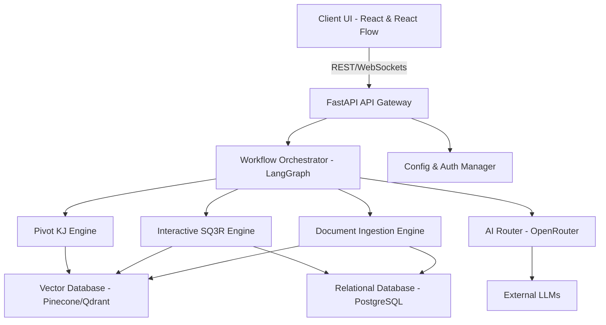

# SYSTEM ARCHITECTURE

## 1. Summary
The matome platform is an advanced, interactive knowledge workspace designed to transform the way professionals, researchers, and learners digest and interact with massive amounts of text. By integrating generative AI, cognitive psychology principles (such as SQ3R and spaced repetition), and a high-performance interactive frontend, matome elevates reading from a passive consumption activity to an active, frictionless learning and insight-generation process. The system orchestrates multiple AI models to perform document ingestion, semantic chunking, hierarchical tree generation (RAPTOR), and dynamic knowledge restructuring (Pivot KJ).

## 2. System Design Objectives
The primary objective of the matome platform is to completely eradicate the cognitive overload typically associated with processing vast amounts of unstructured text. In modern business and academic environments, users are frequently overwhelmed by voluminous documents such as legacy system manuals, exhaustive market reports, and dense academic papers. Traditional reading methods often lead to the "Lost-in-the-Middle" phenomenon, where critical context is forgotten, and readers succumb to fatigue. Matome aims to solve this by providing a highly interactive, visually engaging interface that employs progressive disclosure. This ensures that users are only presented with the information they need at any given moment, significantly reducing intrinsic and extraneous cognitive load. To achieve this, the interface progressively unveils complex information structures, transforming a static reading experience into a dynamic exploration. This approach mitigates the common frustration experienced when confronting dense academic texts or intricate corporate specifications, making knowledge acquisition a seamless and engaging process. The progressive disclosure mechanism acts as an "Advance Organizer", laying the structural groundwork before presenting detailed content.

Another key objective is to foster active, generative learning through seamless UI interventions. The system is designed to interrupt passive reading with intelligent, context-aware prompts—asking users to predict content before reading and to summarise (recite) it afterwards. This frictionless application of the SQ3R method aims to transition information from short-term to long-term memory, enhancing retention and understanding. The platform must ensure that these interactions feel like a rewarding micro-gamification experience rather than a tedious chore, leveraging immediate feedback and visual rewards to maintain user motivation. This gamified approach transforms rote learning into a compelling intellectual game. Immediate auditory and visual feedback signals success, releasing dopamine and creating a positive reinforcement loop that keeps the user engaged. The transition from passive consumption to active production is a critical success factor for the platform.

Furthermore, the architecture must support advanced knowledge restructuring to prevent the "As-Is" trap. Users often accept the original structure of a document, which can carry over inefficiencies when designing new systems or strategies. Matome provides the "Pivot KJ" feature, allowing users to dynamically rearrange information along new multidimensional axes (e.g., actor vs. state transition, SWOT). The system must rapidly recalculate relationships and re-render the knowledge graph in real-time. This requires a highly performant backend capable of executing complex vector searches and a frontend that can render thousands of nodes at a smooth 60fps. This dynamic restructuring allows users to transcend the original author's narrative structure. By mapping content to novel frameworks, the system acts as a powerful analytical tool, surfacing latent patterns and relationships that would otherwise remain hidden within the raw text.

Security, privacy, and extensibility are also paramount. Enterprise users must trust that their sensitive data—such as unpublished papers or internal manuals—will not be leaked or used to train external models without consent. The system must support Bring Your Own Key (BYOK) configurations and offer on-premise or local inference options for highly confidential workflows. The architecture must be resilient, with fallback mechanisms for AI model routing to ensure continuous availability even if a specific LLM provider experiences downtime. Stringent access controls and robust encryption mechanisms are foundational to the system's enterprise readiness. The architecture ensures that data sovereignty is maintained, satisfying the rigorous compliance requirements of large-scale organisations and research institutions.

## 3. System Architecture
The system architecture of matome follows a strictly decoupled, modern service-oriented design. At its core, it separates the presentation layer, the application logic orchestration layer, the AI processing layer, and the data persistence layer. This ensures that changes in one domain (e.g., swapping out an LLM provider or changing the vector database) do not ripple through the entire codebase. The architecture strictly adheres to the principles of Dependency Injection and the Repository Pattern to maintain clean boundaries between components. The frontend interacts exclusively with the backend via a well-defined REST or GraphQL API, completely isolated from any internal business logic or AI orchestration. This decoupling is essential for parallel development, simplified testing, and the ability to scale individual components independently. The backend serves as the single source of truth for business logic and data state, abstracting the complexities of external AI model integration.

**Frontend Layer:** The presentation layer is built using React and React Flow to manage the complex, highly interactive "Semantic Zoom" canvas. To ensure the UI remains responsive (targeting 60fps) even with thousands of nodes, computationally heavy tasks such as document parsing and physics-based layout calculations for the Pivot KJ feature are offloaded to Web Workers. This strict separation of UI rendering from data processing within the client ensures an uninterrupted user experience. State management is handled centrally, providing a consistent and predictable application state across diverse components. The visual layer leverages advanced WebGL or Canvas APIs for optimal rendering performance, ensuring that zooming, panning, and dynamic node repositioning feel instantaneous and completely fluid to the user.

**Backend Layer:** The backend is implemented in Python using FastAPI, providing a robust and high-performance asynchronous API. LangGraph is utilised to orchestrate the complex state machines required for AI workflows, such as the document ingestion pipeline (extraction -> semantic chunking -> entity tagging -> clustering). This orchestration layer is entirely decoupled from the actual AI model execution, treating the AI models merely as external services. This design pattern ensures that the system's workflow logic remains invariant, even when underlying AI models are upgraded or swapped. FastAPI's inherent asynchronous capabilities allow the system to efficiently handle thousands of concurrent connections, a critical requirement for serving multiple enterprise users simultaneously.

**AI Routing and Integration:** OpenRouter serves as the unified gateway for LLM requests, allowing the system to dynamically route tasks to the most appropriate model based on configuration (e.g., using Gemini for fast chunking and Claude for deep reasoning). A Config Management module handles BYOK settings and automatic fallbacks, ensuring high availability. By centralising AI model interactions, the system simplifies API key management and reduces dependency on any single provider. This architecture also allows the system to optimise costs by dynamically selecting the most cost-effective model for a given task, while ensuring that the selected model possesses the necessary capabilities for that specific operation.

**Data Persistence and Vector Search:** Document metadata, user progress, and system state are stored in a relational database (e.g., PostgreSQL), accessed via the Repository Pattern to abstract the underlying SQL queries. For semantic search and RAPTOR tree generation, a dedicated Vector Database (such as Pinecone or Qdrant) is used. The integration with the Vector DB is hidden behind an interface, allowing the concrete implementation to be swapped if an enterprise requires an on-premise vector store. This dual-database architecture ensures that relational data is efficiently managed with ACID properties, while vector data is optimised for high-dimensional similarity searches. The strict separation of storage concerns enhances performance, scalability, and the system's ability to handle massive datasets without degrading query response times.

**Boundary Management Rules:**
1. **Frontend-Backend Contract:** The frontend must never contain business logic related to document parsing or AI prompt generation. It strictly consumes standard REST/GraphQL APIs and renders the state.
2. **AI Service Abstraction:** All interactions with external LLMs must be abstracted through a unified interface. Business logic classes must not directly import or depend on specific provider SDKs (like openai or anthropic).
3. **Data Access Isolation:** Domain models must be pure Pydantic classes without any ORM logic. All database interactions must occur through dedicated repository classes.



## 4. Design Architecture
The design architecture of matome is structured to promote maintainability, testability, and scalability. The codebase is organised by functional domains rather than technical layers, applying Domain-Driven Design (DDD) principles where appropriate. This modular approach ensures that each component can be developed, tested, and deployed independently, reducing the risk of introducing regressions during complex feature updates.

### File Structure Overview
```text
matome/
├── src/
│   ├── api/                 # FastAPI routes and controllers
│   ├── core/                # System configuration, security, and exception handling
│   ├── domain_models/       # Pure Pydantic models for business entities
│   ├── engines/             # Core business logic (Ingestion, RAPTOR, Pivot KJ)
│   ├── infrastructure/      # External service implementations (DB, OpenRouter)
│   └── interfaces/          # Abstract base classes and protocols
├── tests/
│   ├── unit/
│   ├── integration/
│   └── e2e/
├── dev_documents/
│   ├── system_prompts/
│   ├── ALL_SPEC.md
│   └── USER_TEST_SCENARIO.md
├── tutorials/
│   └── UAT_AND_TUTORIAL.py
├── pyproject.toml
└── README.md
```

### Core Domain Pydantic Models and Typing

The core domain relies heavily on strict Pydantic models to ensure data integrity and type safety across the entire application lifecycle. These models define the fundamental shapes of data moving through the system, acting as the definitive source of truth for object structures.

1. **DocumentNode (extends existing Node model):** Represents a single unit of information in the RAPTOR tree. The existing Node model serves as a foundation, ensuring backwards compatibility and code reuse.
   - `id`: Unique identifier, ensuring robust referencing across the database and frontend.
   - `content`: The semantic text chunk, representing the core informational value of the node.
   - `level`: Depth in the hierarchical tree, essential for rendering the Semantic Zoom UI correctly.
   - `metadata`: A comprehensive dictionary containing extracted entities, time-axis tags, and system design tags (actors, data flows). This extends the standard metadata to comprehensively support the Pivot KJ feature, allowing complex multidimensional filtering and clustering.

2. **UserInteractionContext:** Tracks the user's progress and SQ3R state, ensuring a seamless and personalised learning experience.
   - `user_id`: Identifier linking the interaction state to a specific authenticated user account.
   - `node_id`: Target node currently being interacted with or studied by the user.
   - `status`: Enum (LOCKED, QUESTION_ASKED, UNLOCKED, COMPLETED), dictating the precise UI state and allowed actions.
   - `attempts`: Number of answer attempts, driving the progressive hint system and preventing user frustration.

3. **PivotBoard:** Represents a restructured view generated by the Pivot KJ engine, encapsulating a novel analytical perspective.
   - `id`: Board identifier, allowing users to save and recall different analytical views.
   - `original_document_id`: Reference to the source document, maintaining strict traceability back to the primary material.
   - `axes`: The multidimensional axes selected (e.g., X=Time, Y=Actor), defining the underlying logic of the new spatial arrangement.
   - `layout`: Spatial coordinates and relationships of nodes on the new canvas, consumed directly by the React Flow frontend for rendering.

**Integration Points:** The new models seamlessly integrate with the existing infrastructure, extending rather than replacing core functionality. For instance, the `DocumentNode` extends the base node structure expected by the Vector Database repository, allowing for seamless persistence and retrieval of enriched metadata. When the `Pivot KJ Engine` requests a new layout, it queries the `DocumentNode` metadata and constructs a `PivotBoard` instance, which is then serialised and sent to the frontend. The `engines` directory acts as the central coordinator, pulling data via `infrastructure` repositories, applying pure business logic from `domain_models`, and returning results to the `api` layer. This clear separation of concerns guarantees that complex business rules remain isolated from data access concerns or API presentation details.

## 5. Implementation Plan
**Cycle 01: Core System Setup and Ingestion Foundation**
This initial cycle establishes the foundational architecture and infrastructure required for the matome project. The primary focus is setting up the FastAPI backend, configuring the strict linter rules (ruff, mypy) defined in the pyproject.toml, and implementing the base Pydantic models for data validation. We will construct the API gateway and the core authentication middleware to ensure secure access. Furthermore, the skeleton of the Document Ingestion Engine will be developed, focusing on file upload handling, format validation (PDF, TXT, Markdown), and initial text extraction. The architecture will enforce dependency injection from day one, ensuring that the ingestion components are loosely coupled. By the end of this cycle, the system should be able to receive a document securely, parse its raw text, and store the metadata in the relational database without any AI processing yet. This phase is critical for establishing a robust, secure, and scalable baseline upon which all subsequent complex AI logic will be built. We will establish a clear project structure that segregates API routes, business logic, and database access. The configuration module will be fully implemented, ensuring environment variables are parsed and validated accurately. The initial database schema will be defined using Alembic for seamless migration management. A robust logging framework will be integrated, providing deep visibility into API requests and internal processing stages. This ensures that the system is ready for the rigorous integration of external AI services in the subsequent cycles. The focus remains strictly on establishing the core architectural scaffolding, ensuring high test coverage for all fundamental components before introducing the complexities of asynchronous AI orchestration.

**Cycle 02: Semantic Chunking and Vector Database Integration**
Cycle 02 introduces the first layer of intelligent processing. We will implement the Semantic Chunker, which analyses text to find natural breakpoints based on semantic similarity rather than mechanical character counts. This requires integrating a fast embedding model (via the AI Router) to evaluate the cosine similarity between sentences. Concurrently, the Vector Database integration (e.g., Pinecone or Qdrant) will be finalised. The system will take the chunks generated, embed them into high-dimensional vectors, and store them securely in the vector store alongside essential metadata (like original page number and chunk sequence). We will also implement the Named Entity Recognition (NER) pipeline to extract critical terms, actors, and dates during the chunking process, enriching the metadata. The Repository Pattern will be strictly applied here, abstracting the vector database behind an interface so that the core business logic remains unaware of the specific vendor chosen. This cycle bridges the gap between raw text and structured vector representations. The AI Router module will be robustly tested to ensure seamless communication with OpenRouter, handling rate limits and potential API failures gracefully. The chunking algorithm will be iteratively refined to handle diverse sentence structures and punctuation anomalies, ensuring high-quality semantic boundaries. The vector database repository will implement robust error handling for connection timeouts and batch insertion failures. This cycle lays the groundwork for the advanced hierarchical clustering required in the RAPTOR implementation, providing a stable and highly annotated dataset for the next processing stages.

**Cycle 03: RAPTOR Tree Generation and Summarisation**
This cycle tackles the complex hierarchical structuring of the ingested data using the RAPTOR algorithm. The engine will perform dimensionality reduction and Gaussian Mixture Model (GMM) clustering on the semantic chunks stored in the vector database. A bottom-up approach will be implemented to recursively cluster nodes and generate summaries for each cluster using the configured LLM. Crucially, the Chain of Density (CoD) prompt engineering technique will be integrated into this summarisation step, ensuring that the generated summaries at each parent node are highly condensed and informative. The resulting hierarchical tree structure will be persisted in the relational database, linking parent summaries to their child chunks. This cycle represents the core algorithmic challenge of the ingestion phase, transforming a flat list of text chunks into a structured, traversable knowledge graph that forms the basis for the Semantic Zoom UI. The LangGraph orchestration will be fully utilised to manage the complex, multi-step process of clustering, prompt generation, LLM invocation, and result parsing. Extensive logic will be implemented to handle edge cases, such as extremely large document sets that require deep hierarchical nesting. The summarisation prompts will be meticulously tuned to extract the absolute maximum informational density while adhering to strict length constraints. This phase ensures the structural integrity of the generated knowledge graph, a critical prerequisite for the platform's advanced user interaction features.

**Cycle 04: Semantic Zoom UI and Basic Frontend Visualization**
With the backend capable of generating the RAPTOR tree, Cycle 04 shifts focus to the frontend presentation layer. We will integrate React Flow to build the interactive infinite canvas. The initial implementation will focus on rendering the top-level nodes of the tree and implementing the smooth "Semantic Zoom" functionality. As the user zooms in or clicks a node, the UI will dynamically fetch and render the child nodes from the backend via REST/GraphQL APIs. Web Workers will be configured to handle the layout calculations, ensuring the UI remains perfectly fluid at 60fps even as the number of visible nodes increases. The minimap and breadcrumb navigation features will be added to ensure users maintain spatial context. By the end of this cycle, users will be able to visually navigate the structured summary of a document, verifying the fundamental "Advance Organizer" concept of the platform. The frontend architecture will be strictly componentized, ensuring reusability and isolated testing. Complex state management solutions, such as Redux or Zustand, will be integrated to manage the vast amount of node data efficiently. The rendering performance will be profiled meticulously, ensuring that DOM manipulation is minimised and that off-screen elements are aggressively culled. This cycle transforms the backend data structures into an intuitive, visually compelling user experience, establishing the core interface paradigm of the matome platform.

**Cycle 05: Interactive SQ3R Learning Engine**
This cycle implements the active learning hooks that differentiate matome from a standard summariser. The frontend will be updated to display unread nodes as "locked." The backend will implement the Question Generation logic, dynamically creating fact-recall or inference questions based on the node's content when a user attempts to unlock it. The interaction flow—presenting the question, accepting the user's input (text or simulated voice transcription), and evaluating the answer—will be orchestrated. If the answer is sufficient, the node unlocks with appropriate visual rewards; if not, the progressive hint system activates. Furthermore, the "Recite" phase will be implemented, allowing the user to provide a post-reading summary and receive "Sandwich Feedback" generated by the AI. This cycle fully realises the frictionless SQ3R methodology. The LangGraph workflows will be expanded to handle the conversational turns required for the hint system and the complex feedback generation logic. The frontend UI will be enriched with animations and auditory cues to reinforce the gamification elements of the learning process. The integration of speech-to-text APIs will provide a seamless, hands-free "Recite" experience, lowering the barrier to active engagement. This cycle ensures the platform effectively transitions users from passive readers to active participants in the knowledge acquisition process.

**Cycle 06: Multi-Dimensional Pivot KJ Engine**
Cycle 06 introduces the advanced output generation feature: Pivot KJ. The backend will implement the MD-SKJ engine capable of receiving a target multidimensional axis (e.g., Actor vs. State Transition) and querying the vector database for all nodes matching those metadata tags across the document. The engine will calculate a new structural layout for these nodes, disregarding the original hierarchical tree. The frontend will implement the physics-based animation to visually detach nodes from their original positions and smoothly re-arrange them into the new clusters or swimlanes on the canvas. The version snapshot feature will also be implemented, ensuring that users can toggle between the original RAPTOR view and various Pivot views without losing data. The backend layout calculation algorithms will be heavily optimised to ensure rapid response times, even when querying and restructuring thousands of nodes. The frontend physics engine integration will be carefully tuned to provide an elegant, visually coherent transition between different analytical views. This cycle transforms the platform from a sophisticated reading tool into a powerful analytical instrument, allowing users to uncover hidden relationships and synthesize novel insights across vast datasets. The ability to seamlessly pivot between perspectives represents the core innovative value proposition of the matome platform.

**Cycle 07: Web-Grounding and Export Capabilities**
In this cycle, we add external verification and practical export features to the Pivot KJ board. The Web-Grounding feature will be integrated, allowing the AI to cross-reference the user's new restructured clusters with external knowledge (simulated via web search APIs or specific modern knowledge-base LLM calls) to suggest bias removal or modern best practices. Following user acceptance of the final layout, the export engine will be built. This engine will traverse the updated graph layout and automatically generate a structured Markdown document (PRD or Executive Summary). Additionally, it will use LLM capabilities to translate the graph structure into valid Mermaid.js or PlantUML code snippets, enabling seamless handover to development teams. The prompt engineering for the Web-Grounding feature will focus on maintaining high accuracy and preventing hallucinations, ensuring the AI's suggestions are consistently constructive and externally verifiable. The export logic will be meticulously tested to ensure the generated Markdown and Mermaid syntaxes are flawless and directly usable by external tools. This cycle closes the loop on the user journey, allowing the insights generated within the matome platform to be easily exported and integrated into standard enterprise workflows, significantly enhancing the practical utility of the system.

**Cycle 08: Security, Optimization, and Enterprise Authentication**
The final cycle focuses on enterprise readiness, security hardening, and performance optimisation. Role-Based Access Control (RBAC) and enterprise SSO (SAML/OAuth2) integration stubs will be implemented. The Config Management system will be finalised to fully support the Bring Your Own Key (BYOK) architecture, ensuring API keys are securely encrypted at rest. We will conduct extensive performance profiling on both the frontend canvas rendering and the backend vector search latency, implementing necessary caching layers (e.g., Redis) to guarantee the <2.5s response time SLA. Finally, local inference fallbacks and comprehensive error handling for OpenRouter timeouts will be rigorously tested, ensuring the system is robust and ready for production deployment. The API gateway will be fortified with rate limiting and strict input validation to prevent malicious abuse. The database connections will be audited and optimised for high concurrency, ensuring stability under heavy load. The entire system will undergo rigorous load testing and vulnerability scanning, providing confidence in its security posture and performance characteristics before a wide-scale enterprise release. This cycle ensures the platform transitions from a highly functional prototype to a reliable, secure, and performant enterprise-grade application.

## 6. Test Strategy
**Cycle 01 Test Strategy**
Testing in this cycle focuses on the fundamental API infrastructure and ingestion pipeline stability. Unit tests will rigorously verify the Pydantic models to ensure strict schema compliance. The ingestion endpoints will be tested using mocked file uploads to ensure they handle various file types correctly and reject malicious files (e.g., path traversal attempts). We will use Pytest with isolated fixtures to ensure that the database interactions via the Repository Pattern perform correctly without side effects. Integration tests will simulate the API gateway routing and authentication middleware, verifying that unauthorised requests are promptly blocked. No external AI calls are made in this cycle, making the test suite extremely fast and reliable. The configuration module will be exhaustively tested to ensure it correctly parses complex environment variables and falls back to safe defaults when necessary. The logging framework will be verified to ensure it captures all critical application events, providing essential debugging information for future cycles. This rigorous foundational testing guarantees a stable platform for the subsequent complex feature implementations.

**Cycle 02 Test Strategy**
The focus shifts to testing the Semantic Chunker and Vector Database integration. Unit tests will cover the chunking algorithms, providing static text strings and verifying that the output chunks align with expected semantic boundaries. To execute these tests without side effects or incurring API costs, we will use the `unittest.mock` library to entirely mock the OpenRouter embedding responses, returning deterministic dummy vectors. Integration tests will verify the connection to the Vector Database repository, using a temporary, in-memory instance or a dedicated test namespace to ensure tests do not pollute production data. We will also test the NER extraction logic against known text samples to validate accuracy. The repository integration tests will thoroughly evaluate error handling routines, verifying that connection timeouts or malformed data insertions are gracefully managed and logged. The chunking boundary tests will include complex edge cases, such as texts with diverse formatting or unusual punctuation, ensuring the robustness of the text processing pipeline under varied conditions.

**Cycle 03 Test Strategy**
Testing the RAPTOR tree generation requires careful validation of the clustering algorithms and the recursive summarisation process. Unit tests will focus on the GMM clustering logic, feeding it pre-calculated dummy vectors and asserting the expected cluster formations. For the CoD summarisation, we will heavily mock the LLM responses to ensure the orchestration logic (retries, prompt construction) functions correctly without making real API calls. Integration tests will verify that the entire tree structure is correctly assembled and persisted in the relational database, testing edge cases such as extremely large documents that require multiple levels of hierarchy. The LangGraph state machine will be thoroughly evaluated to ensure proper execution flows and error recovery mechanisms during complex, multi-stage AI orchestrations. The mocked LLM responses will be carefully designed to simulate diverse outputs, including unexpected formatting or edge-case entity extractions, guaranteeing the resilience of the data parsing logic.

**Cycle 04 Test Strategy**
Frontend testing takes precedence in this cycle. We will utilise testing frameworks like Jest and React Testing Library to verify the rendering of the React Flow canvas. Component tests will ensure that nodes are rendered correctly and that the progressive disclosure (Semantic Zoom) triggers the appropriate state changes. End-to-End (E2E) testing tools like Playwright will be employed to simulate user interactions, such as zooming and panning, ensuring the UI remains responsive and that the frontend correctly fetches data from the backend APIs. We will use mock service workers (MSW) to intercept frontend API calls, returning static tree structures to isolate frontend testing from backend dependencies. Performance profiling will be a critical testing component, ensuring that the DOM manipulation remains efficient and that the application maintains a consistent 60fps frame rate, even when navigating densely populated knowledge graphs. The accessibility features, such as keyboard navigation and contrast ratios, will be rigorously evaluated against WCAG standards.

**Cycle 05 Test Strategy**
Testing the Interactive SQ3R Engine involves validating the complex state machine of user interactions. Unit tests will verify the state transitions of the `UserInteractionContext` model. The Question Generation and Feedback AI features will be tested by mocking the LLM responses to simulate both correct and incorrect user answers, ensuring the system appropriately unlocks nodes or triggers the progressive hint system. E2E tests will simulate a user navigating the tree, encountering a locked node, answering a question, and receiving the visual reward. The voice transcription feature will be tested using mock audio inputs. The UI animations and feedback mechanisms will be visually inspected and programmatically verified to ensure they trigger consistently and correctly upon successful user interactions. The state management integration tests will guarantee that user progress is accurately tracked and persisted, preventing data loss or inconsistent UI states during extended learning sessions.

**Cycle 06 Test Strategy**
The Pivot KJ Engine requires testing the dynamic restructuring of data. Unit tests will focus on the MD-SKJ layout algorithms, feeding them a set of nodes with diverse metadata tags and verifying that they are correctly grouped along requested multidimensional axes. Integration tests will ensure that the backend correctly queries the Vector Database based on these multidimensional filters. Frontend tests will verify that the physics-based animations correctly animate nodes to their new positions without overlapping or visual glitches. E2E tests will simulate a user executing the Pivot action and validating the visual outcome. The performance of the backend layout calculation engine will be stress-tested with increasingly large datasets to identify and resolve any potential bottlenecks. The state management logic for the version snapshot feature will be rigorously evaluated to ensure users can reliably save and restore specific analytical views without data corruption.

**Cycle 07 Test Strategy**
Testing the export and Web-Grounding features focuses on data formatting and external data handling. Unit tests will thoroughly verify the Markdown and Mermaid.js generation functions, feeding them various graph structures and asserting that the output strings are syntactically valid. The Web-Grounding feature will be tested by mocking the external search API responses, ensuring the AI correctly identifies and suggests updates based on simulated external facts. Integration tests will verify that the generated files are correctly formatted and downloadable by the client via the API. The prompt generation logic for the Web-Grounding feature will be tested with diverse, challenging scenarios to ensure it consistently produces relevant and verifiable suggestions, minimising the risk of AI hallucination. The export file validation tests will ensure broad compatibility across different operating systems and Markdown parsers, guaranteeing a seamless user experience.

**Cycle 08 Test Strategy**
The final testing cycle is heavily focused on security, performance, and reliability. Penetration testing and automated security scans will be run to verify the BYOK encryption and RBAC implementations. Performance tests using tools like Locust or JMeter will bombard the API with concurrent requests to validate the caching layers and ensure the system maintains the <2.5s SLA under load. Chaos engineering principles will be applied to simulate OpenRouter API timeouts and vector database disconnects, verifying that the automatic fallback mechanisms and error handling routines function as designed without causing system crashes. The deployment pipelines will be thoroughly tested to ensure smooth, zero-downtime updates across all environments. The comprehensive monitoring and alerting infrastructure will be validated to guarantee rapid detection and resolution of any operational issues post-deployment. This exhaustive testing regimen ensures the highest standards of reliability and security for enterprise deployment.
