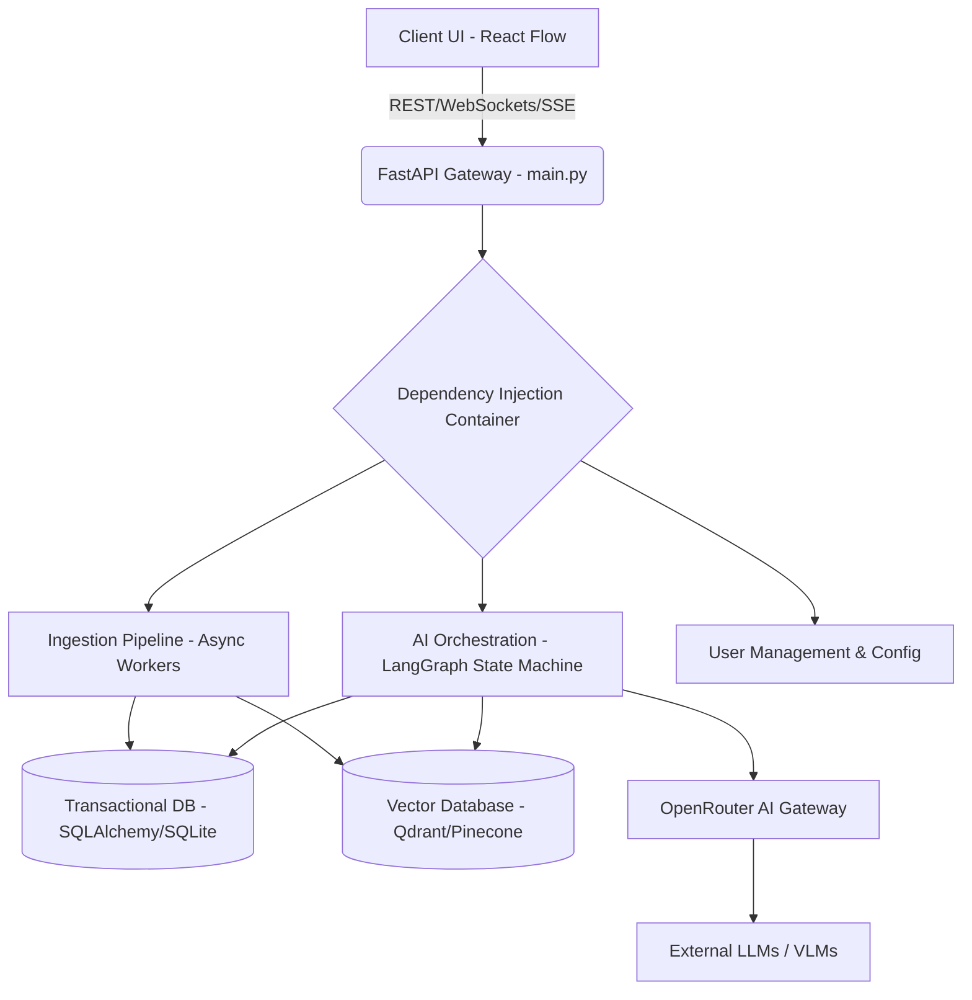

# SYSTEM ARCHITECTURE


## 1. Summary
The "matome" project is an advanced, frictionless active learning platform designed to transform the digestion of massive textual data into an engaging intellectual game. It integrates cognitive psychology principles, such as the SQ3R method and the spacing effect, with cutting-edge generative AI technologies, including RAPTOR, GraphRAG, and Multi-Dimensional Semantic KJ. The system empowers users, particularly product managers, consultants, researchers, and learners, to automatically deconstruct and reconstruct complex documents. By leveraging a progressive disclosure user interface and semantic zooming, the platform mitigates cognitive overload. The underlying architecture relies on a robust Python backend, orchestrating document ingestion, semantic chunking, and AI-driven node generation, while preserving the integrity of existing codebase elements such as `main.py` by seamlessly importing and extending them within new application contexts.


## 2. System Design Objectives


The primary objective of the system design for the matome platform is to establish a highly scalable, maintainable, and robust architecture that seamlessly blends complex AI processing with an intuitive, low-latency user interface. The system is required to process thousands of pages of dense text, systematically extracting semantic meaning, generating complex hierarchical RAPTOR trees, and supporting dynamic multi-dimensional clustering operations without compromising the performance perceived by the end user.

A critical constraint identified in the requirements is the severe cognitive load imposed on the user by existing, text-heavy solutions. Therefore, the system design must rigorously enforce progressive disclosure, ensuring that users are only presented with manageable, bite-sized chunks of information at any given time. This necessitates an architecture that fundamentally separates the raw data ingestion pipeline from the active user interface rendering. The architecture must strictly adhere to the principles of separation of concerns, ensuring that the ingestion pipeline, the AI processing orchestration (driven by LangGraph), and the API Gateway (FastAPI) are entirely decoupled. This decoupling is absolutely essential to allow independent scaling of the compute-heavy asynchronous document processing layer and the highly interactive, low-latency frontend.

In defining the success criteria for this system design, performance metrics are paramount. The frontend must maintain a stable 60 frames per second rendering speed even when displaying over 5,000 active nodes on the interactive canvas. On the backend, the Time-To-First-Token (TTFT) for AI interactions must be strictly under 1.0 second to ensure a conversational, real-time feel. Furthermore, given the sensitive nature of the corporate and academic documents that will be processed, the architecture must strictly enforce zero-data retention policies. This means that temporary files, intermediate processing artifacts, and cache data must be securely wiped immediately after use. The system must natively support Bring Your Own Key (BYOK) configurations, ensuring that enterprise users can securely utilise their preferred OpenRouter models without their API keys being exposed in plain text within the application memory space.

Furthermore, the architecture must explicitly adopt an additive mindset to preserve existing functionality. The repository currently contains a minimal `main.py` file, which serves as a rudimentary entry point printing a basic greeting. Rather than aggressively rewriting or discarding this historical foundation, our modern design strategy dictates that `main.py` will be safely enveloped and extended. It will act as the primary bootstrap script that mounts the new FastAPI server routers, initialises the application state, and instantiates the dependency injection containers, while retaining its original functional character if executed in a legacy context.

The resilience of the system is another core objective. The platform must gracefully handle unexpected failures, timeouts, and rate limits imposed by external AI model providers (such as OpenRouter endpoints). This requires the implementation of advanced automatic fallbacks and robust circuit breaker patterns within the AI routing layer. The asynchronous processing of massive documents must be systematically managed through durable job queues, ensuring that memory limits are not exceeded during the intensive semantic chunking and clustering phases. In doing so, we guarantee a frictionless, highly reliable experience that lives up to the product's ultimate vision of liberating humanity from the pain of digesting complex information.

To further elaborate on the scalability aspect, the system is designed to seamlessly integrate with cloud-native orchestration tools such as Kubernetes. By containerizing the various microservices—specifically separating the AI orchestration layer from the RESTful API gateways—we enable independent auto-scaling policies. During periods of intense document ingestion, the worker nodes handling semantic chunking and named entity recognition can scale out horizontally, processing multiple documents in parallel without degrading the performance of active user learning sessions. The use of a robust message broker, such as RabbitMQ or Redis Pub/Sub, ensures that processing tasks are reliably queued and distributed across available workers, preventing any single point of failure from crashing the entire pipeline.

Additionally, the integration of advanced observability tools is a non-negotiable objective. The system will implement comprehensive distributed tracing using OpenTelemetry, allowing developers to track the lifecycle of a request from the initial user upload, through the complex LangGraph state transitions, to the final database transaction. This high-resolution visibility into the system's operational state is critical for rapidly diagnosing performance bottlenecks and ensuring that the stringent Time-To-First-Token SLAs are consistently met. The deliberate focus on modularity, robust error handling, and deep observability ensures that the matome architecture is not just capable of meeting today's requirements, but is fundamentally prepared to evolve alongside the rapidly advancing landscape of generative AI technologies.


## 3. System Architecture


The system architecture of the matome platform embraces a modern, event-driven, and highly modular design pattern, primarily leveraging FastAPI for the backend API routing and LangGraph for orchestrating complex, multi-step AI workflows. The architecture is logically divided into three primary functional layers: the Ingestion & Preprocessing Pipeline, the Core Orchestration & AI Routing Layer, and the Client API & UI Presentation Layer.


### Mermaid Diagram


Strict boundary management and rigorous separation of concerns are enforced across all layers of the system. The Ingestion Pipeline operates as an isolated, asynchronous worker pool exclusively responsible for parsing incoming files, normalizing noise (such as headers, footers, and page numbers), and executing semantic chunking algorithms. Crucially, this pipeline has zero knowledge of the user interface state or the specific AI reasoning models that will later consume its output.

The AI Orchestration layer, driven by LangGraph, functions as a state machine that coordinates the complex cognitive tasks mandated by the product requirements. The state itself is strictly defined via a Pydantic model (`PipelineGraphState`), which passes between cyclical operations such as the RAPTOR tree generation process, the iterative Chain of Density (CoD) summarization loops, and the multi-dimensional Pivot KJ tagging. By confining these workflows within a dedicated orchestration layer, we prevent complex business logic from leaking into the HTTP request handlers.

The existing `main.py` script will be safely extended to function as the primary ASGI application entry point. It will mount the new FastAPI routers and initialize the central Dependency Injection (DI) container. This strategy ensures that the original functional scope of the minimal repository is preserved, yet seamlessly integrated into a robust, enterprise-grade application structure. All external system interactions—particularly communications with the OpenRouter AI gateway, transactional databases, and the high-speed vector databases—are abstracted behind explicit protocol interfaces (e.g., `AIGatewayProtocol`, `DocumentRepository`). This interface-driven design prevents tight coupling to any single vendor (vendor lock-in) and significantly facilitates comprehensive unit testing by allowing the injection of lightweight mock implementations during the CI pipeline.

Data flows entirely asynchronously from the moment of user upload. Documents enter a background job queue where the Ingestion Pipeline processes the text chunk by chunk to avoid out-of-memory (OOM) errors. The resulting semantic entities, chunk metadata, and dense vector embeddings are persisted in the vector database, while transactional state (e.g., user progress, node lock status) is securely managed in a relational data store. This foundation enables the AI Orchestration layer to perform ultra-fast, high-accuracy Retrieval-Augmented Generation (RAG) during the user's interactive learning sessions. By utilizing dependency injection for configuring pipeline limits, chunk sizes, and API credentials, the architecture guarantees that the system remains responsive, highly scalable, and remarkably easy to maintain as advanced new cognitive features are incrementally introduced.
To ensure the integrity and security of the data flowing through these highly decoupled layers, the architecture mandates strict input validation at every boundary. The FastAPI Gateway acts as the first line of defense, employing Pydantic models to strictly validate the structure, type, and logical consistency of all incoming HTTP payloads before they are allowed to proceed deeper into the system. Any request containing malformed data, unexpected fields, or attempting to exploit known vulnerabilities (such as SQL injection or path traversal) is immediately rejected with a precise, sanitized error response.

Furthermore, the AI Orchestration layer utilizes a highly robust, stateful circuit breaker pattern to protect the system from catastrophic cascading failures. If an external LLM provider, accessed via the OpenRouter AI Gateway, begins to exhibit high latency, returns severe error codes (e.g., HTTP 500 Internal Server Error or HTTP 429 Too Many Requests), or simply times out, the circuit breaker automatically trips. This instantly halts further requests to the failing service, preventing the depletion of crucial system resources such as thread pools and memory buffers. The system then seamlessly routes subsequent requests to a pre-configured, highly reliable fallback model (for instance, dynamically shifting from an advanced reasoning model to a faster, cheaper alternative) ensuring that the user's active learning session is not abruptly terminated by an invisible, upstream infrastructure failure.


## 4. Design Architecture


The design architecture details the concrete structural composition of the matome codebase, focusing heavily on the file hierarchy, module definitions, and the core domain Pydantic models. To prevent the emergence of tightly coupled "God Classes", the project rigorously employs a strict Domain-Driven Design (DDD) file structure. This ensures that pure business logic and schema definitions remain completely isolated from infrastructural concerns like database connections or HTTP transport protocols.

### File Structure (ASCII Tree)
```text
.
├── main.py                     # Existing entry point, safely extended to boot FastAPI
├── pyproject.toml              # Strict linter and type-checker configurations
├── README.md                   # Comprehensive project landing page
├── src/
│   ├── domain/                 # Core domain models (Pydantic) and interfaces
│   │   ├── models.py           # DocumentNode, IdentityNode, ContentNode schemas
│   │   ├── protocols.py        # Abstract Base Classes for repositories & services
│   │   └── exceptions.py       # Custom, precise business logic exceptions
│   ├── application/            # Use cases and business logic orchestration
│   │   ├── ingestion.py        # Document parsing and semantic chunking workflows
│   │   └── study_session.py    # SQ3R state management and quiz generation logic
│   ├── infrastructure/         # External service and database integrations
│   │   ├── ai_gateway.py       # Robust OpenRouter client implementation with fallbacks
│   │   └── vector_db.py        # Abstracted Pinecone/Qdrant repository adapters
│   └── api/                    # FastAPI routers and HTTP request/response schemas
│       ├── routes.py           # REST API endpoints
│       └── dependencies.py     # Centralised DI container and configuration injection
└── tests/                      # Comprehensive, side-effect-free test suite
    ├── unit/                   # High-speed tests utilizing mocked dependencies
    └── integration/            # API and database interaction verification tests
```

### Core Domain Pydantic Models Structure
The domain models are defined using modern Pydantic classes configured with strict typing policies (specifically `extra="forbid"`) to categorically guarantee runtime data integrity and immediately reject malformed inputs. The new schema objects are meticulously designed to extend the core concepts of the application logically.

The most central architectural entity is the `DocumentNode`, which represents a single, atomic piece of information within the hierarchical RAPTOR tree. To maintain strict separation of concerns and avoid bloated models, the monolithic concept of a node is decoupled into two strictly isolated sub-models: the `IdentityNode` and the `ContentNode`.

The `IdentityNode` is responsible exclusively for structural and relational metadata. It handles unique cryptographic identifiers, maintains the parent-child traversal relationships within the tree hierarchy, and stores the multidimensional tags (e.g., Time Axis, Actor Axis, Sentiment) that are absolutely required for the dynamic Pivot KJ restructuring functionality.

Conversely, the `ContentNode` encapsulates the substantive data. It houses the raw, unedited text chunk, the refined Chain of Density (CoD) summary, and the structured list of named entities extracted during preprocessing. This additive, composite design ensures that as complex new dimensional axes or metadata tags are introduced in future iterations, the `IdentityNode` can be independently extended without risking any unintended side effects on the core text processing and validation logic housed securely within the `ContentNode`.

Furthermore, all application configuration schemas, such as `PipelineConfig` and `CredentialConfig`, are defined as strict Pydantic models and injected directly into the constructors of specific services. This entirely eliminates the reliance on insecure global singletons and hardcoded magic numbers scattered throughout the logic. This approach actively enforces the Dependency Inversion Principle, facilitating significantly easier mocking during testing and ensuring highly predictable state management across the entire application lifecycle. By enforcing these rigorous architectural constraints at the foundational domain level, we guarantee that the matome platform remains agile, deeply testable, and fundamentally resilient as it scales to handle enterprise workloads.


## 5. Implementation Plan

The implementation of the matome project will be executed in six strictly defined, sequential cycles. This phased approach guarantees that each technical iteration builds securely upon a fully validated foundation, minimizing integration risks and ensuring that the existing codebase, particularly the original `main.py`, remains undisturbed.

### Cycle 01: Core Infrastructure and Strict Additive Foundation

In this critical first cycle, we establish the bedrock architecture of the platform while strictly preserving the existing `main.py` script. The primary objective is to configure the non-negotiable, strict linter settings (ruff, mypy) within `pyproject.toml` to enforce extremely high code quality from day one. We will implement the fundamental FastAPI server structure within `main.py`, carefully ensuring that its original capability (printing 'Hello from matome!') is retained and accessible. We will define the core domain Pydantic models, specifically the `IdentityNode` and `ContentNode`, enforcing the `extra='forbid'` constraint to champion a schema-first development methodology. Simultaneously, a robust dependency injection (DI) container will be architected to manage application configuration and inject external credentials securely, entirely avoiding global variables. This cycle establishes the indispensable structural scaffolding required for all subsequent AI feature additions, proving that the additive mindset is technically viable and rigorously followed. Crucially, we will implement the foundational abstract base classes (protocols) that will define the strict contracts for our external infrastructure components: `DocumentRepository`, `UserRepository`, `VectorDBProtocol`, and `AIGatewayProtocol`. By defining these strict interfaces early, we guarantee that the core business logic remains blissfully unaware of the specific database or AI technologies that will eventually power it, ensuring total decoupling and massive testability from day one.

### Cycle 02: Resilient Ingestion and Semantic Chunking Pipeline

This cycle shifts focus entirely to building the heavy-duty document ingestion engine. We will engineer multi-modal support mechanisms capable of parsing standard text files and cleanly extracting raw content while heuristically discarding layout noise. The highly complex semantic chunking algorithm will be developed here, explicitly abandoning primitive fixed-character-count splitting in favor of dynamic division based on the cosine similarity of adjacent sentences. To ensure extreme resilience against memory limitations, the ingestion pipeline will process all text data strictly as iterators (e.g., `yield`ing chunks), actively preventing Out-Of-Memory (OOM) exceptions when handling massive corporate manuals. Furthermore, we will build the foundational Named Entity Recognition (NER) protocol adapters, allowing the system to extract absolutely critical business terms from the text chunks and safely persist them as tagged metadata. To maintain total independence from Cycle 06's infrastructure, this pipeline will be immediately wired to `InMemoryDocumentRepository` and `InMemoryVectorDB` mock implementations. The ingestion engine will be designed to run entirely asynchronously, allowing the main API thread to instantly return a 202 Accepted response to the user while the heavy lifting safely occurs in an isolated background worker thread.

### Cycle 03: RAPTOR Tree Generation and Information Densification

Building directly upon the clean data streams produced by the ingestion pipeline, this cycle implements the complex, stateful AI orchestration leveraging the LangGraph framework. We will precisely define the `PipelineGraphState` Pydantic model that dictates the entire flow of data through the AI nodes. We will integrate advanced clustering algorithms, specifically utilizing UMAP for dimensionality reduction and Gaussian Mixture Models (GMM) for soft clustering, to automatically synthesize a comprehensive, bottom-up hierarchical RAPTOR tree from the flat semantic chunks. Crucially, the Information Super-Densification process—utilizing iterative Chain of Density (CoD) prompting loops—will be engineered to forcefully strip redundant modifiers and generate incredibly high-density summaries for every single generated node in the tree. The state management of this intensive, multi-call workflow will be strictly controlled. We will implement highly durable circuit breaker patterns within the injected `AIGatewayProtocol` and automatic fallback mechanisms to ensure that transient failures in external LLM API calls are handled gracefully without corrupting the overall document processing job. The resulting structured knowledge tree will be carefully synchronized with both the transactional database and the vector database, ensuring that all newly generated parent summaries are fully searchable and their state accurately recorded.

### Cycle 04: Semantic Zoom API Backend and Interactive SQ3R Logic

This fourth cycle transitions the development focus aggressively towards the application layer APIs that directly support the innovative frontend user interface. We will design and implement the high-performance endpoints necessary to serve the dense RAPTOR tree progressively, acting as the backend engine for the visual Semantic Zoom functionality. To ensure the required sub-second latency for an interactive feel, we will implement Server-Sent Events (SSE) or WebSockets to stream the tree data directly to the client as it is processed. The core cognitive psychology features, specifically the SQ3R logic, will be fully realized. We will engineer the API endpoints responsible for dynamically generating adaptive, context-aware questions when a user attempts to 'unlock' a previously unread node, leveraging the transactional DB to track user progress. Furthermore, we will integrate the sophisticated evaluation logic required to assess user answers—whether submitted via text or transcribed voice—and provide immediate, highly accurate Sandwich Feedback that gently corrects hallucinations. The logic handling the state transitions of these nodes will be strictly isolated within dedicated `StudySessionUseCase` classes, keeping the FastAPI route handlers thin, highly testable, and completely focused exclusively on HTTP transport semantics.

### Cycle 05: Pivot KJ and Multi-Dimensional Knowledge Engine

The fifth cycle introduces the platform's absolute most powerful insight generation capabilities. We will construct the backend logic for the Pivot KJ engine, which allows the dynamic relocation of knowledge nodes across entirely new multidimensional axes, such as a System Design Axis or a SWOT Analysis Axis. The pre-tagging metadata foundation established meticulously in the second cycle will now be deeply leveraged to perform high-speed, on-the-fly SQL and Vector queries to restructure the massive knowledge graph logically. Crucially, the actual computationally expensive physics calculations (e.g., Force-directed graph layouts) will be explicitly delegated to the React Flow frontend client; this cycle's backend responsibility is solely to return the logically mapped multidimensional coordinates and cluster assignments. Additionally, we will integrate the critical Web-Grounding feature, connecting the LangGraph AI to simulated external search APIs to cross-reference reconstructed business workflows with real-world best practices and flag human status quo biases. Finally, we will build the highly complex automated export formatting capabilities, writing the algorithms that perfectly translate a dynamically rearranged node layout into perfectly structured Markdown Requirements Documents and syntactically valid Mermaid.js UML sequence diagram snippets directly downloadable by the user.

### Cycle 06: Enterprise Security Hardening and Model Optimisation

The final implementation cycle systematically and ruthlessly addresses the non-functional enterprise requirements, deep security hardening, and final system optimization. We will construct the user-level Bring Your Own Key (BYOK) architecture, guaranteeing that highly sensitive user API keys are requested just-in-time via a `CredentialProviderProtocol`. We will explicitly engineer a `SecureString` wrapper utilizing `ctypes.memset` to absolutely guarantee that API keys are zeroized in memory immediately after use, preventing catastrophic logging leaks or memory dump exposures. The task-specific model routing logic will be finalized, enabling the application to dynamically dispatch requests to either cheap, fast models (for chunking) or expensive, advanced reasoning models (for Pivot KJ insights) strictly based on the injected, validated `config.json` rules. We will conduct extensive, methodical performance profiling to identify API bottlenecks, ensuring ultra-low latency HTTP responses and optimizing the vector database indexing queries. This cycle rigorously verifies that all granular access control mechanisms, aggressive path traversal protections, and absolute zero-data retention constraints are bulletproof, formally declaring the matome platform fully prepared for demanding, highly secure enterprise deployment.

## 6. Test Strategy

The comprehensive test strategy for the matome project is meticulously designed to ensure an exceptionally high level of reliability, strict security compliance, and absolute functional correctness across all development cycles. We mandate a strict minimum of 85% code coverage. Crucially, all tests must execute in total isolation to actively prevent any bleeding side effects, heavily utilizing temporary directory fixtures for all file I/O operations and injecting comprehensive mock objects to intercept all external network interactions.

### Cycle 01 Test Strategy

Testing within this foundational cycle focuses intently on verifying the absolute structural integrity of the newly defined Pydantic domain models. We will author highly strict unit tests that explicitly pass unexpected, malformed data structures to assert that precise validation errors are immediately raised, definitively proving that the `extra='forbid'` constraint is actively enforced at runtime. The centralized Dependency Injection (DI) container will be subjected to exhaustive tests to confirm that all required service dependencies are correctly instantiated, properly scoped, and that sensitive credentials are securely mapped without leakage. We will exclusively employ Pytest's `tmp_path` fixture to perfectly simulate complex configuration file loading scenarios without ever touching the actual host filesystem. Furthermore, we will write a highly specific integration test verifying that the extended `main.py` successfully boots the modern FastAPI application structure while simultaneously preserving its original legacy terminal output, thereby guaranteeing zero regressions in the fundamental baseline functionality. The abstract base classes and protocols will be rigorously validated by implementing intentionally faulty mock subclasses to ensure that Python's typing system correctly catches protocol violations during the static analysis phase.

### Cycle 02 Test Strategy

The critical document ingestion pipeline will be aggressively tested using a highly diverse suite of mock documents intentionally containing extreme edge cases. This includes deeply malformed text structures, highly unusual character encodings, and chaotic formatting designed to break naive parsers. The complex semantic chunking logic will be isolated and unit-tested by providing it with carefully predefined, multi-topic text sequences; we will mathematically assert that the resulting chunk boundaries perfectly match the logically expected proposition breaks based on cosine similarity thresholds. We will heavily and explicitly mock all vector database network interactions to guarantee that the test suite runs at lightning speed and remains entirely independent of external network stability. Crucially, severe security tests will be engineered to verify that deliberate directory traversal attacks attempted during the file upload process are immediately and successfully blocked by our robust path canonicalization checks. All file reading and writing operations within these tests will strictly and exclusively utilize isolated temporary directories. We will specifically assert that the asynchronous iterators do not consume excessive memory by utilizing tracemalloc during the chunking tests to verify our tight memory footprint guarantees.

### Cycle 03 Test Strategy

Rigorous testing of the LangGraph AI orchestration workflow requires highly sophisticated, stateful mocking of the external OpenRouter AI Gateway. We will systematically simulate a wide variety of extremely hostile LLM responses—including severely malformed JSON outputs, sudden network timeouts, and HTTP 429 rate limits—to unequivocally verify that our implemented circuit breakers, graceful degradation pathways, and retry mechanisms function perfectly without crashing the host process. The mathematical clustering algorithms (UMAP and GMM) will be strictly tested by injecting locked, deterministic random seeds to ensure perfectly reproducible tree generation results across multiple test runs in varied CI environments. We will author highly specific semantic tests for the Chain of Density (CoD) summarization process, asserting with exact precision that the iterative refinement loops successfully maintain the rigidly specified word counts while flawlessly integrating the previously extracted named entities. These deep integration tests will comprehensively validate all complex state transitions within the LangGraph state machine without incurring any financial cost from external APIs. The strict separation between the orchestration engine and the raw domain models will be verified to ensure that the AI logic cannot inadvertently corrupt the core data schemas.

### Cycle 04 Test Strategy

The cognitive SQ3R logic and the progressive Semantic Zoom APIs will be tested primarily through blazing-fast integration tests leveraging FastAPI's lightweight `TestClient`. We will extensively simulate complete user session lifecycles, forcefully verifying that locked informational nodes absolutely cannot be accessed or revealed without the user first successfully passing the required adaptive question gates. The AI-driven adaptive question generation logic itself will be rigorously tested by injecting specifically mocked, low-quality LLM prompts to ensure the system gracefully handles poor AI performance and correctly applies the configured difficulty levels (Beginner vs. Expert). We will also implement deeply specific tests to rigorously verify the immediate feedback loop mechanism, guaranteeing that the system correctly parses hallucinated facts from a user's transcribed audio response and generates the appropriate, gently corrective Sandwich Feedback without breaking character. The critical state management of the user's learning progress will be subjected to concurrency tests to absolutely prevent any data race conditions or state inconsistencies. Security boundaries will be validated to ensure that users absolutely cannot manipulate their session state via malformed API requests to automatically bypass the mandatory learning gates.

### Cycle 05 Test Strategy

The highly complex Pivot KJ multi-dimensional analysis engine will be deeply tested by programmatically injecting a massive, perfectly pre-calculated RAPTOR knowledge tree directly into the state machine. We will then programmatically trigger the radical restructuring process along multiple, conflicting dimensional axes simultaneously. We will write complex assertion logic to mathematically verify that the resulting newly formed clusters correctly reflect the underlying multidimensional metadata tags, and crucially, that absolutely zero original text data is lost or orphaned during the violent physical transformation of the graph. The innovative Web-Grounding feature will be securely tested by heavily mocking the external search engine APIs and asserting that our AI logic correctly identifies and flags deliberately inserted status quo biases within the test data. The automated document export functionality will be subjected to incredibly strict format validation; we will write regex-based tests to guarantee that the dynamically generated Markdown and Mermaid.js snippets are syntactically perfect, parseable by standard UML tools, and accurately represent the newly restructured knowledge graph geometry. Output constraints will be tested rigorously to verify that the generated artifacts completely adhere to the rigid format expectations of downstream parsers.

### Cycle 06 Test Strategy

The final cycle's test strategy is completely dedicated to ruthless security penetration testing, advanced performance profiling, and enterprise configuration management verification. We will deeply test the Bring Your Own Key (BYOK) functionality by simulating the dynamic injection of complex, highly entropic API keys via the `CredentialProviderProtocol`. We will utilize memory inspection techniques within the test suite to definitively verify that these sensitive keys are explicitly zeroized and absolutely never exposed in raw application memory dumps or text-based error logs. The dynamic, task-specific model routing logic will be comprehensively tested by asserting that simulated text summarization requests are correctly dispatched to cheap, fast models, while complex reasoning tasks are successfully routed to advanced models, strictly adhering to the complex rules defined in the simulated `config.json` settings. We will execute highly aggressive simulated high-load concurrency scenarios to forcefully trigger external provider failures, verifying that the entire system degrades gracefully rather than crashing. Finally, we will execute a complete suite of massive end-to-end (E2E) UI-to-Database simulation tests, ensuring every single component interacts flawlessly under extreme, enterprise-grade stress.
