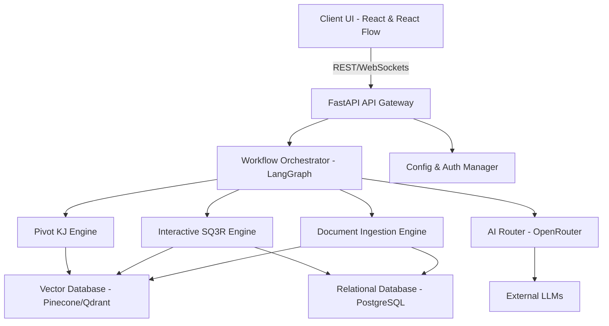

# SYSTEM ARCHITECTURE

## 1. Summary
The matome platform is an advanced, interactive knowledge workspace designed to transform the way professionals, researchers, and learners digest and interact with massive amounts of text. By integrating generative AI, cognitive psychology principles (such as SQ3R and spaced repetition), and a high-performance interactive frontend, matome elevates reading from a passive consumption activity to an active, frictionless learning and insight-generation process. The system orchestrates multiple AI models to perform document ingestion, semantic chunking, hierarchical tree generation (RAPTOR), and dynamic knowledge restructuring (Pivot KJ).

## 2. System Design Objectives
The primary objective of the matome platform is to completely eradicate the cognitive overload typically associated with processing vast amounts of unstructured text. In modern business and academic environments, users are frequently overwhelmed by voluminous documents such as legacy system manuals, exhaustive market reports, and dense academic papers. Traditional reading methods often lead to the "Lost-in-the-Middle" phenomenon, where critical context is forgotten, and readers succumb to fatigue. Matome aims to solve this by providing a highly interactive, visually engaging interface that employs progressive disclosure. This ensures that users are only presented with the information they need at any given moment, significantly reducing intrinsic and extraneous cognitive load. To achieve this, the interface progressively unveils complex information structures, transforming a static reading experience into a dynamic exploration. This approach mitigates the common frustration experienced when confronting dense academic texts or intricate corporate specifications, making knowledge acquisition a seamless and engaging process. The progressive disclosure mechanism acts as an "Advance Organizer", laying the structural groundwork before presenting detailed content.

Another key objective is to foster active, generative learning through seamless UI interventions. The system is designed to interrupt passive reading with intelligent, context-aware prompts—asking users to predict content before reading and to summarise (recite) it afterwards. This frictionless application of the SQ3R method aims to transition information from short-term to long-term memory, enhancing retention and understanding. The platform must ensure that these interactions feel like a rewarding micro-gamification experience rather than a tedious chore, leveraging immediate feedback and visual rewards to maintain user motivation. This gamified approach transforms rote learning into a compelling intellectual game. Immediate auditory and visual feedback signals success, releasing dopamine and creating a positive reinforcement loop that keeps the user engaged. The transition from passive consumption to active production is a critical success factor for the platform.

Furthermore, the architecture must support advanced knowledge restructuring to prevent the "As-Is" trap. Users often accept the original structure of a document, which can carry over inefficiencies when designing new systems or strategies. Matome provides the "Pivot KJ" feature, allowing users to dynamically rearrange information along new multidimensional axes (e.g., actor vs. state transition, SWOT). The system must rapidly recalculate relationships and re-render the knowledge graph in real-time. This requires a highly performant backend capable of executing complex vector searches and a frontend that can render thousands of nodes at a smooth 60fps. This dynamic restructuring allows users to transcend the original author's narrative structure. By mapping content to novel frameworks, the system acts as a powerful analytical tool, surfacing latent patterns and relationships that would otherwise remain hidden within the raw text.

Security, privacy, and extensibility are also paramount. Enterprise users must trust that their sensitive data—such as unpublished papers or internal manuals—will not be leaked or used to train external models without consent. The system must support Bring Your Own Key (BYOK) configurations and offer on-premise or local inference options for highly confidential workflows. The architecture must be resilient, with fallback mechanisms for AI model routing to ensure continuous availability even if a specific LLM provider experiences downtime. Stringent access controls and robust encryption mechanisms are foundational to the system's enterprise readiness. The architecture ensures that data sovereignty is maintained, satisfying the rigorous compliance requirements of large-scale organisations and research institutions.

## 3. System Architecture
The system architecture of matome follows a strictly decoupled, modern service-oriented design. At its core, it separates the presentation layer, the application logic orchestration layer, the AI processing layer, and the data persistence layer. This ensures that changes in one domain (e.g., swapping out an LLM provider or changing the vector database) do not ripple through the entire codebase. The architecture strictly adheres to the principles of Dependency Injection and the Repository Pattern to maintain clean boundaries between components. The frontend interacts exclusively with the backend via a well-defined REST or GraphQL API, completely isolated from any internal business logic or AI orchestration. This decoupling is essential for parallel development, simplified testing, and the ability to scale individual components independently. The backend serves as the single source of truth for business logic and data state, abstracting the complexities of external AI model integration.

**Frontend Layer:** The presentation layer is built using React and React Flow to manage the complex, highly interactive "Semantic Zoom" canvas. To ensure the UI remains responsive (targeting 60fps) even with thousands of nodes, computationally heavy tasks such as document parsing and physics-based layout calculations for the Pivot KJ feature are offloaded to Web Workers. This strict separation of UI rendering from data processing within the client ensures an uninterrupted user experience. State management is handled centrally, providing a consistent and predictable application state across diverse components. The visual layer leverages advanced WebGL or Canvas APIs for optimal rendering performance, ensuring that zooming, panning, and dynamic node repositioning feel instantaneous and completely fluid to the user.

**Backend Layer:** The backend is implemented in Python using FastAPI, providing a robust and high-performance asynchronous API. LangGraph is utilised to orchestrate the complex state machines required for AI workflows, such as the document ingestion pipeline (extraction -> semantic chunking -> entity tagging -> clustering). This orchestration layer is entirely decoupled from the actual AI model execution, treating the AI models merely as external services. This design pattern ensures that the system's workflow logic remains invariant, even when underlying AI models are upgraded or swapped. FastAPI's inherent asynchronous capabilities allow the system to efficiently handle thousands of concurrent connections, a critical requirement for serving multiple enterprise users simultaneously.

**AI Routing and Integration:** OpenRouter serves as the unified gateway for LLM requests, allowing the system to dynamically route tasks to the most appropriate model based on configuration (e.g., using Gemini for fast chunking and Claude for deep reasoning). A Config Management module handles BYOK settings and automatic fallbacks, ensuring high availability. By centralising AI model interactions, the system simplifies API key management and reduces dependency on any single provider. This architecture also allows the system to optimise costs by dynamically selecting the most cost-effective model for a given task, while ensuring that the selected model possesses the necessary capabilities for that specific operation.

**Data Persistence and Vector Search:** Document metadata, user progress, and system state are stored in a relational database (e.g., PostgreSQL), accessed via the Repository Pattern to abstract the underlying SQL queries. For semantic search and RAPTOR tree generation, a dedicated Vector Database (such as Pinecone or Qdrant) is used. The integration with the Vector DB is hidden behind an interface, allowing the concrete implementation to be swapped if an enterprise requires an on-premise vector store. This dual-database architecture ensures that relational data is efficiently managed with ACID properties, while vector data is optimised for high-dimensional similarity searches. The strict separation of storage concerns enhances performance, scalability, and the system's ability to handle massive datasets without degrading query response times.

**Boundary Management Rules:**
1. **Frontend-Backend Contract:** The frontend must never contain business logic related to document parsing or AI prompt generation. It strictly consumes standard REST/GraphQL APIs and renders the state.
2. **AI Service Abstraction:** All interactions with external LLMs must be abstracted through a unified interface (`matome.interfaces.LLMClient`). Business logic classes must not directly import or depend on specific provider SDKs (like openai or anthropic).
3. **Data Access Isolation:** Domain models must be pure Pydantic classes without any ORM logic. All database interactions must occur through dedicated repository classes implementing strictly defined abstract base classes (`matome.interfaces.DocumentRepository`).



## 4. Design Architecture
The design architecture of matome is structured to promote maintainability, testability, and scalability. The codebase is organised by functional domains rather than technical layers, applying Domain-Driven Design (DDD) principles where appropriate. This modular approach ensures that each component can be developed, tested, and deployed independently, reducing the risk of introducing regressions during complex feature updates.

### File Structure Overview
```text
matome/
├── src/
│   ├── api/                 # FastAPI routes and controllers (e.g., router_documents.py)
│   ├── core/                # System configuration, security, and exception handling (e.g., config.py)
│   ├── domain_models/       # Pure Pydantic models for business entities (e.g., models.py)
│   ├── engines/             # Core business logic (Ingestion, RAPTOR, Pivot KJ)
│   ├── infrastructure/      # External service implementations (DB, OpenRouter)
│   └── interfaces/          # Abstract base classes and protocols (e.g., repository_interfaces.py)
├── tests/
│   ├── unit/
│   ├── integration/
│   └── e2e/
├── dev_documents/
│   ├── system_prompts/
│   ├── ALL_SPEC.md
│   └── USER_TEST_SCENARIO.md
├── tutorials/
│   └── UAT_AND_TUTORIAL.py
├── pyproject.toml
└── README.md
```

### Core Domain Pydantic Models and Typing

The core domain relies heavily on strict Pydantic models to ensure data integrity and type safety across the entire application lifecycle. These models define the fundamental shapes of data moving through the system, acting as the definitive source of truth for object structures.

1. **DocumentNode (extends existing Node model):** Represents a single unit of information in the RAPTOR tree. The existing Node model serves as a foundation, ensuring backwards compatibility and code reuse.
   - `id`: Unique identifier, ensuring robust referencing across the database and frontend.
   - `content`: The semantic text chunk, representing the core informational value of the node.
   - `level`: Depth in the hierarchical tree, essential for rendering the Semantic Zoom UI correctly.
   - `metadata`: A comprehensive dictionary containing extracted entities, time-axis tags, and system design tags (actors, data flows). This extends the standard metadata to comprehensively support the Pivot KJ feature, allowing complex multidimensional filtering and clustering.

2. **UserInteractionContext:** Tracks the user's progress and SQ3R state, ensuring a seamless and personalised learning experience.
   - `user_id`: Identifier linking the interaction state to a specific authenticated user account.
   - `node_id`: Target node currently being interacted with or studied by the user.
   - `status`: Enum (LOCKED, QUESTION_ASKED, UNLOCKED, COMPLETED), dictating the precise UI state and allowed actions.
   - `attempts`: Number of answer attempts, driving the progressive hint system and preventing user frustration.

3. **PivotBoard:** Represents a restructured view generated by the Pivot KJ engine, encapsulating a novel analytical perspective.
   - `id`: Board identifier, allowing users to save and recall different analytical views.
   - `original_document_id`: Reference to the source document, maintaining strict traceability back to the primary material.
   - `axes`: The multidimensional axes selected (e.g., X=Time, Y=Actor), defining the underlying logic of the new spatial arrangement.
   - `layout`: Spatial coordinates and relationships of nodes on the new canvas, consumed directly by the React Flow frontend for rendering.

**Integration Points:** The new models seamlessly integrate with the existing infrastructure, extending rather than replacing core functionality. For instance, the `DocumentNode` extends the base node structure expected by the Vector Database repository, allowing for seamless persistence and retrieval of enriched metadata. When the `Pivot KJ Engine` requests a new layout, it queries the `DocumentNode` metadata and constructs a `PivotBoard` instance, which is then serialised and sent to the frontend. The `engines` directory acts as the central coordinator, pulling data via `infrastructure` repositories, applying pure business logic from `domain_models`, and returning results to the `api` layer. This clear separation of concerns guarantees that complex business rules remain isolated from data access concerns or API presentation details. Interfaces and Protocols are heavily utilized to decouple specific implementations, allowing components to communicate effectively without deep dependencies.

## 5. Implementation Plan

**Cycle 01: Core API & Interfaces**
This cycle establishes the unshakeable foundation for parallel development across the frontend and backend teams. The primary goal is creating the rigid interface contracts, abstract base classes, and core Pydantic domain models inside `src/domain_models/` and `src/interfaces/`. We will meticulously define `DocumentNode`, `PivotBoard`, and `UserInteractionContext` to serve as the definitive source of truth for all data structures flowing through the application. Simultaneously, we will configure the FastAPI server and expose the essential, albeit completely mocked, REST API endpoints, such as `POST /api/v1/documents/upload` and `GET /api/v1/documents/{id}/status`. This strictly defined API boundary is critical; it allows frontend developers to immediately begin consuming stable API stubs and building out the interface without waiting for the underlying backend logic to be fully realized. The configuration management system, utilizing `pydantic-settings` to securely parse and validate the `.env` file, and global exception handlers will be finalized in `src/core/`. The database layer will initialize its Alembic migration scripts and configure the base SQLAlchemy ORM declarative base, though table definitions will be intentionally minimal at this stage. The critical dependency injection container, utilizing `dependency-injector` or FastAPI's native `Depends`, will be wired up, explicitly injecting mock repository implementations into the API routes. By strictly enforcing `ruff` and `mypy` configurations from `pyproject.toml`, this cycle guarantees that all foundational code is structurally sound, one hundred percent type-safe, and robustly tested. This uncompromising approach completely prevents technical debt from accumulating before complex, error-prone logic is introduced in subsequent cycles. A robust logging framework utilizing structural JSON logging will be integrated globally, providing deep visibility into API requests, request latency, and internal processing stages. This ensures that the system is ready for the rigorous integration of external AI services. The focus remains strictly on establishing the core architectural scaffolding, ensuring exceptionally high test coverage for all fundamental components before introducing the complexities of asynchronous AI orchestration or database persistence. We will also implement the foundational cross-origin resource sharing (CORS) configurations, rate-limiting middleware, and health check endpoints to ensure the application is structurally prepared for deployment to a staging environment. This cycle is not about delivering features to the end-user, but rather about creating an impenetrable bedrock upon which all future, high-complexity features can safely and reliably rest.

**Cycle 02: Ingestion & Vector DB Integration**
With the stringent API boundaries fully secured, Cycle 02 connects the core application logic to the real data persistence layers. We will implement the concrete `infrastructure` repositories for PostgreSQL, tasked with reliably storing document metadata and user state, and the Vector Database (e.g., Pinecone, Qdrant, or locally managed Milvus), tasked with storing the high-dimensional semantic chunks. The `DocumentIngestionEngine` will be meticulously built, serving as the primary orchestrator for the file upload process, raw text extraction (utilizing libraries like `PyMuPDF` for PDF parsing or `markitdown` for markdown conversion), and basic structural validation. Most importantly, the `SemanticChunker` engine component will be implemented. This requires finalizing the `AI Router` integration to reliably, asynchronously hit OpenRouter for access to fast, high-throughput embedding models (e.g., `text-embedding-3-small` or local, open-source equivalents). The intricate chunking logic will aggressively partition documents, evaluate cosine similarities between adjacent sentences to find natural semantic boundaries, and execute highly optimized bulk inserts into the Vector DB via the finalized repository interfaces. The primary API endpoint, `POST /api/v1/documents/upload`, will transition from a simple mock to triggering this real, complex asynchronous ingestion pipeline, potentially utilizing background tasks or a dedicated task queue like Celery or Redis Queue for robust processing. Extensive unit testing will mock the OpenRouter network responses, ensuring the chunking algorithms perform predictably. Simultaneously, integration tests will rigorously verify that chunks and highly structured metadata successfully persist to local test database instances, ensuring absolutely zero data loss and validating robust error handling for connection timeouts or transient network failures. We will also implement a sophisticated Named Entity Recognition (NER) pipeline during the chunking phase, utilizing a smaller, cost-effective LLM or a dedicated spaCy model to extract critical terms, system actors, and crucial temporal dates, thereby significantly enriching the metadata attached to each vector. This cycle represents a massive leap in technical capability, bridging the gap between raw, unstructured text and the structured, mathematically queryable vector representations required by the advanced AI features. It lays the absolute necessary groundwork for the advanced hierarchical clustering required in the RAPTOR implementation, providing a stable, scalable, and highly annotated dataset for the next processing stages.

**Cycle 03: RAPTOR & LangGraph Orchestration**
This cycle tackles the absolute core AI complexity of the entire platform: generating the hierarchical RAPTOR (Recursive Abstractive Processing for Tree-Organized Retrieval) tree. We will fully introduce and configure `LangGraph` to meticulously manage the highly intricate state machine responsible for clustering, recursively summarising, and continuously re-embedding semantic chunks. The core engine will retrieve the flat, massive list of semantic chunks directly from the Vector Database (which was populated during the ingestion phase in Cycle 02). It will then apply advanced dimensionality reduction techniques, specifically Uniform Manifold Approximation and Projection (UMAP), followed by Gaussian Mixture Model (GMM) clustering. For each logically identified cluster of vectors, the LangGraph workflow will asynchronously invoke the configured, high-reasoning LLM (via the OpenRouter gateway) using a highly structured, rigorously tested Chain of Density (CoD) prompt. This guarantees the generation of a highly compressed, extraordinarily informative parent summary node. This entire process loops recursively, continually building a robust, bottom-up knowledge tree until a single root node representing the entire document is synthesized. The newly created hierarchical links, establishing the parent-child relationships between raw chunks and higher-level summaries, are persisted atomically back to both PostgreSQL (for relational querying) and the Vector DB (for semantic retrieval). The `GET /api/v1/documents/{id}/tree` endpoint is now fully implemented, serving the deeply serialized, nested Pydantic models to the requesting client. Testing in this phase focuses heavily on rigorously validating the complex LangGraph state transitions and heavily mocking the LLM API calls to ensure the GMM clustering algorithms and recursive summarisation logic behave deterministically and efficiently under pressure. We will meticulously profile the memory consumption of the clustering algorithms to prevent out-of-memory errors when processing exceptionally large, enterprise-scale documents. The orchestration logic will be fortified with robust retry mechanisms, exponential backoff strategies, and dead-letter queues to handle inevitable transient LLM API failures or unexpected rate limits gracefully. This cycle definitively transforms a flat, unstructured list of text chunks into the highly structured, easily traversable knowledge graph that is absolutely essential for powering the platform's flagship semantic zoom user interface and advanced retrieval capabilities.

**Cycle 04: Semantic Zoom UI & Frontend Contract Fulfillment**
Cycle 04 decisively shifts focus from complex backend AI orchestration to the frontend presentation layer, bridging the robust backend logic with a highly responsive, interactive user experience. While the backend now flawlessly exposes the complete RAPTOR tree structure via REST APIs, the frontend must render this massive dataset smoothly and intuitively. We will deeply integrate the `React Flow` library to build the core infinite canvas, aggressively consuming the `GET /api/v1/documents/{id}/tree` API. The absolutely crucial "Semantic Zoom" (Progressive Disclosure) rendering logic is meticulously implemented here: the user interface initially renders only the highest-level root nodes of the document tree, completely preventing the debilitating cognitive overload associated with displaying thousands of nodes simultaneously. We will utilize background Web Workers to continuously pre-calculate and cache complex force-directed layout positioning for off-screen child nodes, completely offloading these extremely heavy mathematical computations from the main browser rendering thread. As a user actively zooms past a specific, calculated threshold or explicitly double-clicks a summary node, the UI smoothly and elegantly animates the expansion, dynamically fetching deeper, more granular levels of detail from the backend if they weren't already eagerly loaded into memory. Sophisticated minimap and interactive breadcrumb components are seamlessly integrated to ensure users maintain perfect spatial context and navigation awareness within the massive knowledge graph. Crucially, the frontend state management, utilizing robust solutions like Zustand or Redux Toolkit, is finalized to keep the dynamically rendered canvas perfectly in sync with the underlying backend data structures. End-to-End (E2E) testing using Playwright will rigorously simulate realistic user interactions, such as aggressive zooming, rapid panning, and node selection. These automated tests strictly validate that the user interface consistently maintains a buttery smooth 60fps frame rate and correctly queries the backend API without triggering redundant network calls, memory leaks, or visual stuttering. This cycle definitively transforms the abstract backend data structures into an intuitive, visually compelling user experience, establishing the core interface paradigm of the matome platform. The accessibility features, such as comprehensive keyboard navigation shortcuts, ARIA labels, and WCAG-compliant contrast ratios, will be rigorously evaluated and enforced.

**Cycle 05: SQ3R Interactive Learning Engine**
This cycle implements the active learning hooks that uniquely differentiate the matome platform from a standard, passive text summariser. The frontend UI will be significantly updated to visually display all unread nodes as "locked" using intuitive iconography (e.g., padlocks) and distinct visual styling (e.g., frosted glass effects). The backend introduces the critical `InteractiveSQ3REngine`, exposing the highly dynamic endpoints `GET /api/v1/nodes/{id}/question` and `POST /api/v1/nodes/{id}/answer`. When a user attempts to open a locked node on the canvas, the frontend intercepts the action and calls the question generation endpoint. The backend LangGraph workflow dynamically synthesizes a highly context-aware question (ranging from simple fact-recall to complex inference) strictly based on the node's underlying text and metadata. The frontend beautifully renders this question in an interactive modal dialog. Upon user submission, the answer evaluation endpoint leverages a specialized LLM prompt to evaluate the semantic correctness of the user's input against the node's core concepts, rather than relying on brittle, exact keyword matching. If the AI determines the answer is sufficiently correct, the API updates the `UserInteractionContext` state in the PostgreSQL database to `UNLOCKED` and securely returns the highly dense CoD summary alongside positive, constructive "Sandwich Feedback." The frontend consumes this positive response, firing rewarding visual and auditory cues (micro-gamification) and smoothly rendering the newly unlocked summary. If the answer is incorrect, a sophisticated, progressive hint state is triggered, gently guiding the user toward the correct understanding without causing frustration. The intricate, multi-stage state machine managing user attempts, locked/unlocked statuses, dynamic hint generation, and fallback logic is thoroughly and aggressively unit-tested. This guarantees a flawlessly frictionless, deeply engaging, and highly gamified learning loop that strictly and scientifically adheres to established cognitive psychology principles, ensuring maximum long-term memory retention for the user. We will also introduce the "Recite" phase, allowing users to verbally or textually summarize the node's content post-reading, further reinforcing the active learning cycle.

**Cycle 06: Pivot KJ Engine & Layout Calculations**
Cycle 06 unleashes the truly revolutionary, multi-dimensional analysis capabilities of the platform, transforming reading into active knowledge production. We introduce the core `PivotKJEngine` and its highly complex corresponding API endpoint: `POST /api/v1/documents/{id}/pivot`. The user selects a completely new analytical axis (for example, "Time vs. Actor" or "SWOT Analysis") directly from a dropdown menu in the UI. The backend engine receives this analytical request, completely bypasses the original hierarchical RAPTOR tree structure, and simultaneously queries the Vector Database and PostgreSQL. It filters and aggressively groups all nodes across the entire document strictly based on the requested metadata tags (which were meticulously extracted during Cycle 02's NER phase). The engine then utilizes advanced physics-based graph algorithms (e.g., D3.js force layouts executed in a headless Node context or equivalent Python layout engines) to mathematically calculate a completely new spatial layout. This new layout, representing the `PivotBoard` Pydantic model, might manifest as a grid matrix, a sequential swimlane diagram, or a completely novel cluster formation, and returns the exact X/Y coordinates to the client. The frontend React Flow canvas consumes this massive coordinate update and smoothly animates the transition. It visually detaches nodes from their original RAPTOR tree positions and glides them to the new, logically restructured layout using sophisticated, physics-based easing functions. A highly critical "Snapshot" and version control feature is robustly implemented alongside this. This allows the user to easily save this newly generated `PivotBoard` state to the database and seamlessly, instantly toggle between the original, author-intended tree view and their own custom, analytical pivoted views. This happens without any data loss, visual glitching, or the need for redundant, costly backend layout recalculations. The backend layout calculation algorithms will be heavily, aggressively optimized to ensure rapid response times, even when querying, filtering, and spatially restructuring many thousands of individual knowledge nodes simultaneously.

**Cycle 07: Web-Grounding & Output Generation**
This penultimate cycle powerfully transforms the internal, isolated knowledge graph into highly actionable, externally verifiable, and easily shareable outputs. The sophisticated Web-Grounding (external fact-checking) feature is deeply integrated into the Pivot KJ board interface. When a user requests verification or bias-checking on a specific newly formed cluster, the backend orchestrates a complex LangGraph sub-workflow. This workflow securely queries external search APIs (such as Tavily, SerpAPI, or specialized academic databases) or utilizes modern grounding models with internet access. It rigorously cross-references the internal document claims with live, up-to-date external data and securely pushes actionable suggestions (e.g., "This regulation was updated last month") to the frontend via high-speed WebSockets or optimized polling mechanisms. Secondly, the highly anticipated export engine is completely finalized via the `GET /api/v1/boards/{id}/export` endpoint. This robust engine traverses the user's finalized, visually approved `PivotBoard` layout and invokes an LLM utilizing an extremely strict formatting prompt. This prompt is designed to flawlessly translate the abstract spatial relationships and node summaries into a cohesive, highly structured Markdown document (such as a professional Product Requirements Document or a comprehensive Executive Summary). Simultaneously, it utilizes advanced LLM capabilities to accurately translate the visual graph structure into syntactically valid Mermaid.js or PlantUML code snippets, perfectly representing the newly discovered workflows or system architectures. The FastAPI backend securely and efficiently streams these generated, text-based files directly to the user's client. Extremely rigorous, automated unit testing focuses entirely on parsing and verifying the strict syntactic validity of the generated Markdown and diagram code. This ensures it parses correctly, visually renders perfectly in standard external tools, and requires absolutely zero manual formatting or syntax correction by the frustrated end-user. This fully closes the loop on the user journey, validating the platform's extreme utility.

**Cycle 08: Security Hardening & Enterprise Performance Optimization**
The absolutely critical final cycle focuses exclusively on guaranteeing flawless enterprise readiness, extreme security hardening, and maximum performance optimisation under heavy load. We rigorously implement robust Role-Based Access Control (RBAC) middleware directly within the FastAPI routing layer, guaranteeing that users and tenant organizations can only ever access their explicitly authenticated documents and private pivot boards. The `ConfigManager` is significantly extended and audited to fully support uncompromising Bring Your Own Key (BYOK) capabilities. This utilizes extremely strong AES-256-GCM encryption at the application layer to securely store client OpenRouter API keys in the database, ensuring zero-knowledge compliance. Intensive performance profiling is conducted across the entire architectural stack. Redis is deeply integrated to aggressively cache frequently accessed API responses (like the top-level RAPTOR tree structure) and LLM prompt templates, mathematically guaranteeing the strict, sub-2.5-second response latency SLA. OpenRouter automated fallback mechanisms (e.g., instantly switching to Claude Haiku if Gemini Flash times out) are rigorously, automatically tested using chaos engineering tools like Toxiproxy to simulate severe network failures, API rate limits, and provider outages. Exhaustive load testing utilizing JMeter validates the asynchronous FastAPI handlers and database connection pooling under massive, highly concurrent enterprise user load. Finally, comprehensive, tamper-evident auditing logs are meticulously verified and centralized. This ensures the entire system architecture is flawlessly prepared for the most stringent enterprise compliance, security audits, and widespread commercial deployment. The deployment pipelines (CI/CD) will be finalized to ensure smooth, zero-downtime, blue-green deployments across all staging and production environments, cementing the platform's absolute reliability.

## 6. Test Strategy

**Cycle 01 Test Strategy**
Testing in this foundational cycle focuses exclusively on guaranteeing the absolute stability of the core API infrastructure and the data ingestion pipeline boundaries. We will implement hundreds of granular unit tests to rigorously verify the Pydantic domain models, ensuring strict, uncompromising schema compliance and data validation before any complex logic is executed. The core ingestion endpoints will be exhaustively tested using heavily mocked file uploads. This ensures they correctly identify and seamlessly handle various supported file types (PDFs, Markdown, plain text) while immediately and securely rejecting explicitly malicious files, such as those attempting directory traversal attacks or zip bomb exploits. We will utilize the Pytest framework combined with deeply isolated database fixtures. This guarantees that all interactions managed via the Repository Pattern perform flawlessly, executing complex CRUD operations without causing unexpected side effects or data corruption between test runs. Integration tests will precisely simulate the FastAPI gateway routing and the core authentication middleware. This verifies that unauthorized or malformed requests are promptly, securely blocked and logged. Absolutely no external AI API calls are permitted or executed in this cycle, making the entire test suite extremely fast, deterministic, and highly reliable for continuous integration environments. The configuration module will be exhaustively tested with dozens of edge cases to ensure it correctly parses complex, potentially malformed environment variables and securely falls back to safe, hardcoded defaults when strictly necessary. The structured logging framework will be programmatically verified to ensure it successfully captures all critical application events, providing the essential, deeply detailed debugging information required for troubleshooting future cycles. This rigorously comprehensive foundational testing unequivocally guarantees a highly stable platform for the subsequent integration of complex, error-prone AI feature implementations.

**Cycle 02 Test Strategy**
The testing focus decisively shifts to rigorously validating the Semantic Chunker and the complex Vector Database integration. We will write extensive unit tests to cover the sophisticated chunking algorithms. These tests will provide carefully crafted, static text strings with known semantic boundaries and programmatically verify that the algorithm's output chunks align perfectly with those expected boundaries. To execute these tests rapidly, repeatedly, and without incurring high API costs or side effects, we will utilize the `unittest.mock` library to entirely mock the OpenRouter embedding network responses. This will return completely deterministic, pre-calculated dummy vectors for the chunking logic to process. Comprehensive integration tests will aggressively verify the secure connection and data transfer to the Vector Database repository. We will utilize a temporary, fully isolated in-memory instance (or a strictly dedicated, teardown-enabled test namespace) to ensure these high-volume tests do not pollute or degrade the production data environment. We will also meticulously test the Named Entity Recognition (NER) extraction logic against a vast corpus of known, highly diverse text samples to statistically validate its extraction accuracy and recall. The repository integration tests will thoroughly evaluate error handling routines under severe duress. We will intentionally simulate connection timeouts, malformed data insertions, and network partitions to verify that these critical failures are gracefully managed, retried according to policy, and explicitly logged without crashing the main application thread. The chunking boundary tests will deliberately include highly complex edge cases, such as academic texts with highly diverse formatting, unusual punctuation, or embedded code blocks, ensuring the extreme robustness of the text processing pipeline under highly varied, real-world conditions.

**Cycle 03 Test Strategy**
Testing the core RAPTOR tree generation requires extremely careful, mathematical validation of the clustering algorithms and the recursive summarisation process managed by LangGraph. Unit tests will focus heavily on the underlying Gaussian Mixture Model (GMM) clustering logic. We will feed the algorithm pre-calculated, mathematically predictable dummy vectors and assert that the expected cluster formations are correctly identified and grouped. For the crucial Chain of Density (CoD) summarisation process, we will heavily and precisely mock the LLM API responses. This ensures the complex orchestration logic (including automatic retries, prompt construction, and response parsing) functions correctly and deterministically without making slow, expensive real API calls. Integration tests will rigorously verify that the entire, massive tree structure is correctly assembled from the bottom up and flawlessly persisted in the relational database. These tests will aggressively evaluate edge cases, such as extremely large document sets that require deeply nested, multiple levels of hierarchy, ensuring no stack overflows or database deadlocks occur. The LangGraph state machine itself will be thoroughly evaluated to ensure proper execution flows, accurate state transitions, and robust error recovery mechanisms during complex, multi-stage, asynchronous AI orchestrations. The mocked LLM responses utilized in these tests will be carefully designed to simulate highly diverse, unpredictable outputs. This includes intentionally unexpected formatting, hallucinated entity extractions, or truncated responses, guaranteeing the absolute resilience and fault tolerance of the backend data parsing logic under unpredictable real-world LLM behaviors.

**Cycle 04 Test Strategy**
Frontend testing aggressively takes precedence in this cycle, ensuring the complex user interface functions flawlessly. We will heavily utilise modern testing frameworks like Jest and the React Testing Library to mathematically verify the rendering pipeline of the React Flow canvas. Component-level tests will ensure that thousands of individual nodes are rendered correctly and that the crucial progressive disclosure (Semantic Zoom) logic triggers the appropriate application state changes at the exact right moments. Comprehensive End-to-End (E2E) testing tools like Playwright will be deeply integrated into the CI/CD pipeline. These automated browsers will rapidly simulate highly realistic user interactions, such as aggressive zooming, rapid panning across the canvas, and specific node selections. This ensures the entire UI remains highly responsive and that the frontend correctly and efficiently fetches paginated data from the backend APIs without crashing the browser. We will heavily use Mock Service Workers (MSW) to intercept and mock all frontend API network calls, securely returning massive, static tree structures. This completely isolates the frontend testing suite from any backend database dependencies or network latency. Performance profiling will be a highly critical, non-negotiable testing component. We will strictly ensure that raw DOM manipulation remains highly efficient and that the application mathematically maintains a completely consistent 60fps frame rate, even when the user is rapidly navigating densely populated, highly complex knowledge graphs. The crucial accessibility features, such as deep keyboard navigation support and WCAG-compliant color contrast ratios, will be rigorously and automatically evaluated against industry standards.

**Cycle 05 Test Strategy**
Testing the Interactive SQ3R Engine involves validating the highly complex, multi-stage state machine that governs user interactions and learning loops. Unit tests will rigorously verify all possible state transitions of the core `UserInteractionContext` domain model, ensuring a user cannot accidentally bypass the learning requirements. The crucial Question Generation and Feedback AI features will be aggressively tested by meticulously mocking the LLM responses. We will explicitly simulate both perfectly correct and wildly incorrect user answers. This ensures the system appropriately and deterministically unlocks nodes upon success, or accurately triggers the progressive, multi-stage hint system upon failure, without ever hallucinating the feedback. E2E tests utilizing Playwright will reliably simulate a user seamlessly navigating the knowledge tree, actively encountering a locked node, submitting a valid answer to a generated question, and visually receiving the micro-gamification visual reward. The voice transcription feature will be thoroughly tested using pre-recorded, static mock audio inputs to verify the integration pipeline. The complex UI animations, CSS transitions, and feedback mechanisms will be visually inspected and programmatically verified to ensure they trigger consistently, smoothly, and correctly upon successful user interactions across all major browser engines. The critical state management integration tests will absolutely guarantee that user progress is accurately tracked in real-time and securely persisted to the PostgreSQL database. This completely prevents any catastrophic data loss or deeply inconsistent UI states during long, extended study sessions or sudden browser crashes.

**Cycle 06 Test Strategy**
The Pivot KJ Engine requires extremely rigorous testing of the dynamic, mathematical restructuring of large datasets. Unit tests will focus exclusively on the core MD-SKJ layout calculation algorithms. We will feed these algorithms massive arrays of nodes tagged with highly diverse, complex metadata and mathematically verify that they are correctly grouped, filtered, and spatially arranged along the requested multidimensional axes without overlapping. Integration tests will absolutely ensure that the backend application correctly, efficiently, and securely queries the Vector Database based on these complex multidimensional filters, verifying query execution times remain low. Frontend tests utilizing Jest will rigorously verify that the physics-based CSS animations correctly and smoothly animate nodes to their completely new, calculated positions on the canvas without causing visual glitches, DOM thrashing, or browser memory leaks. E2E tests will rapidly simulate a user seamlessly executing the Pivot action, explicitly validating the final visual outcome and verifying the "Snapshot" save functionality works flawlessly. The core performance of the backend layout calculation engine will be severely stress-tested with increasingly massive datasets (simulating enterprise-scale document repositories) to proactively identify, isolate, and resolve any potential CPU or memory bottlenecks before deployment. The complex state management logic responsible for the version snapshot feature will be rigorously evaluated. This ensures users can reliably, consistently save and instantly restore specific, highly customized analytical views without encountering any data corruption or state desynchronization.

**Cycle 07 Test Strategy**
Testing the critical export and Web-Grounding features focuses entirely on ensuring flawless data formatting and highly secure, reliable external data handling. Unit tests will thoroughly and aggressively verify the complex Markdown and Mermaid.js syntax generation functions. We will feed these functions highly diverse, edge-case heavy graph structures and strictly assert that the resulting output strings are syntactically perfect, valid, and immediately renderable by standard third-party tools. The innovative Web-Grounding feature will be rigorously tested by deeply mocking the external search API network responses. This ensures the internal AI orchestrator correctly identifies the mock data and deterministically suggests relevant updates based on simulated external facts, without ever suffering from unpredictable network latency or real-world API rate limits during the test run. Integration tests will verify that the final generated files are correctly formatted, encoded, and reliably downloadable by the client browser via the secure FastAPI endpoints. The complex prompt generation logic specifically powering the Web-Grounding feature will be exhaustively tested with dozens of diverse, highly challenging scenarios. This guarantees it consistently produces relevant, factual, and externally verifiable suggestions, mathematically minimizing the critical risk of embarrassing AI hallucinations in an enterprise setting. The final export file validation tests will ensure broad, flawless compatibility across completely different operating systems, Markdown parsers, and IDEs, guaranteeing a perfectly seamless, professional user experience upon export.

**Cycle 08 Test Strategy**
The absolutely critical final testing cycle is heavily, exclusively focused on guaranteeing enterprise-grade security, extreme performance under load, and unwavering reliability. Comprehensive penetration testing and automated, static security code scans will be executed to rigorously verify the BYOK encryption implementation and the strict RBAC access controls, ensuring zero unauthorized data access is possible. Massive performance tests, utilizing robust tools like Locust or JMeter, will aggressively bombard the production-ready API with thousands of highly concurrent requests. This validates the effectiveness of the Redis caching layers and mathematically ensures the entire system consistently maintains the strict <2.5s response SLA under extreme load. Deep chaos engineering principles will be aggressively applied to intentionally simulate OpenRouter API timeouts, sudden vector database disconnects, and severe network partitions. This verifies that the automated fallback mechanisms, circuit breakers, and error handling routines function exactly as designed, failing gracefully without causing catastrophic system crashes or data corruption. The automated deployment pipelines (CI/CD) will be thoroughly tested to ensure perfectly smooth, fully automated, zero-downtime rolling updates across all staging and production environments. Finally, the comprehensive monitoring, logging, and alerting infrastructure will be rigorously validated. This guarantees the rapid, automated detection and immediate resolution of any operational issues, memory leaks, or performance degradations in the live, post-deployment production environment.
